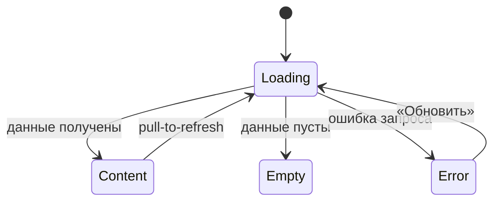

# Требования на дизайн · Foundations (сквозные правила)

Сквозной документ дизайн-требований приложения «Шеф-стол». Описывает принципы, структурные токены, паттерны навигации и состояний, доступность и микрокопию, **общие для всех экранов**. Экранные документы ссылаются сюда и не дублируют эти правила.

**Статус:** Черновик · **Версия:** 0.1 · **Дата:** 2026-06-15 · **Зона:** НЗ + АЗ

**Источники:** Бизнес-требования · Функциональные требования · Нефункциональные требования · Use cases · User stories · Описание домена

---

## 1. Продукт и аудитория

**«Шеф-стол»** — клиентское мобильное приложение для самостоятельной записи на кулинарные классы студии. Заменяет запись через WhatsApp и Google-таблицу.

**Единственная роль — «Клиент».** Шеф-повара и владелец в приложение не входят. Справочные данные (классы, программы, шефы) — read-only из API. Оплата — **офлайн** (наличные / перевод); приложение показывает цену и фиксирует запись, онлайн-оплаты нет.

**Контекст использования:** клиент находится на кухне или в студии, нередко в спешке, руки могут быть мокрыми. Это диктует крупные элементы, высокий контраст и минимум шагов (NFR-1).

---

## 2. Дизайн-принципы

| # | Принцип | Источник | Что это значит для макета |
|---|---------|----------|---------------------------|
| P1 | **Mobile-first для кухни** | NFR-1 | Крупные тач-зоны, высокий контраст, читаемость при ярком освещении, минимум мелкого текста. |
| P2 | **Короткий путь к записи** | NFR-2 | От списка до подтверждения — **≤ 3 экранов**. Не добавлять необязательных шагов/полей. |
| P3 | **Минимальный порог входа** | NFR-3 | Регистрация — только имя + телефон, без пароля. Не запрашивать лишних данных. |
| P4 | **Воспринимаемая скорость** | NFR-6 | Скелетоны вместо пустого экрана; отклик списка и подтверждения ощущается < 2–3 с. |
| P5 | **Только свои данные** | NFR-11, NFR-12 | Клиент видит лишь свои записи и контакты; в UI нет доступа к чужим/админским данным. |
| P6 | **Честность и спокойствие** | UC-1/UC-2 | Ошибки и правила (места, прокат, 2 часа) объясняются понятно и без давления; штрафов нет. |

---

## 3. Структурные токены (без бренда)

Дизайнер выбирает конкретные значения; ниже — обязательные **правила**.

### 3.1 Тач-зоны и размеры
- Минимальный размер интерактивного элемента — **≥ 44–48 pt** по меньшей стороне.
- Основной CTA — во всю ширину контентной области, высота не менее минимальной тач-зоны.
- Между кликабельными элементами — отступ, исключающий промахи «мокрым пальцем».

### 3.2 Контраст и читаемость (NFR-1)
- Контраст текста к фону — не ниже **WCAG AA** (обычный текст ≥ 4.5:1, крупный ≥ 3:1).
- Состояния не передаются **только цветом** — дублируются иконкой/текстом/формой (важно для яркого освещения и дальтонизма).
- Важные числа (свободно мест, цена, время старта) — крупные и контрастные.

### 3.3 Типографическая иерархия (уровни, не шрифты)
- **Заголовок экрана** → **Заголовок секции/карточки** → **Основной текст** → **Вторичный/подпись (caption)**. Достаточно 4–5 уровней; держать единообразно.
- Минимальный размер основного текста комфортен для чтения на кухне (не «мелкий серый»).

### 3.4 Плотность и сетка
- Единая шкала отступов (например, кратная базовому шагу) — задаёт дизайнер, применяет везде.
- Контент — в одну колонку (mobile-first), карточки разделены явными отступами/границами.

### 3.5 Иконки и индикаторы
- Иконки сопровождаются текстом в ключевых местах (таб-бар, статусы), не несут смысл в одиночку.
- Индикатор активных фильтров, бейдж статуса записи — визуально считываемы с первого взгляда.

---

## 4. Каркас экрана и навигация

### 4.1 Базовый каркас
```
┌─────────────────────────────┐
│ Хедер (заголовок / назад)    │  ← фиксированный
├─────────────────────────────┤
│                              │
│ Скролл-контент               │  ← основная зона
│                              │
├─────────────────────────────┤
│ Фикс. нижний CTA (если есть) │  ← всегда виден, не перекрыт клавиатурой
└─────────────────────────────┘
│ Таб-бар (в АЗ, верхнеуровневые│  ← только на корневых экранах вкладок
│ экраны)                       │
└─────────────────────────────┘
```

### 4.2 Таб-бар (авторизованная зона)
Три верхнеуровневых раздела, всегда доступны на корневых экранах:
- **«Классы»** (SCR-002) — стартовая вкладка (список доступных кулинарных классов).
- **«Мои записи»** (SCR-005).
- **«Профиль»** (SCR-007).

Таб-бар скрывается на вложенных экранах (карточка класса, оформление, детали брони) и на bottom sheet. Каждая иконка сопровождается подписью.

### 4.3 Bottom Sheet (шторки BS-001 / BS-002 / BS-003)
Единые правила для всех шторок:
- Высота — по контенту, но не выше ~90% экрана; длинный контент скроллится внутри.
- **Бэкдроп** (затемнение фона) + закрытие по тапу вне шторки (кроме критичных подтверждений, где закрытие — только явной кнопкой).
- **Swipe-to-close** жестом вниз + видимый «грабер» (полоска) сверху.
- Явная кнопка закрытия/отмены. Действия-кнопки шторки — в её нижней части.
- Открытие/закрытие — плавная анимация снизу вверх.

### 4.4 Карта навигации
Полная карта переходов будет уточнена в экранных документах. Каждый экран описывает свои входящие/исходящие переходы в разделе «Навигация».

### 4.5 Адрес студии (текстовый блок, опционально карта)
Сквозной компонент для экранов, где показывается адрес студии (SCR-003, SCR-006). Описывается здесь один раз; экраны на него **ссылаются**.

```
┌─────────────────────────────────┐
│ 📍 Адрес студии                  │  ← текстовый блок
│ Лофт на ул. Заводской, 15       │     (адрес из API: studio_address)
│                                  │
│ (опционально — статичная карта)  │  ← если API даёт координаты
│ [ Открыть в картах › ]          │  ← тап → BS-004 или внешнее приложение
└─────────────────────────────────┘
```

- **По умолчанию:** адрес отображается **текстом** (строка из API, обязательное поле `studio_address`).
- **Опционально:** если API предоставляет координаты, может показываться статичная карта (превью) с пином. Но fallback на текст обязателен.
- **Тап по адресу/карте** → открывается шторка BS-004 «Адрес студии» с полным адресом и, при наличии координат, интерактивной картой.
- **Состояния:**
  - *Loading* — скелетон в форме текстового блока (не пустой экран).
  - *Error / offline / нет координат* — **fallback на текст**: только адрес строкой; экран не ломается, запись/просмотр остаются доступны.
- **Ключ API карт** (если используется) — параметр конфигурации, в макет не зашивается.

---

## 5. Сквозной паттерн состояний экрана

Применяется ко **всем экранам с запросами к API**. Экранные документы лишь уточняют специфику (тексты пустых состояний, конкретные ошибки), не переописывая паттерн.



| Состояние | Что показываем | Правило |
|-----------|----------------|---------|
| **Loading** | Скелетон/шиммер в форме будущего контента | Не пустой белый экран; не блокирующий спиннер по возможности (P4). |
| **Content** | Данные | Основной сценарий. |
| **Empty** | Заглушка + понятная подсказка + действие (если применимо) | Объясняет, почему пусто, и что сделать. |
| **Error** | Заглушка ошибки + кнопка **«Обновить»** | Нейтральный тон; не винит пользователя; даёт повтор. |

Специфичные состояния (например, **disabled CTA «Записаться»** при отсутствии свободных мест, бейдж **«Поздняя отмена»**) описаны в соответствующих экранных документах.

---

## 6. Tone of voice и общая микрокопия

**Тон:** простой, прямой, дружелюбный, без жаргона и канцелярита. Обращение на «вы». Сообщения — короткие, по делу, без вины и давления (штрафов в продукте нет).

**Сквозные тексты (единые формулировки, переиспользуются экранами):**

| Контекст | Текст |
|----------|-------|
| Оплата | «Оплата на месте: наличные или перевод на карту.» |
| Лейблы инвентаря | «Свой фартук и ножи» / «Прокатный набор» |
| Правило отмены | «Отмена не позднее чем за 2 часа до начала — место освобождается. Позже — место остаётся за вами, но штрафов нет.» |
| Поздняя отмена (итог) | «Поздняя отмена: место не освобождено (правило 2 часов). Штраф не взимается.» |
| Кнопка повтора | «Обновить» |
| Сетевая ошибка при загрузке (общая) | «Не удалось загрузить. Проверьте соединение и попробуйте снова.» |
| Сетевая ошибка при действии | «Не удалось выполнить. Проверьте соединение и повторите.» |
| Ошибка сервера при действии (5xx) | «Что-то пошло не так. Попробуйте ещё раз позже.» |
| Ошибка действия без текста от сервера (дефолт 4xx без `message`) | «Не удалось выполнить. Попробуйте ещё раз.» |

> Числовые лимиты (потолок программы, размер прокатного фонда) **не зашиваются в тексты** — подставляются из данных класса/программы.
>
> **Раздельная модель доступности.** Места и прокат считаются **независимо**:
> - **Места** (за раз можно выбрать): `max_seats = min(free_seats, program.capacity_cap, 3)`.
> - **Прокатные наборы**: ограничение отдельное — `rental_count ≤ free_rental_kits`; своё оборудование не расходует прокатный фонд.
>
> Прокатные наборы **не** ограничивают число доступных мест — формулу доступности «через прокатные наборы» использовать **нельзя**.

### 6.1 Каталог снеков успеха (единые формулировки)

Снек успеха показывается после **завершённого действия**, у которого результат не очевиден из самого перехода. Тон — короткий, утвердительный, без восклицаний. Единые тексты (экраны **ссылаются** сюда и не вводят свои формулировки):

| Действие | Экран/Шторка | Текст снека успеха | Примечание |
|----------|--------------|-------------------|------------|
| Сохранение профиля (`updateProfile`) | SCR-007 | «Профиль обновлён» | — |
| Подтверждение смены телефона (`confirmPhoneChange`) | SCR-007 | «Изменения сохранены» | После успешного ввода кода подтверждения. |
| Удаление аккаунта (`deleteAccount`) | SCR-007 | «Аккаунт удалён» | Показывается на экране входа после выхода из сессии. |
| Выход из аккаунта (`logout`) | SCR-007 | — (снек не показывается) | Обратная связь — сам переход на SCR-001. |
| Отмена брони (`cancelBooking`, ранняя) | BS-003 → SCR-006 | «Бронь отменена» | Показывает экран-родитель после закрытия шторки (см. §6.2). |
| Отмена брони (`cancelBooking`, поздняя) | BS-003 → SCR-006 | «Поздняя отмена: место не освобождено (правило 2 часов). Штраф не взимается.» | Это **успешный** исход (см. строку «Поздняя отмена (итог)» выше), а не ошибка. |
| Создание брони (`createBooking`) | SCR-004 → BS-002 | — (снек не показывается) | Обратная связь — переход на шторку успеха BS-002 с детальной сводкой. Дублировать снеком **нельзя** (см. §6.2). |
| Применение/сброс фильтров (`listSlots` с фильтрами) | BS-001 → SCR-002 | — (снек не показывается) | Обратная связь — обновлённый список и индикатор активных фильтров. |
| Успешный pull-to-refresh | любой список | — (снек не показывается) | Обратная связь — обновлённый контент; снек только при **ошибке** обновления (§6.3). |

### 6.2 Кто показывает снек при закрытии шторки

Когда действие выполняется на **шторке** (bottom sheet), а её результат нужно показать после закрытия — единое правило:
- Снек **успеха/итога** действия, после которого шторка закрывается, показывает **экран-родитель** (он остаётся на экране и переживает закрытие шторки). Пример: подтверждение отмены на BS-003 → снек «Бронь отменена» показывает SCR-006.
- Снек **ошибки** действия, при которой шторка **остаётся открытой** (можно повторить), показывает **сама шторка**.
- **Нельзя дублировать** обратную связь: если результат уже выражен переходом на отдельную шторку успеха (например, `createBooking` → BS-002), снек об успехе на экране-инициаторе **не показывается**.

### 6.3 Снеки vs Error-заглушка (разграничение)

- **Снеком** сообщаются результаты **действий** (отправка формы, тап CTA, подтверждение) и **ошибка при pull-to-refresh** (контент на экране сохраняется). Источник текста: 4xx с `message` → текст из `message`; 4xx без `message` → дефолт (§6); 5xx → «Что-то пошло не так…»; сеть → сетевой текст (§6).
- **Error-заглушкой** (состояние Error + «Обновить», §5) сообщается провал **первичной загрузки** данных экрана (5xx/сеть/таймаут), когда показывать нечего.

> **Единый источник правила отмены.** Полный текст правила «2 часов» и формулировки ранней/поздней отмены задаются **только здесь** (строки «Правило отмены» / «Поздняя отмена»). Экраны SCR-006 и BS-003 **ссылаются** на эти формулировки и не переписывают их. Граничный случай **«ровно 2 часа до старта» трактуется как ранняя отмена** (`≥ 2 ч` → место освобождается).

---

## 7. Доступность (NFR-1, NFR-25 — WCAG AA)

Целевой уровень — **WCAG 2.1 AA**. Обязательные требования:
- **Контраст:** не ниже WCAG AA (обычный текст ≥ 4.5:1, крупный ≥ 3:1) — см. §3.2.
- **Тач-зоны:** интерактивные элементы — **≥ 44 pt** по меньшей стороне, с отступами (§3.1).
- **Dynamic type:** поддержка системного увеличения шрифта; layout не «ломается» при крупном тексте (перенос/перекомпоновка вместо обрезки).
- **Screen reader:** все интерактивные элементы имеют текстовую подпись/доступное имя; иконки без подписи получают `accessibilityLabel`; статусы и важные числа озвучиваются.
- **Не только цвет:** состояния (свободно/нет мест, статус брони, ошибка) дублируются иконкой/текстом/формой, не передаются одним цветом (§3.2) — важно при ярком свете и для дальтонизма.
- **Малые экраны:** макет корректно работает на компактных устройствах (узкая ширина, низкая высота) — контент скроллится, фикс. CTA не перекрывает контент, ничего не обрезается.
- Фокус-состояния и обратная связь на тап обязательны.
- **Адрес студии (§4.5) — не единственный носитель информации:** адрес обязательно продублирован **текстом**. При наличии карты — у неё доступное имя; при недоступности карты текстовый эквивалент остаётся.

---

## 8. Сквозные функции

### 8.1 Напоминания и уведомления (FR-33, NFR-13)
- Заблаговременное напоминание о предстоящем классе; уведомление об отмене класса студией.
- **Канал — push.** Доставку обеспечивает существующая инфраструктура; приложение регистрирует push-токен.
- **Запрос разрешения на push показывается после первой успешной записи** — на шторке подтверждения BS-002, когда ценность очевидна, а не на старте. Экран входа SCR-001 разрешение **не запрашивает**.
- Отдельного экрана/раздела управления уведомлениями в MVP нет (в т.ч. вне профиля SCR-007).

### 8.2 Безопасность данных в UI (NFR-11, NFR-12)
- На экранах отображаются только данные текущего клиента.
- Персональные данные (имя, телефон) не дублируются без необходимости; номер телефона маскируется (например, +7 *** *** ** 67).

### 8.3 Поведение офлайн и сетевые ошибки (NFR-24, NFR-6)
- **Просмотр кэша офлайн разрешён:** ранее загруженные списки/детали показываются из кэша с **видимой пометкой устаревания** («Данные могут быть неактуальны» / время обновления), а не пустым экраном.
- **Мутации офлайн запрещены:** запись, отмена, изменение профиля при отсутствии сети не отправляются и не ставятся в очередь — действие блокируется с понятным сообщением «Нет подключения».
- **Единый паттерн Error / Retry:** все сетевые/серверные сбои и таймауты ведут к состоянию Error с кнопкой «Обновить» (для загрузки, §5) или к снеку ошибки с возможностью повтора (для действий, §6.3); тексты — из §6.
- **Таймаут запроса — ~10 с:** по истечении показывается ошибка с повтором, экран не «висит».
- **Идемпотентность бронирования:** при создании брони клиент передаёт Idempotency-Key; повтор с тем же ключом не создаёт дубль.

---

## 9. Глоссарий

| Термин | Значение |
|--------|----------|
| **Класс / Слот** | Конкретное проведение программы: дата, время начала, программа (меню), шеф, цена, всего/свободно мест. |
| **Программа (меню)** | Тема класса (например, итальянская паста), определяет уровень сложности (новичковая/опытная) и потолок вместимости (до 12 или до 8 мест). |
| **Шеф** | Повар, ведущий класс. |
| **Рабочее место (стол)** | Одно место за столом на одного человека. |
| **Прокатный набор** | Комплект студии «фартук + ножи»; фонд 15 наборов, учитывается отдельно от мест. |
| **Своё оборудование** | Клиент использует свои фартук и ножи; прокатный фонд не расходуется. |
| **Запись (бронь)** | Бронь одного или нескольких мест (до 3) на класс: выбор инвентаря для каждого места, пищевые ограничения, итоговая цена, статус. |
| **Ранняя отмена** | Отмена ≥ 2 ч до начала → места и прокатные наборы возвращаются в слот. |
| **Поздняя отмена** | Отмена < 2 ч до начала → запись фиксируется, место и прокат не освобождаются, штрафов нет. |
| **Отмена студией** | Отмена класса организатором (форс-мажор: поставка, оборудование); бронь получает статус «Отменён студией» с причиной; повторная запись на слот запрещена. |
| **Администратор / владелец** | Артём — управляет расписанием и шефами через существующую инфраструктуру (вне скоупа клиентского приложения). |
| **MVP** | Минимально жизнеспособный продукт: набор функций к старту сезона (без онлайн-оплаты, оценок и лояльности). |
| **Пищевые ограничения** | Необязательное текстовое поле при бронировании (аллергии, диеты, пожелания); передаётся шефу через бэкенд. |

---

## 10. Карта документов дизайн-требований

| ID | Документ |
|----|----------|
| — | **00-foundations.md** (этот файл) |
| SCR-001 | Регистрация / Вход |
| SCR-002 | Список классов |
| BS-001 | Фильтры |
| SCR-003 | Карточка класса |
| SCR-004 | Оформление записи |
| BS-002 | Подтверждение записи |
| SCR-005 | Мои бронирования |
| SCR-006 | Детали брони + отмена |
| BS-003 | Подтверждение отмены |
| BS-004 | Адрес студии |
| SCR-007 | Профиль клиента |
