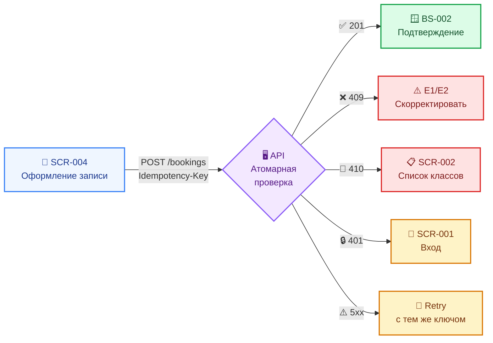
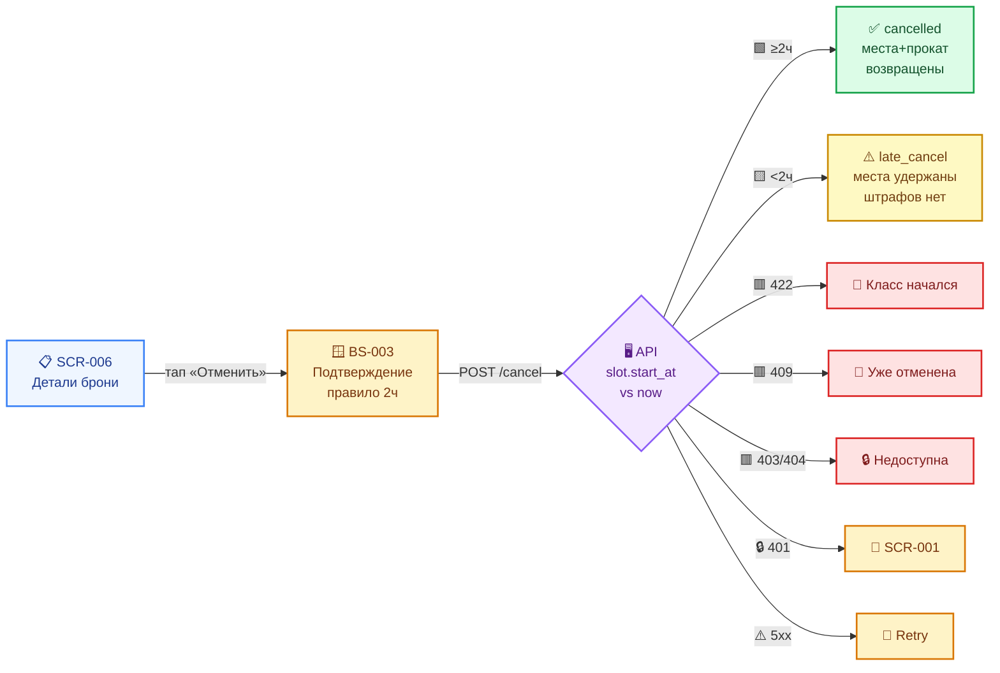

# Sequence-диаграммы API-взаимодействия

Документ описывает, как клиентское мобильное приложение «Шеф-стол» и сервер обмениваются вызовами в критичных сценариях бронирования кулинарных классов. Контракты API детализированы в спецификации `api/`. Здесь фиксируются только ключевые потоки: **создание брони (UC-1)** и **отмена брони (UC-2)**.

> **Формат:** диаграммы приведены в формате [Mermaid](https://mermaid.js.org/) — рендерятся в GitHub, GitLab, Obsidian, Notion, VS Code (плагин).

---

## 🎨 Условные обозначения

| Цвет блока | Значение |
|------------|----------|
| 🟦 Голубой `rgb(240, 248, 255)` | Подготовка / действия пользователя |
| 🟧 Оранжевый `rgb(255, 248, 240)` | Критичное подтверждение |
| 🟩 Зелёный `rgb(240, 255, 240)` | Успешное завершение |
| 🟥 Красный `rgb(255, 240, 240)` | Ошибка / откат |
| 🟪 Фиолетовый `rgb(248, 240, 255)` | Логика сервера / атомарная проверка |
| 🟨 Жёлтый `rgb(255, 249, 196)` | Поздняя отмена (без штрафа) |

---

## 🔐 Сквозные правила взаимодействия

| Правило | Описание | Источник |
|---------|----------|----------|
| **Авторизация** | Все вызовы — с заголовком `Authorization: Bearer <token>`. При `401` клиент ведёт пользователя на SCR-001. | `auth/api.yaml` |
| **Источник истины** | Сервер — единственный источник по времени (`start_at` в UTC) и доступности (места, прокат). Клиент не пересчитывает. | R-005, R-021 |
| **Атомарность** | Операции записи и отмены атомарны: овербукинг и двойная бронь исключены. | NFR-8, NFR-9 |
| **Идемпотентность** | `POST /bookings` — с заголовком `Idempotency-Key`. Повтор с тем же ключом не создаёт дубль. | NFR-9, R-020 |
| **Таймаут** | ~10 секунд. Мутирующие операции офлайн запрещены. | NFR-24, R-020 |
| **Error/Retry** | Единый паттерн: снек для действий, заглушка «Обновить» для загрузки. | `00-foundations.md` §5, §6.3 |

---

## 📝 Сценарий 1 · Создание брони (`createBooking`, UC-1)

**Поток:** SCR-004 «Оформление записи» → `POST /bookings` → BS-002 «Подтверждение записи»

Клиент отправляет `slot_id`, `seats_count` (1..3), `rental_count` (0..seats_count) и опциональное поле `dietary_restrictions`. Итоговую стоимость `price_total` (RUB, read-only) рассчитывает и возвращает сервер; клиент только отображает её (FR-45).

### 📋 Таблица шагов

| # | Шаг | Что происходит | Эффект на состояние | Источник |
|---|-----|----------------|---------------------|----------|
| 1 | **Запрос** | `POST /bookings` с заголовком `Idempotency-Key`; тело — `CreateBookingRequest` | — | `bookings/api.yaml` |
| 2 | **Проверка** | Сервер атомарно проверяет лимит мест и проката, фиксирует цену | — | NFR-8/9, FR-13/FR-14 |
| 3 | **201 Created** | Возвращается объект `Booking` со статусом `active` и полем `price_total` | `free_seats -= seats_count`; `free_rental_kits -= rental_count` | R-005, модель данных |
| 4 | **409 Conflict** | Недостаточно мест/проката или двойная бронь | Состояние не меняется | `common/models.yaml` |
| 5 | **410 Gone** | Класс был отменён студией | Состояние не меняется | R-008 |
| 6 | **Повтор** | При сетевом сбое клиент повторяет запрос с тем же `Idempotency-Key` | Гарантирует отсутствие дублей | NFR-9, R-020 |

### 🗺️ Обзорная схема потока



### 🎭 Детальная sequence-диаграмма

```mermaid
sequenceDiagram
    autonumber
    actor User as 👤 Клиент
    participant App as 📱 Приложение<br/>(SCR-004)
    participant API as 🖥️ API<br/>(bookings)
    participant DB as 💾 БД

    rect rgb(240, 248, 255)
        Note over User,App: 🎯 Экран «Оформление записи»
        User->>App: Заполняет места, инвентарь,<br/>пищевые ограничения
        User->>App: Тапает «Записаться»
        App->>App: Генерирует Idempotency-Key<br/>(UUID v4)
    end

    activate API
    activate DB
    
    rect rgb(240, 248, 255)
        App->>API: POST /bookings<br/>━━━━━━━━━━━━━━━━━━━━━━<br/>Authorization: Bearer <token><br/>Idempotency-Key: <key><br/>━━━━━━━━━━━━━━━━━━━━━━<br/>{<br/>  slot_id: UUID,<br/>  seats_count: 1..3,<br/>  rental_count: 0..seats_count,<br/>  dietary_restrictions?: string<br/>}
    end

    rect rgb(248, 240, 255)
        Note over API,DB: 🔒 АТОМАРНАЯ ПРОВЕРКА (транзакция)
        API->>DB: BEGIN TRANSACTION
        DB-->>API: SELECT Slot, Program
        Note over API: Проверка лимитов:<br/>━━━━━━━━━━━━━━━━━━━<br/>• max_seats = min(free_seats,<br/>  program.capacity_cap, 3)<br/>• seats_count ≤ max_seats<br/>• rental_count ≤ free_rental_kits<br/>• нет активной брони на этот слот<br/>━━━━━━━━━━━━━━━━━━━<br/>Фиксация цены из Slot
        API->>DB: INSERT Booking<br/>UPDATE Slot (free_seats,<br/>free_rental_kits)
        DB-->>API: COMMIT
    end

    alt 🟩 Успех (201 Created)
        rect rgb(240, 255, 240)
            API-->>App: 201 Created<br/>━━━━━━━━━━━━━━━━━━━━━━<br/>{<br/>  id: UUID,<br/>  status: "active",<br/>  price_total: Money(RUB),<br/>  created_at: DateTime<br/>  ...<br/>}
            deactivate API
            deactivate DB
            App-->>User: Открывает BS-002<br/>«Подтверждение записи»<br/>(сводка брони, цена,<br/>напоминание об оплате)
        end
    else 🟥 Нехватка мест / проката / двойная бронь (409)
        rect rgb(255, 240, 240)
            API-->>App: 409 Conflict<br/>━━━━━━━━━━━━━━━━━━━━━━<br/>{<br/>  code: "slot_full" |<br/>        "double_booking" |<br/>        "rental_unavailable",<br/>  details: {<br/>    available_seats: int,<br/>    available_rental_kits: int<br/>  }<br/>}
            deactivate API
            deactivate DB
            App-->>User: Сообщение об ошибке (E1/E2),<br/>предложение скорректировать
        end
    else 🟥 Класс отменён студией (410)
        rect rgb(255, 240, 240)
            API-->>App: 410 Gone<br/>{code: "slot_cancelled"}
            deactivate API
            deactivate DB
            App-->>User: «Класс отменён студией»,<br/>возврат к списку SCR-002
        end
    else 🔒 Токен истёк (401)
        API-->>App: 401 Unauthorized
        deactivate API
        deactivate DB
        App-->>User: Переход на SCR-001<br/>(экран входа)
    else ⚠️ Сеть / сервер / таймаут (~10с, 5xx)
        rect rgb(255, 248, 240)
            API-->>App: Ошибка / нет ответа
            deactivate API
            deactivate DB
            
            loop 🔄 Retry с тем же Idempotency-Key
                App->>API: POST /bookings<br/>(повтор запроса)
                Note over API: Если первая транзакция<br/>успела — вернёт 201<br/>(идемпотентность)
                API-->>App: 201 / 409 / 410 / 5xx
            end
            
            App-->>User: Снек ошибки,<br/>кнопка «Повторить»
        end
    end
```

---

## ❌ Сценарий 2 · Отмена брони (`cancelBooking`, UC-2)

**Поток:** SCR-006 «Детали брони» → BS-003 «Подтверждение отмены» → `POST /bookings/{bookingId}/cancel`

Отмена выполняется **только целиком** (нельзя отменить часть мест). Тип отмены определяет сервер на основе времени до начала класса (источник истины — `slot.start_at` в UTC):

- **≥ 2 часов** до начала → статус `cancelled` (ранняя отмена): места и прокатные наборы возвращаются в слот.
- **< 2 часов** до начала → статус `late_cancel` (поздняя отмена): места и прокатные наборы **не** возвращаются, но штраф не начисляется.

> ⚠️ Граница **«ровно 2 часа»** трактуется как **ранняя отмена** (FR-17, R-021).

### 📋 Таблица шагов

| # | Шаг | Что происходит | Эффект на состояние | Источник |
|---|-----|----------------|---------------------|----------|
| 1 | **Запрос** | `POST /bookings/{bookingId}/cancel` (без тела; отмена целиком) | — | R-014, `bookings/api.yaml` |
| 2 | **Решение** | Сервер определяет тип отмены по `slot.start_at` в UTC | — | R-021 |
| 3 | **200 OK** | Возвращается `Booking` с новым статусом и `cancelled_at` | Зависит от типа отмены | модель данных |
| 4 | **422 Unprocessable** | Класс уже начался (`slot_started`) | Состояние не меняется | UC-2 E1 |
| 5 | **409 Conflict** | Повторная отмена (`already_cancelled`) | Состояние не меняется | UC-2 E2 |

### 🗺️ Обзорная схема потока



### 🎭 Детальная sequence-диаграмма

```mermaid
sequenceDiagram
    autonumber
    actor User as 👤 Клиент
    participant App as 📱 Приложение<br/>(SCR-006)
    participant Sheet as 🪟 BS-003<br/>(Подтверждение)
    participant API as 🖥️ API<br/>(bookings)
    participant DB as 💾 БД

    rect rgb(240, 248, 255)
        Note over User,App: 📋 SCR-006: бронь active,<br/>класс в будущем
        User->>App: Тап «Отменить запись»
    end

    activate Sheet
    rect rgb(240, 248, 255)
        App-->>User: Открывает BS-003<br/>«Подтверждение отмены»<br/>(правило 2 часов,<br/>последствия)
    end

    rect rgb(255, 248, 240)
        Note over User,Sheet: 🟧 ОСОЗНАННОЕ ПОДТВЕРЖДЕНИЕ
        User->>Sheet: Подтверждает отмену (целиком)
    end

    activate API
    activate DB
    
    rect rgb(240, 248, 255)
        Sheet->>API: POST /bookings/{bookingId}/cancel<br/>━━━━━━━━━━━━━━━━━━━━━━<br/>Authorization: Bearer <token>
    end

    rect rgb(248, 240, 255)
        Note over API,DB: 🔒 АТОМАРНАЯ ПРОВЕРКА
        API->>DB: BEGIN TRANSACTION
        DB-->>API: SELECT Booking, Slot
        Note over API: Проверка:<br/>━━━━━━━━━━━━━━━━━━━<br/>• Booking.status == active?<br/>• Slot.start_at > now()?<br/>━━━━━━━━━━━━━━━━━━━<br/>Определение типа отмены:<br/>• start_at − now() ≥ 2ч → cancelled<br/>• start_at − now() < 2ч → late_cancel
        API->>DB: UPDATE Booking (status, cancelled_at)
        opt 🟩 Ранняя отмена (≥ 2 ч)
            Note over API,DB: Места и прокат ВОЗВРАЩАЮТСЯ
            API->>DB: UPDATE Slot<br/>(free_seats += seats_count,<br/>free_rental_kits += rental_count)
        end
        opt 🟨 Поздняя отмена (< 2 ч)
            Note over API,DB: Места и прокат НЕ возвращаются<br/>(штрафов нет)
        end
        DB-->>API: COMMIT
    end

    alt 🟩 Ранняя отмена (≥ 2 ч)
        rect rgb(240, 255, 240)
            API-->>Sheet: 200 OK<br/>━━━━━━━━━━━━━━━━━━━━━━<br/>{<br/>  status: "cancelled",<br/>  cancelled_at: DateTime<br/>}
            deactivate API
            deactivate DB
            Sheet-->>App: Закрывается
            deactivate Sheet
            App-->>User: 🟩 Снек «Бронь отменена»<br/>(места и прокатные наборы<br/>возвращены в слот)
        end
    else 🟨 Поздняя отмена (< 2 ч)
        rect rgb(255, 248, 240)
            API-->>Sheet: 200 OK<br/>━━━━━━━━━━━━━━━━━━━━━━<br/>{<br/>  status: "late_cancel",<br/>  cancelled_at: DateTime<br/>}
            deactivate API
            deactivate DB
            Sheet-->>App: Закрывается
            deactivate Sheet
            App-->>User: 🟨 Снек «Поздняя отмена:<br/>место не освобождено.<br/>Штраф не взимается.»
        end
    else 🟥 Класс уже начался (422)
        rect rgb(255, 240, 240)
            API-->>Sheet: 422 Unprocessable<br/>{code: "slot_started"}
            deactivate API
            deactivate DB
            Sheet-->>User: 🟥 «Класс уже начался —<br/>отменить нельзя»
        end
    else 🟥 Уже отменена (409)
        rect rgb(255, 240, 240)
            API-->>Sheet: 409 Conflict<br/>{code: "already_cancelled"}
            deactivate API
            deactivate DB
            Sheet-->>User: 🟥 «Бронь уже отменена»,<br/>статус актуализируется
        end
    else 🔒 Чужая / несуществующая бронь (403/404)
        rect rgb(255, 240, 240)
            API-->>Sheet: 403 Forbidden / 404 NotFound
            deactivate API
            deactivate DB
            Sheet-->>User: 🟥 «Бронь недоступна»
        end
    else 🔑 Токен истёк (401)
        API-->>Sheet: 401 Unauthorized
        deactivate API
        deactivate DB
        Sheet-->>App: Переход на SCR-001
    else ⚠️ Сеть / сервер / таймаут (~10с, 5xx)
        rect rgb(255, 248, 240)
            API-->>Sheet: Ошибка / нет ответа
            deactivate API
            deactivate DB
            Sheet-->>User: ⚠️ Снек ошибки,<br/>шторка остаётся открытой —<br/>можно повторить
        end
    end
```

---

## 📊 Сводная таблица кодов ответов

| Код | Сценарий | Значение | Эффект на состояние | Действие клиента |
|-----|----------|----------|---------------------|------------------|
| **200** | Отмена | Успешная отмена (ранняя или поздняя) | Обновляется `Booking.status` и `cancelled_at`; при ранней — возвращаются места/прокат | Обновить статус, показать снек |
| **201** | Создание | Бронь создана | Создаётся `Booking`; уменьшаются `free_seats` и `free_rental_kits` | Открыть BS-002 |
| **401** | Любой | Токен истёк / невалиден | Состояние не меняется | Переход на SCR-001 |
| **403** | Отмена | Бронь не принадлежит клиенту | Состояние не меняется | Сообщение «Бронь недоступна» |
| **404** | Отмена | Бронь не найдена | Состояние не меняется | Сообщение «Бронь недоступна» |
| **409** | Создание | Мест/проката нет или двойная бронь | Состояние не меняется | Показать E1/E2, предложить скорректировать |
| **409** | Отмена | Уже отменена | Состояние не меняется | Актуализировать статус |
| **410** | Создание | Класс отменён студией | Состояние не меняется | Возврат к SCR-002 |
| **422** | Отмена | Класс уже начался | Состояние не меняется | Сообщение «Класс уже начался» |
| **5xx** | Любой | Ошибка сервера / таймаут | Состояние не меняется (или откат транзакции) | Снек ошибки + «Повторить» |

---

## 🔗 Связь с другими артефактами

- **📐 Модель данных и ERD** — в `data-model.md` (раздел «Модель состояний брони»).
- **📜 Контракты API** — в `api/bookings/api.yaml`, `api/common/models.yaml`.
- **📱 Экранные документы:**
  - SCR-004 «Оформление записи» — инициатор создания брони.
  - SCR-006 «Детали брони + отмена» — инициатор отмены.
  - BS-002 «Подтверждение записи» — успех создания.
  - BS-003 «Подтверждение отмены» — диалог подтверждения отмены.
- **📖 Сквозные правила** — `00-foundations.md` §5 (состояния), §6 (микрокопия), §8.3 (офлайн/ошибки).