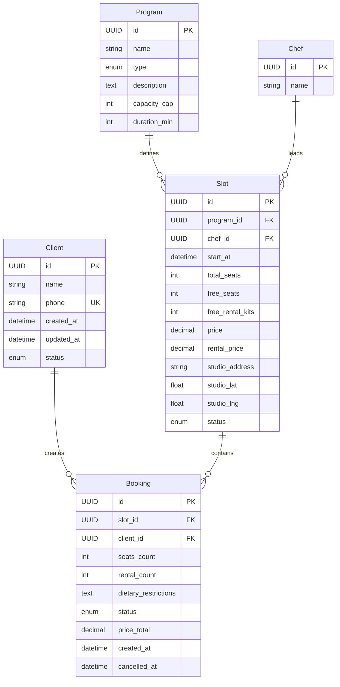
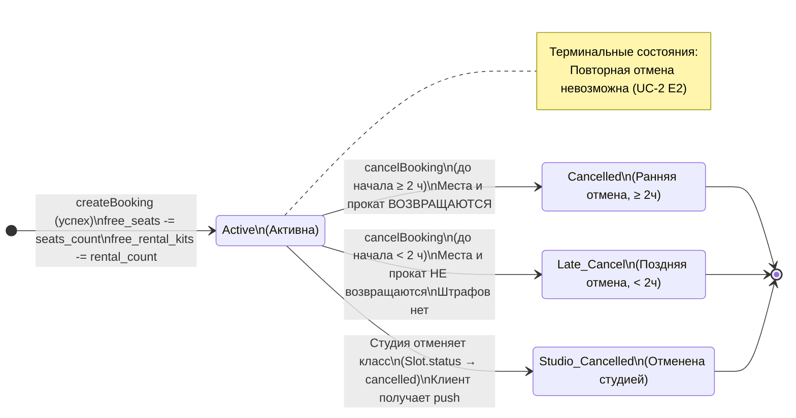
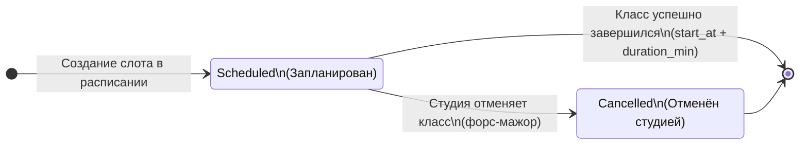

# Модель данных

Документ фиксирует каноническую ресурсную модель данных для клиентского мобильного приложения «Шеф-стол» и его API. Модель описывает сущности, их атрибуты, связи и ключевые инварианты, опираясь на сформулированные ранее требования, use cases, user stories, описание домена и дизайн-брифа. Эта модель является основой для проектирования API и клиентской логики.

> **Скоуп.** В модель включены только сущности, с которыми непосредственно работает клиентское приложение. Сущности управления расписанием, назначения шефов, административные данные находятся в существующей инфраструктуре студии и здесь не описываются. Клиент получает справочные данные через read-only API, а мутирует только свои бронирования и профиль.
>
> **Данные существующей инфраструктуры (R-015).** Проект учебный/тестовый, легаси-данных нет. Эта модель считается канонической и совпадает с контрактом API. Бэкенд по условию отдаёт все описанные поля, включая `rental_price`, `program.description`, `studio_address` и `free_rental_kits`. Миграция и дозаполнение исторических данных не рассматриваются.

---

## 1. Сущности и атрибуты

### 👤 Client (Клиент)
Представляет зарегистрированного пользователя приложения. Создаётся при первом входе по номеру телефона.

| Атрибут | Тип | Обяз. | Описание |
|---------|-----|:---:|----------|
| `id` | UUID (PK) | ✅ | Уникальный идентификатор клиента. |
| `name` | String (max 100) | ✅ | Имя клиента, указанное при регистрации. |
| `phone` | String (E.164, UK) | ✅ | Номер телефона, служит логином. Уникален в системе. |
| `created_at` | DateTime (UTC) | ✅ | Дата и время регистрации. |
| `updated_at` | DateTime (UTC) | ✅ | Дата и время последнего обновления профиля. |
| `status` | Enum { active, deleted } | ✅ | Статус аккаунта. `deleted` — аккаунт удалён, ПДн анонимизированы (FR-48, NFR-20). |

> **Примечания:**
> - Вход/регистрация — трёхшаговый поток (телефон → код из SMS → имя для нового), см. SCR-001. OTP-код отдельной сущностью не хранится.
> - При удалении (`deleteAccount`): активные брони отменяются с освобождением мест/проката; прошедшие анонимизируются; `phone` освобождается для повторной регистрации.
> - Пароль отсутствует (NFR-3).

### 🍲 Program (Программа)
Справочная сущность (read-only). Определяет тематику, уровень сложности и ограничения по вместимости кулинарного класса.

| Атрибут | Тип | Обяз. | Описание |
|---------|-----|:---:|----------|
| `id` | UUID (PK) | ✅ | Уникальный идентификатор программы. |
| `name` | String (max 200) | ✅ | Название программы (меню), например «Итальянская паста». |
| `type` | Enum { beginner, experienced } | ✅ | Уровень сложности: `beginner` (новичковая), `experienced` (опытная). |
| `description` | Text | ❌ | Описание программы, блюд, техник. Отображается в SCR-003. |
| `capacity_cap` | Integer | ✅ | Потолок вместимости: новичковая ≤ 8, опытная ≤ 12. |
| `duration_min` | Integer | ❌ | Длительность класса в минутах (обычно ~180). |

### 👨‍🍳 Chef (Шеф)
Справочная сущность (read-only). Представляет шеф-повара, ведущего класс.

| Атрибут | Тип | Обяз. | Описание |
|---------|-----|:---:|----------|
| `id` | UUID (PK) | ✅ | Уникальный идентификатор шефа. |
| `name` | String | ✅ | Имя шефа. Отображается клиенту. |

### 📅 Slot (Класс / слот)
Предзаполненная сущность расписания (read-only для клиента). Представляет конкретное проведение программы в заданное время с назначенным шефом.

| Атрибут | Тип | Обяз. | Описание |
|---------|-----|:---:|----------|
| `id` | UUID (PK) | ✅ | Уникальный идентификатор класса. |
| `program_id` | FK → Program | ✅ | Программа (меню) класса. |
| `chef_id` | FK → Chef | ✅ | Назначенный шеф-повар. |
| `start_at` | DateTime (UTC) | ✅ | Дата и время начала. **Источник истины** для правила отмены (R-021). |
| `total_seats` | Integer | ✅ | Всего рабочих мест (≤ `capacity_cap`). |
| `free_seats` | Integer | ✅ | Свободно рабочих мест (денормализованное значение). |
| `free_rental_kits`| Integer | ✅ | Свободно прокатных наборов (из общего фонда 15). |
| `price` | Money (RUB) | ✅ | Цена за одно место. |
| `rental_price` | Money (RUB) | ✅ | Отдельный тариф за один прокатный набор. Своё оборудование — бесплатно. |
| `studio_address` | String | ✅ | Адрес студии. Обязательный текстовый блок на SCR-003/SCR-006. |
| `studio_lat` | Float | ❌ | Широта студии для карты (опционально). |
| `studio_lng` | Float | ❌ | Долгота студии для карты (опционально). |
| `status` | Enum { scheduled, cancelled } | ✅ | Статус класса. `cancelled` — отменён студией (форс-мажор). |

> **Примечания:**
> - Лимит доступных для бронирования мест на клиенте: `max_seats = min(free_seats, program.capacity_cap, 3)`.
> - Прокатный фонд и места учитываются **раздельно** (FR-14).

### 🎟️ Booking (Запись / бронь)
Основная **мутируемая** сущность клиентского API. Создаётся и отменяется клиентом (или системой при отмене класса студией).

| Атрибут | Тип | Обяз. | Описание |
|---------|-----|:---:|----------|
| `id` | UUID (PK) | ✅ | Уникальный идентификатор брони. |
| `slot_id` | FK → Slot | ✅ | Класс, на который запись. |
| `client_id` | FK → Client | ✅ | Клиент, оформивший бронь. |
| `seats_count` | Integer | ✅ | Число мест в брони (1–3: себя + до 2 гостей). Без сущности «Гость» (R-013). |
| `rental_count` | Integer | ✅ | Сколько мест используют прокат (0..`seats_count`). Остальные — со своим инвентарём. |
| `dietary_restrictions`| Text | ❌ | Пищевые ограничения (аллергии, диеты). Необязательное поле (FR-50). |
| `status` | Enum | ✅ | Статус брони: `active`, `cancelled`, `late_cancel`, `studio_cancelled`. |
| `price_total` | Money (RUB) | ✅ | **Read-only**. Итоговая цена: `price × seats_count + rental_price × rental_count`. |
| `created_at` | DateTime (UTC) | ✅ | Время создания брони. |
| `cancelled_at` | DateTime (UTC) | ❌ | Время отмены (если была). |

> **Примечания:**
> - Данные гостей не собираются — достаточно количества мест и выбора инвентаря (FR-12).
> - «Прошедшая» — не хранимый статус, а производное отображение по `Slot.start_at` в прошлом (для группировки в SCR-005).
> - Статус `no_show` (неявка) и оценки — вне скоупа клиентского приложения.

---

## 2. ERD (Диаграмма «сущность-связь»)

> 💡 **Легенда:**  
> 🔵 Мутируемые сущности клиентского API: **Client**, **Booking**.  
> ⚪ Справочные сущности (read-only): **Program**, **Chef**, **Slot**.


---

## 3. Модель состояний (Жизненный цикл)

### 🎟️ Состояния Booking (Запись)

`status` ∈ {`active`, `cancelled`, `late_cancel`, `studio_cancelled`}. Создаётся в `active`; отмена — терминальный переход (повторная отмена не выполняется, UC-2 E2).

#### Диаграмма состояний



#### Таблица переходов

| Из | Событие / условие | В | Эффект на слот | Трасса |
|----|-------------------|---|----------------|--------|
| — | Клиент подтверждает бронь | `active` | `free_seats -= seats_count`; `free_rental_kits -= rental_count` | UC-1, FR-10 |
| `active` | Отмена клиентом, до начала ≥ 2 ч | `cancelled` | Места и прокат возвращаются: `free_seats += ...` | UC-2, FR-17 |
| `active` | Отмена клиентом, до начала < 2 ч | `late_cancel` | Места и прокат **НЕ** освобождаются. Штрафов нет. | UC-2 A1, FR-18 |
| `active` | Класс отменён студией | `studio_cancelled` | Слот снят; клиент уведомляется (push). | R-008, FR-33 |
| *любой терминальный* | — | — | Повторная отмена не выполняется | UC-2 E2 |

> ⚠️ Отмена возможна только пока класс не начался (`start_at` в будущем). После начала кнопка «Отменить» недоступна (SCR-006, UC-2 E1). Граница «ровно 2 часа» трактуется как ранняя отмена (FR-17, R-021).

---

### 📅 Состояния Slot (Класс)

`status` ∈ {`scheduled`, `cancelled`} — read-only для клиента. Переход в `cancelled` инициирует владелец в существующей инфраструктуре (форс-мажор).



| Статус | Что видит клиент | Запись |
|--------|------------------|--------|
| `scheduled` (начало в будущем) | Класс в списке/карточке; при `free_seats = 0` — пометка «Мест нет» | Доступна при `free_seats > 0` |
| `scheduled` (начало в прошлом) | Производная «Прошедшая». В клиентских сценариях не предлагается | Недоступна |
| `cancelled` | Пометка «Класс отменён» / «Слот недоступен» | Недоступна / скрыта |

---

## 4. Ключевые инварианты (Целостность данных)

> 🛡️ **Гарантии сервера.** Эти правила соблюдаются на уровне БД и бизнес-логики API. Клиент лишь отображает их следствия.

- 🪑 **Учёт мест (поздняя отмена удерживает место):**
  ```text
  Slot.free_seats = Slot.total_seats − Σ(booking.seats_count)
  ```
  *Где сумма берётся только по броням со статусами `active` и `late_cancel`. При `cancelled` места возвращаются.*

- 🧥 **Учёт прокатных наборов (раздельный фонд):**
  ```text
  Slot.free_rental_kits = 15 − Σ(booking.rental_count)
  ```
  *Сумма по статусам `active` и `late_cancel`. Общий прокатный фонд студии — 15 наборов.*

- 📏 **Потолок вместимости:**
  ```text
  Slot.total_seats ≤ Program.capacity_cap
  ```
  *(новичковая ≤ 8, опытная ≤ 12).*

- 💰 **Фиксация цены:**
  ```text
  Booking.price_total = Slot.price × seats_count + Slot.rental_price × rental_count
  ```
  *Итоговая цена фиксируется на момент создания брони и не меняется. Валюта — RUB (FR-45).*

- 🔒 **Атомарность и идемпотентность:**
  Запись/отмена выполняются атомарно: овербукинг и двойная бронь исключены при параллельных операциях (NFR-8, NFR-9). Повтор `POST /bookings` с тем же `Idempotency-Key` не создаёт дубль.

---

## 5. Связь с другими артефактами

- **API-потоки** — в `api-sequence.md` (создание и отмена брони).
- **Контракты API** — в `api/bookings/api.yaml`, `api/common/models.yaml`.
- **Экранные документы:**
  - SCR-001 (Регистрация) → мутация `Client`.
  - SCR-002, SCR-003 (Список, Карточка) → чтение `Slot`, `Program`, `Chef`.
  - SCR-004 (Оформление) → создание `Booking`.
  - SCR-005, SCR-006 (Мои записи, Детали) → чтение и мутация `Booking`.
- **Сквозные правила** — `00-foundations.md` §6 (лимиты и микрокопия), §8.2 (безопасность данных).