# Расчёт доступности мест и прокатных наборов

**ID:** LOGIC-002  
**Тип:** Логика  
**Домен:** 09. Логики  
**Приоритет:** Critical  
**Статус:** Черновик  
**Функциональные блоки:** FB-BOOKING-001 (Запись на класс), FB-BOOKING-002 (Выбор инвентаря)

---

## История изменений

| Релиз | ТЗ | Описание изменений |
|-------|-----|-------------------|
| — | — | Первоначальная документация |

---

## Входные данные

> Логика — **чистый клиентский расчёт** по данным уже загруженного класса/программы.
> Отдельных запросов не делает; источник всех значений — ответ `getSlot` (см. раздел «API запросы»).
> Числа **не хардкодятся**: `capacity_cap` (новичковая/опытная), `free_seats`, `free_rental_kits`
> приходят из данных. Единственная зашитая константа — групповой лимит **3** («себя + до 2 гостей», FR-12).

| Название | Тип | Возможные значения | Описание |
|----------|-----|-------------------|----------|
| `free_seats` | Состояние (поле класса) | `0…total_seats`, напр. `5` | Число свободных рабочих мест в классе. Расчётное/денормализованное значение из `Slot.free_seats`. |
| `program.capacity_cap` | Состояние (поле программы) | `≤8` (beginner) / `≤12` (experienced), напр. `8` | Потолок мест программы. Из `Slot.program.capacity_cap`. Зависит от типа программы, **не хардкодится**. |
| `free_rental_kits` | Состояние (поле класса) | `≥ 0`, напр. `7` | **Остаток прокатных наборов ПО КЛАССУ**: `исходный прокатный фонд класса − Σ rental_count активных/late_cancel броней`. Из `Slot.free_rental_kits`. **НЕ** глобальный фонд студии (15 наборов): 15 — общий фонд студии, не путать с остатком класса (см. data-model, инварианты). Именно это значение показывается в SCR-003/SCR-004 как «Свободно N прокатных». |
| `GUEST_GROUP_LIMIT` | Константа | `3` | Лимит мест в одной записи: сам клиент + до 2 гостей (FR-12). |
| `seats_count` | Состояние (ввод) | `1…max_seats` | Текущее число мест в форме (степпер). По умолчанию `1`. |
| `rental_count` | Состояние (производное) | `0…seats_count` | Число мест с выбранной опцией «Прокатный набор». |

### Валидация входных диапазонов

Значения `free_seats`, `free_rental_kits`, `program.capacity_cap` по контракту — целые `≥ 0`.
Перед расчётом клиент **санитизирует** вход:

- **Отрицательное** или **`null`** значение любого из полей трактуется как `0` (защитный
  fallback, без аварии расчёта). Практический эффект: при `free_seats` ≤ 0 / `null` запись
  **недоступна** (`max_seats = 0`, CTA «Записаться» неактивна); при `free_rental_kits` ≤ 0 / `null`
  опция «Прокатный набор» недоступна на всех местах.
- `capacity_cap` ≤ 0 / `null` → как `0`, что также даёт `max_seats = 0` (запись недоступна). Такое
  значение трактуется как невалидные данные класса и фиксируется логом для диагностики.
- Поскольку `max_seats = min(free_seats, program.capacity_cap, 3)`, результат всегда в диапазоне
  `0…3`: при любых аномалиях минимум «прижимает» лимит к `0`, не давая выйти за безопасные границы.

---

## Обзор

Логика рассчитывает **два независимых лимита** для записи на кулинарный класс и приводимые из них производные
значения, на основе которых строится поведение UI экранов записи:

1. **Лимит мест группы** — максимум мест, доступных к записи одной бронью:
   `max_seats = min(free_seats, program.capacity_cap, 3)`.
2. **Лимит прокатного фонда** — `rental_count ≤ free_rental_kits`.

«Своё оборудование» занимает место в группе, но **не** уменьшает прокатный фонд; «Прокатный набор» — занимает
место в группе **и** уменьшает прокатный фонд (FR-14). Из выбора пользователя выводится
`own_count = seats_count − rental_count` (для своего инвентаря отдельного лимита нет).

Это **расчётная логика клиента** по уже полученным данным класса (ответ `getSlot`) — без отдельного
запроса. UI-ограничения предупреждают пользователя заранее; **финальную проверку лимитов делает
сервер** при создании брони (см. [LOGIC-003 «Расчёт цены брони»](./LOGIC-003_Расчёт-цены-брони.md)
и гонки E1–E3 на SCR-004).

### User Story

> Как клиент, я хочу видеть, сколько рабочих мест и прокатных наборов реально доступно в выбранном классе,
> чтобы выбрать корректное число мест и вариант инвентаря, не упёршись в отказ при подтверждении.

### Бизнес-ценность

- Предотвращение овербукинга и заведомо невалидных броней на стороне клиента — меньше отказов от сервера.
- Прозрачность для пользователя: границы (макс. мест, остаток проката) видны до подтверждения.
- Единый, переиспользуемый расчёт двух лимитов для всех экранов записи — без дублирования правил.

---

## Точки применения

| Экран/Компонент | Элемент/Триггер | Условие |
|-----------------|-----------------|---------|
| [SCR-003 Карточка класса](../SCR-003-slot-card.md) | При открытии: показ «Свободно мест / прокатных наборов», активность CTA «Записаться» | Всегда (по данным класса) |
| [SCR-004 Оформление записи](../SCR-004-booking.md) | Степпер «Число мест», тумблеры «Свой фартук и ножи / Прокатный набор», подписи лимитов | Всегда; пересчёт при каждом изменении `seats_count`/`rental_count` |

---

## Флоу

```mermaid
flowchart TD
    Start([Открыт экран записи · данные класса из getSlot]) --> Calc[Рассчитать max_seats = min&#40;free_seats, program.capacity_cap, 3&#41;]

    Calc --> Zero{free_seats = 0?}
    Zero -->|Да| NoSeats[CTA «Записаться» неактивна · «Мест нет»]
    NoSeats --> End([Конец])

    Zero -->|Нет| Stepper[Степпер ограничен: 1 ≤ seats_count ≤ max_seats]
    Stepper --> SeatMax{seats_count достиг max_seats?}
    SeatMax -->|Да| DisablePlus["+" в степпере disabled]
    SeatMax -->|Нет| EnablePlus["+" активна]

    DisablePlus --> Boards
    EnablePlus --> Boards[Для каждого места — тумблер «Свой / Прокатный»]

    Boards --> RentMax{rental_count = free_rental_kits?}
    RentMax -->|Да| DisableRental[Опция «Прокатный набор» недоступна на не-прокатных местах]
    RentMax -->|Нет| EnableRental[Опция «Прокатный набор» доступна]

    DisableRental --> Derive[own_count = seats_count − rental_count]
    EnableRental --> Derive

    Derive --> Valid{seats_count ≤ max_seats И rental_count ≤ free_rental_kits?}
    Valid -->|Да| CTAon[CTA «Записаться» активна]
    Valid -->|Нет| CTAoff[CTA disabled · поясняющая микрокопия]

    CTAon --> Server[Финальную проверку делает сервер при createBooking — LOGIC-003, E1–E3]
    CTAoff --> End
    Server --> End
```

---

## Описание логики

### Шаг 1: Расчёт лимита мест (`max_seats`)

`max_seats = min(free_seats, program.capacity_cap, 3)`, где:
- `free_seats` — свободные рабочие места класса (из данных),
- `program.capacity_cap` — потолок программы (новичковая ≤8 / опытная ≤12, из данных, **не хардкод**),
- `3` — групповой лимит «себя + до 2 гостей» (FR-12).

Минимум всегда `1` (клиент бронирует как минимум себя). Если `free_seats = 0`, запись недоступна
(`max_seats = 0` → шаг 4).

### Шаг 2: Ограничение степпера мест

Степпер `seats_count` ограничен диапазоном `1…max_seats`. На минимуме кнопка «−» неактивна,
на `seats_count = max_seats` кнопка «+» неактивна (граница видима, без скрытой блокировки).
Подпись под степпером показывает текущий лимит словами (число — из данных).

### Шаг 3: Ограничение прокатного фонда

`rental_count` (число мест с опцией «Прокатный набор») не может превышать `free_rental_kits`.
Когда `rental_count = free_rental_kits`, опция «Прокатный набор» на ещё не-прокатных местах становится
**недоступной**. «Своё оборудование» лимита не имеет: `own_count = seats_count − rental_count`.
Следствие: при `free_rental_kits = 0` запись возможна только со своим инвентарём.

### Шаг 4: Влияние на UI и валидность брони

- Степпер числа мест ограничен сверху значением `max_seats`.
- Опция «Прокатный набор» недоступна при `rental_count = free_rental_kits`.
- Кнопка «Записаться» **неактивна** при `free_seats = 0`; при наличии мест активна, пока
  `seats_count ≤ max_seats` и `rental_count ≤ free_rental_kits`.
- Расчёт клиентский и предупреждающий; **сервер — финальный арбитр** при `createBooking`
  (гонки E1–E3, см. SCR-004 §8 и [LOGIC-003](./LOGIC-003_Расчёт-цены-брони.md)).

### Шаг 5: Пересчёт лимитов при обновлении данных класса

Лимиты не кэшируются «навсегда»: при любом обновлении полей класса расчёт `max_seats` и границы
`rental_count` выполняется заново на свежих `free_seats` / `free_rental_kits`.

- **Pull-to-refresh** (SCR-003/SCR-004): повторный `getSlot` актуализирует `free_seats` и
  `free_rental_kits`; логика заново считает `max_seats`, границу проката и состояние CTA. Если
  текущий `seats_count > max_seats` — счётчик откатывается до нового `max_seats`; если
  `rental_count > free_rental_kits` — лишние прокатные места предлагается переключить на «Своё оборудование».
  При обновлённом `free_seats = 0` запись становится недоступной (CTA off, «Мест нет»).
- **Отмена/обновление брони.** Места и прокатные наборы возвращаются в слот **только при ранней
  отмене** (`≥ 2 ч` до начала → статус `cancelled`): `free_seats += seats_count`,
  `free_rental_kits += rental_count`. **Поздняя отмена** (`< 2 ч` → `late_cancel`) **НЕ освобождает**
  ни место, ни прокатный набор — `free_seats` / `free_rental_kits` не растут (data-model, инварианты
  FR-17/FR-18). Граница ровно `2 ч` относится к ранней отмене. Клиент не пересчитывает остатки
  локально по факту отмены, а получает их из обновлённого `getSlot` и прогоняет расчёт заново.

---

## API запросов

> **Отдельных запросов эта логика не делает.** Это чистый клиентский расчёт по данным класса.
> Все входные значения (`free_seats`, `program.capacity_cap`, `free_rental_kits`) берутся из
> **уже полученного ответа `getSlot`** (модель `Slot` / `Slot.program`, см. `api/slots/models.yaml`).
> Создание брони и финальная серверная проверка лимитов описаны в
> [LOGIC-003 «Расчёт цены брони»](./LOGIC-003_Расчёт-цены-брони.md) (`createBooking`).

| Источник данных | Поле | Назначение в расчёте |
|-----------------|------|----------------------|
| `Slot` (ответ `getSlot`) | `free_seats` | Слагаемое `min(...)`; флаг недоступности CTA при `0` |
| `Slot` (ответ `getSlot`) | `free_rental_kits` | Верхняя граница `rental_count` |
| `Slot.program` (ответ `getSlot`) | `capacity_cap` | Слагаемое `min(...)` (потолок программы) |

---

## Связанные требования

### Функциональные (FR-*)

| ID | Название | Приоритет |
|----|----------|-----------|
| FR-13 | Ограничение числа мест слота величиной `min(свободные места, потолок программы, 3)` | Must |
| FR-14 | Отдельный учёт прокатного фонда: «своё оборудование» занимает место, но не прокатный набор | Must |
| FR-15 | Запрет записи сверх лимита мест или прокатных наборов; без двойной брони и овербукинга | Must |

### Интеграции

| ID | Название | Приоритет |
|----|----------|-----------|
| — | Данные берутся из ответа `getSlot` (SCR-003/SCR-004); собственных интеграций логика не имеет | — |

### UI/UX

| ID | Название |
|----|----------|
| US-6 | Выбор варианта инвентаря (свой / прокатный) при записи |
| US-7 | Запись нескольких мест (себя + 1–2 гостя) |
| US-8 | Защита от записи сверх лимита (предупреждение в UI) |

> Связанные сценарии: [UC-1](../../2-requirements/use-cases.md) (основной поток записи, A1/A2),
> [Функциональные требования FR-13–FR-15](../../2-requirements/functional-requirements.md),
> NFR-8 (защита от двойной брони/овербукинга — финальная проверка на сервере).

---

## Критерии приёмки

> Формат: **Дано** {контекст}, **Когда** {действие}, **Тогда** {результат}

| ID | Критерий |
|----|----------|
| AC-001 | **Дано** класс с `free_seats = 5`, `program.capacity_cap = 8`, **Когда** открыт экран записи, **Тогда** максимум мест к записи = `min(5, 8, 3) = 3` и кнопка «+» степпера неактивна на `seats_count = 3`. |
| AC-002 | **Дано** класс с `free_seats = 2`, `program.capacity_cap = 12`, **Когда** открыт экран записи, **Тогда** максимум мест = `min(2, 12, 3) = 2` (ограничивает `free_seats`), и больше 2 мест выбрать нельзя. |
| AC-003 | **Дано** класс с `free_rental_kits = 1` и `seats_count = 2`, **Когда** клиент переключает первое место на «Прокатный набор» (`rental_count = 1`), **Тогда** опция «Прокатный набор» на втором месте становится недоступной, а `own_count = 2 − 1 = 1`. |
| AC-004 | **Дано** класс с `free_seats = 0`, **Когда** открыта карточка класса (SCR-003) и экран записи, **Тогда** кнопка «Записаться» неактивна и показана пометка «Мест нет» (граничный случай: места закончились). |
| AC-005 | **Дано** класс с `free_rental_kits = 0`, **Когда** открыт экран записи, **Тогда** опция «Прокатный набор» недоступна на всех местах, доступна запись только со своим инвентарём, и при `rental_count = 0` кнопка «Записаться» активна (граничный случай: прокат закончился). |
| AC-006 | **Дано** класс с `free_seats = 10`, `program.capacity_cap = 12`, **Когда** открыт экран записи, **Тогда** максимум мест = `min(10, 12, 3) = 3` (ограничивает групповой лимит 3), независимо от больших значений мест и потолка. |
| AC-007 | **Дано** валидная комбинация `seats_count ≤ max_seats` и `rental_count ≤ free_rental_kits`, **Когда** клиент меняет вариант инвентаря, **Тогда** `own_count` пересчитывается как `seats_count − rental_count`, а кнопка «Записаться» остаётся активной. |
| AC-008 | **Дано** класс с `free_seats = 5`, `program.capacity_cap = 2`, **Когда** открыт экран записи, **Тогда** максимум мест = `min(5, 2, 3) = 2` (ограничивает именно `capacity_cap`, раньше чем `free_seats`), кнопка «+» неактивна на `seats_count = 2`. |
| AC-009 | **Дано** класс, в котором `free_seats = -1` или `null` (некорректные данные), **Когда** открыт экран записи, **Тогда** значение трактуется как `0`, `max_seats = 0`, кнопка «Записаться» неактивна, показана пометка «Мест нет». |
| AC-010 | **Дано** класс с `free_rental_kits = -3` или `null`, **Когда** открыт экран записи, **Тогда** значение трактуется как `0`, опция «Прокатный набор» недоступна на всех местах, доступна запись только со своим инвентарём. |
| AC-011 | **Дано** активная бронь `seats_count = 2`, `rental_count = 1` на классе, **Когда** клиент отменяет её **за `≥ 2 ч`** до начала и срабатывает pull-to-refresh, **Тогда** в обновлённом классе `free_seats` выросло на `2`, `free_rental_kits` — на `1`, и `max_seats` пересчитан на новых значениях. |
| AC-012 | **Дано** активная бронь `seats_count = 2`, `rental_count = 1`, **Когда** клиент отменяет её **за `< 2 ч`** (поздняя отмена, `late_cancel`) и срабатывает pull-to-refresh, **Тогда** `free_seats` и `free_rental_kits` **не изменились** (место и прокатный набор удержаны), лимиты пересчитаны без прироста остатков. |

### Примеры граничных расчётов

| Сценарий | Вход | Расчёт | Итог |
|----------|------|--------|------|
| Мест нет | `free_seats = 0`, `capacity_cap = 8` | `min(0, 8, 3) = 0` | `max_seats = 0`, CTA неактивна, «Мест нет» |
| `capacity_cap` ограничивает раньше `free_seats` | `free_seats = 5`, `capacity_cap = 2` | `min(5, 2, 3) = 2` | `max_seats = 2`, «+» неактивна на 2 местах |
| `free_seats` ограничивает | `free_seats = 2`, `capacity_cap = 12` | `min(2, 12, 3) = 2` | `max_seats = 2` |
| Групповой лимит 3 | `free_seats = 10`, `capacity_cap = 12` | `min(10, 12, 3) = 3` | `max_seats = 3` |
| Некорректный вход | `free_seats = -1`/`null` | трактуется как `0`; `min(0, …) = 0` | `max_seats = 0`, запись недоступна |
| Остаток проката исчерпан | `free_rental_kits = 0` | граница `rental_count ≤ 0` | «Прокатный набор» недоступен, только свой инвентарь |

---

## Обработка ошибок

> Сама логика — детерминированный расчёт по локальным данным и собственных ошибок не порождает.
> Ниже — пограничные ситуации, когда клиентский расчёт расходится с состоянием сервера; финальный
> арбитр — сервер при `createBooking` (см. SCR-004 §8, E1–E3, и [LOGIC-003](./LOGIC-003_Расчёт-цены-брони.md)).

| Тип ошибки | Контекст | Действие |
|------------|----------|----------|
| Нехватка мест (E1) | `seats_count > free_seats` на момент подтверждения (данные класса устарели) | Сервер отклоняет; UI показывает актуальное `free_seats` и предлагает откат счётчика — перерасчёт `max_seats`. |
| Нехватка прокатных наборов (E2) | `rental_count > free_rental_kits` | UI предлагает уменьшить число прокатных или переключить место(а) на «Своё оборудование»; опция «Прокатный набор» сверх лимита недоступна (Шаг 3). |
| Гонка запросов (E3, NFR-8) | Класс заполнили параллельно между `getSlot` и `createBooking` | Запись не создана; получить обновлённые `free_seats`/`free_rental_kits`, **перезапустить расчёт** лимитов и состояние CTA; при `free_seats = 0` — увести к списку классов. |

---
