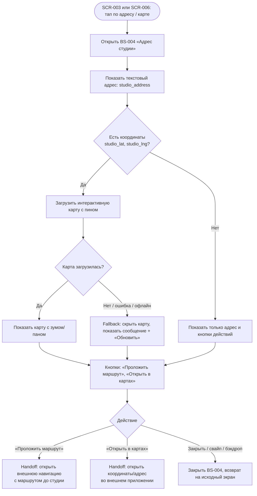

# Адрес студии

**ID:** LOGIC-006  
**Тип:** Логика  
**Домен:** 09. Логики  
**Приоритет:** Medium  
**Статус:** Черновик  
**Функциональные блоки:** FB-SLOTS-001 (Просмотр класса), FB-BOOKING-002 (Детали брони)

---

## История изменений

| Релиз | ТЗ | Описание изменений |
|-------|-----|-------------------|
| — | — | Первоначальная документация |

---

## Входные данные

| Название | Тип | Возможные значения | Описание |
|----------|-----|-------------------|----------|
| `studio_address` | Данные класса (`Slot.studio_address`) | строка | Полный почтовый адрес студии. Обязательное поле. Отображается текстом на SCR-003, SCR-006 и в BS-004. |
| `studio_lat` | Данные класса (`Slot.studio_lat`) | float / `null` | Широта студии для отображения карты. Опционально. |
| `studio_lng` | Данные класса (`Slot.studio_lng`) | float / `null` | Долгота студии для отображения карты. Опционально. |
| `map_api_key` | Конфигурация (Remote Config) | строка | Ключ API картографического сервиса (Яндекс.Карты). Хранится как параметр конфигурации окружения, не в коде, не в модели данных. Ротация ключа не требует пересборки клиента. |

---

## Обзор

Логика управляет отображением адреса кулинарной студии «Шеф-стол» в клиентском приложении. Адрес является обязательным атрибутом каждого класса и отображается текстовым блоком на экранах SCR-003 (карточка класса) и SCR-006 (детали брони). При наличии координат (`studio_lat`, `studio_lng`) дополнительно может отображаться статическая карта с пином студии. Тап по адресу или карте открывает шторку BS-004, где адрес показан полностью и, при наличии координат, с интерактивной картой.

В отличие от SUP-клуба «Волна», где маршрут является ключевой информацией (линия на карте, место встречи), для кулинарной студии карта — вспомогательный элемент. Основным носителем информации всегда является **текстовый адрес**. Карта лишь помогает визуально сориентироваться, поэтому её отсутствие не ухудшает пользовательский опыт.

### User Story

> Как клиент, я хочу видеть адрес студии, чтобы знать, куда идти на класс, и при необходимости построить маршрут.

### Бизнес-ценность

- Снятие неопределённости: клиент заранее знает, где находится студия.
- Удобная навигация: возможность открыть адрес во внешнем картографическом приложении.
- Отказоустойчивость: при отсутствии координат или недоступности карты текстовый адрес остаётся доступным.

---

## Точки применения

| Экран/Компонент | Элемент/Триггер | Условие |
|-----------------|-----------------|---------|
| [SCR-003 Карточка класса](../SCR-003-slot-card.md) | Текстовый блок с адресом | Всегда (адрес обязателен) |
| [SCR-003 Карточка класса](../SCR-003-slot-card.md) | Опциональная статическая карта с пином | Если `studio_lat` и `studio_lng` не `null` |
| [SCR-003 Карточка класса](../SCR-003-slot-card.md) | Тап по адресу / карте → BS-004 | Всегда |
| [SCR-006 Детали брони](../SCR-006-booking-details.md) | Текстовый блок с адресом | Всегда |
| [SCR-006 Детали брони](../SCR-006-booking-details.md) | Опциональная статическая карта с пином | Если `studio_lat` и `studio_lng` не `null` |
| [SCR-006 Детали брони](../SCR-006-booking-details.md) | Тап по адресу / карте → BS-004 | Всегда |
| [BS-004 Адрес студии](../BS-004-studio-address.md) | Полный адрес + интерактивная карта (опционально) | При открытии |
| [BS-004 Адрес студии](../BS-004-studio-address.md) | «Проложить маршрут» | Handoff во внешнее приложение |
| [BS-004 Адрес студии](../BS-004-studio-address.md) | «Открыть в картах» | Handoff во внешнее приложение |

---

## Флоу

---

## Описание логики

### Шаг 1: Отображение адреса на SCR-003 и SCR-006

Адрес студии (`studio_address`) — **обязательный** атрибут каждого класса. На экранах SCR-003 и SCR-006 он всегда отображается текстовым блоком с лейблом «Адрес студии».

Если API предоставляет координаты (`studio_lat`, `studio_lng`), дополнительно может отображаться **статическая карта** (превью) с пином студии. При тапе по адресу или карте открывается шторка BS-004.

**Состояния:**
- *Loading* — скелетон в форме текстового блока (не пустой экран).
- *Error / offline / нет координат* — **fallback на текст**: только адрес строкой; экран не ломается, запись/просмотр остаются доступны.

### Шаг 2: Отображение в шторке BS-004

При открытии BS-004:
- **Текстовый адрес** показывается всегда (крупно, контрастно).
- **Интерактивная карта** показывается, только если есть координаты. Карта загружается с пином студии; доступны зум и пан.
- **Кнопки действий:**
  - «Проложить маршрут» — открывает внешнее навигационное приложение с построением маршрута от текущего местоположения пользователя до студии (используя координаты, если доступны, или текстовый адрес).
  - «Открыть в картах» — открывает координаты/адрес в штатном картографическом приложении устройства (handoff).

**Fallback при отсутствии координат или ошибке загрузки карты:**
- Карта скрывается.
- Текстовый адрес и обе кнопки действий остаются доступны.
- При ошибке загрузки карты дополнительно показывается сообщение «Не удалось загрузить карту» и кнопка «Обновить» для повторной попытки.

### Шаг 3: Ключ API

API-ключ картографического сервиса (Яндекс.Карты) хранится как параметр конфигурации окружения, не в коде, не в модели данных, не в репозитории. Ротация ключа не требует пересборки клиента.

---

## API запросы

> Отдельных запросов эта логика не делает. Данные адреса и координат приходят в составе ответа `getSlot`. Картографический сервис (Static API / Maps JS API) используется на клиенте для отрисовки карты; ключ API — параметр конфигурации.

| Источник данных | Поле | Назначение |
|-----------------|------|------------|
| `Slot` (ответ `getSlot`) | `studio_address` | Текстовый адрес студии |
| `Slot` (ответ `getSlot`) | `studio_lat` | Широта для карты (опционально) |
| `Slot` (ответ `getSlot`) | `studio_lng` | Долгота для карты (опционально) |
| Конфигурация | `map_api_key` | Ключ API картографического сервиса |

---

## Связанные требования

### Функциональные (FR-*)

| ID | Название | Приоритет |
|----|----------|-----------|
| FR-9a | Карточка класса со всеми параметрами, включая адрес студии | Must |

### Нефункциональные (NFR-*)

| ID | Название | Приоритет |
|----|----------|-----------|
| NFR-26 | Отображение адреса студии с fallback на текст при недоступности карты | Средний |

### UI/UX

| ID | Название |
|----|----------|
| US-4 | Клиент видит все детали класса перед записью, включая адрес |

---

## Критерии приёмки

| ID | Критерий |
|----|----------|
| AC-001 | **Дано** открыта карточка класса (SCR-003) или детали брони (SCR-006), **Когда** экран загружен, **Тогда** адрес студии отображается текстовым блоком с лейблом «Адрес студии». |
| AC-002 | **Дано** API предоставил координаты (`studio_lat`, `studio_lng`), **Когда** загружена карточка класса, **Тогда** дополнительно отображается статическая карта с пином студии. |
| AC-003 | **Дано** координаты не предоставлены или карта не загрузилась, **Когда** загружена карточка класса, **Тогда** отображается только текстовый адрес; экран не ломается, запись доступна. |
| AC-004 | **Дано** клиент тапнул по адресу или карте на SCR-003/SCR-006, **Когда** открывается BS-004, **Тогда** показан полный текстовый адрес и, при наличии координат, интерактивная карта с пином. |
| AC-005 | **Дано** открыта BS-004, **Когда** клиент нажимает «Проложить маршрут», **Тогда** открывается внешнее навигационное приложение с маршрутом до студии. |
| AC-006 | **Дано** открыта BS-004, **Когда** клиент нажимает «Открыть в картах», **Тогда** координаты/адрес открываются во внешнем картографическом приложении. |
| AC-007 | **Дано** карта в BS-004 не загрузилась, **Когда** произошла ошибка, **Тогда** карта скрывается, показано сообщение «Не удалось загрузить карту» и кнопка «Обновить»; текстовый адрес и кнопки действий доступны. |

---

## Обработка ошибок

| Тип ошибки | Контекст | Действие |
|------------|----------|----------|
| Отсутствие координат (`studio_lat` / `studio_lng` = `null`) | SCR-003 / SCR-006 / BS-004 | Карта не показывается. Отображается только текстовый адрес. Кнопки «Проложить маршрут» и «Открыть в картах» используют текстовый адрес. Это **не ошибка**, а штатный fallback. |
| Ошибка загрузки карты (сеть, таймаут, невалидный ключ API) | BS-004 | Карта скрывается, показывается сообщение «Не удалось загрузить карту» и кнопка «Обновить». Текстовый адрес и кнопки действий остаются доступны. |
| Картографический сервис недоступен (превышение квоты, блокировка) | BS-004 | Аналогично ошибке загрузки: fallback на текст, кнопки доступны. |

---
