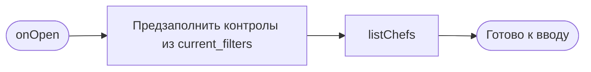

# Фильтры

**ID:** BS-001  
**Тип:** Bottom Sheet  
**Домен:** 01. Просмотр и фильтрация классов  
**Приоритет:** High  
**Статус:** Черновик  
**Функциональные блоки:** FB-001-001 (Фильтр по дате/периоду), FB-001-002 (Фильтр по типу программы), FB-001-003 (Фильтр по наличию мест), FB-001-004 (Фильтр по шефу)  
**Зона авторизации:** АЗ  
**Дизайн-макет:** На основе `3-design-brief/BS-001-filters.md`

> **Пресеты дат:** быстрые чипы «Сегодня / Эта неделя / Выходные» + произвольный диапазон «С / По». Клиент маппит выбранный пресет в `date_from` / `date_to`. Остальные фильтры (тип программы, шеф из справочника, «только со свободными местами», «Применить» / «Сбросить») соответствуют макету.

---

## Содержание

- [История изменений](#история-изменений)
- [Обзор](#обзор)
- [Навигация](#навигация)
- [Входные данные](#входные-данные)
- [Применяемые логики](#применяемые-логики)
- [Свойства Bottom Sheet](#свойства-bottom-sheet)
- [Инициализация](#инициализация)
- [Используемые запросы](#используемые-запросы)
- [Макет экрана](#макет-экрана)
- [Элементы экрана](#элементы-экрана)
- [Состояния экрана](#состояния-экрана)
- [Действия пользователя](#действия-пользователя)
- [Связанные требования](#связанные-требования)
- [Критерии приёмки](#критерии-приёмки)

---

## История изменений

| Релиз | ТЗ | Описание изменений |
|-------|-----|-------------------|
| 0.1.0 | BS-001 «Фильтры» | Первичная версия ТЗ на шторку фильтров классов. |

---

## Обзор

Bottom Sheet BS-001 «Фильтры» — форма выбора параметров фильтрации списка кулинарных классов. Открывается с экрана SCR-002 «Список классов» поверх него и позволяет клиенту сузить каталог до релевантных вариантов: по дате/периоду начала, типу программы, наличию свободных мест и конкретному шефу.

Шторка не выполняет запрос для отображения результата — она лишь собирает комбинацию условий. Итоговая фильтрованная выдача (включая пустой результат) рендерится на SCR-002 после нажатия «Применить». BS-001 — это форма выбора параметров, а не отдельный экран результатов.

Контекст использования — кухня/студия, яркое освещение, спешка: выбор должен быть крупным, быстрым и выполнимым одним пальцем (см. foundations §1).

### User Story

> Как клиент, я хочу фильтровать список классов по дате, типу программы, наличию свободных мест и шефу, чтобы быстро находить подходящий вариант и сокращать путь к записи.

### Бизнес-ценность

- Короткий путь к записи (NFR-2): клиент быстрее доходит от каталога до брони.
- Снижение оттока: не нужно листать весь список — релевантные классы находятся за минимум тапов.
- Релевантность выдачи: гибкая комбинация условий (AND между группами, OR внутри группы) под индивидуальный запрос.

---

## Навигация

### Входящая (откуда открывается)

| Источник | Триггер | Условие | Передаваемые параметры |
|----------|---------|---------|------------------------|
| SCR-002 «Список классов» | Тап по иконке/кнопке «Фильтры» | Всегда (клиент в АЗ) | `current_filters` (текущие применённые значения фильтров SCR-002) |

### Исходящая (куда ведёт)

| Назначение | Триггер | Передаваемые параметры |
|------------|---------|------------------------|
| SCR-002 «Список классов» | Тап «Применить» | `date_from`, `date_to`, `program_type[]`, `chef_id[]`, `only_available` (выбранные значения) |
| SCR-002 «Список классов» | Закрытие (swipe-to-close / тап по бэкдропу / кнопка закрытия) | — (применённые ранее фильтры не изменяются) |

---

## Входные данные

| Название | Тип | Возможные значения | Описание |
|----------|-----|-------------------|----------|
| `current_filters` | Состояние (от SCR-002) | Объект с полями `date_from`, `date_to`, `program_type[]`, `chef_id[]`, `only_available` | Текущие применённые на SCR-002 фильтры. Используются для предзаполнения контролов при открытии шторки, чтобы клиент видел и редактировал актуальный выбор. По умолчанию (фильтры не задавались) — все поля пустые, `only_available = false`. |

---

## Применяемые логики

| Логика | Элемент/Триггер | Описание |
|--------|-----------------|----------|
| LOGIC-005 Фильтрация классов | Кнопка «Применить» | Сборка параметров запроса `listSlots` из выбранных значений: OR внутри группы (мультивыбор `program_type[]`, `chef_id[]`), AND между группами. Применяется на SCR-002. |

---

## Свойства Bottom Sheet

| Свойство | Значение |
|----------|----------|
| Высота | Динамическая (по контенту, не выше ~90% экрана; длинный контент скроллится внутри) |
| Закрытие свайпом | Да (жест вниз) |
| Закрытие по тапу вне области | Да (тап по бэкдропу) |
| Затемнение фона | Да (бэкдроп) |
| Кнопка закрытия | Да (явная кнопка/иконка закрытия в хедере шторки) |

> Дополнительно: видимый грабер (полоска) сверху; плавная анимация открытия/закрытия снизу вверх; таб-бар скрыт на время отображения шторки. Закрытие любым из способов (свайп / тап по бэкдропу / кнопка закрытия) — без применения: ранее применённые на SCR-002 фильтры не изменяются. См. foundations §4.3.

---

## Инициализация

> **Примечание:** При открытии шторки контролы предзаполняются из входного `current_filters` (без запроса). Единственный запрос при открытии — справочник шефов (`listChefs`); он неблокирующий: остальные группы фильтров доступны сразу, поле шефа показывает состояние загрузки до получения справочника.

### Диаграмма загрузки



### Запросы при открытии

| № | Запрос | Критичный | Зависит от | Условие |
|---|--------|-----------|------------|---------|
| 1 | [listChefs](#listchefs) | Нет | — | Всегда при открытии шторки |

> Заполнение остальных групп (дата, тип программы, переключатель мест) выполняется из входных данных `current_filters` без запросов. Полное описание запросов см. в секции Используемые запросы.

---

## Используемые запросы

> Все API-запросы экрана с полным описанием параметров и обработки ответов.

### listChefs

**Тип:** REST  
**Метод:** GET  
**Спецификация:** `../api/chefs/api.yaml` → `listChefs`

**Триггер:** Инициализация (открытие шторки)

**Параметры:**

| Параметр | Тип | Обязательность | Источник | Описание |
|----------|-----|----------------|----------|----------|
| `limit` | integer | Нет | Клиент (default 20, max 100) | Размер страницы справочника шефов. |
| `offset` | integer | Нет | Клиент (default 0) | Смещение для подгрузки следующих страниц справочника. |

**Обработка ответа:**

| Результат | Условие | UI-реакция |
|-----------|---------|------------|
| Загрузка | — | Скелетон/индикатор в группе «Шеф»; остальные группы интерактивны (неблокирующее) |
| Успех | `items` не пуст | Отрисовать чипы шефов (`item.name`, ключ — `item.id`); предвыбрать те, чьи `id` есть в `current_filters.chef_id` |
| Успех | `items` пуст | Скрыть группу «Шеф» (фильтровать не по чему); прочие фильтры доступны |
| HTTP 401 | — | Неблокирующая ошибка в группе «Шеф» (см. формат ниже); обработка истёкшего токена — на уровне приложения. Прочие фильтры работают |
| HTTP 5xx / default | — | Неблокирующая ошибка в группе «Шеф»: подпись «Не удалось загрузить список шефов» + «Обновить»; прочие фильтры работают |
| Сеть | Нет соединения | Неблокирующая ошибка в группе «Шеф»: подпись «Не удалось загрузить список шефов» + «Обновить»; прочие фильтры работают |

**Текст ошибки и формат подачи (неблокирующая ошибка справочника):**
- Ошибка локализована в секции фильтра по шефу и не блокирует шторку: группа «Шеф» становится недоступной (чипы не отрисовываются), остальные группы (дата, тип программы, переключатель мест) и кнопка «Применить» работают как обычно.
- Подача — ненавязчивая, внутри группы (inline-подпись, а не модальная ошибка и не Error-заглушка всего экрана): короткая подпись «Не удалось загрузить список шефов» + инлайн-действие «Обновить» (00-foundations §6 — кнопка повтора; см. также LOGIC-008 Шаг 6).
- Тап «Обновить» → повторный запрос `listChefs` (группа снова в состояние загрузки/скелетон).
- Снек об ошибке справочника не показывается: это не провал действия и не pull-to-refresh, а неблокирующая частичная загрузка — обратная связь даётся подписью в самой секции. Снека успеха применения фильтров тоже нет — результат виден в списке на SCR-002 (00-foundations §6.1).

### listSlots (справочно)

**Тип:** REST  
**Метод:** GET  
**Спецификация:** `../api/slots/api.yaml` → `listSlots`

**Триггер:** Тап «Применить» — запрос выполняется на SCR-002 (шторка к этому моменту уже закрыта). Здесь приведён только для трассировки query-параметров, которые шторка собирает и передаёт.

**Параметры (собираются шторкой из выбранных значений):**

| Параметр | Тип | Обязательность | Источник | Описание |
|----------|-----|----------------|----------|----------|
| `date_from` | string (date-time) | Нет | Группа «Дата начала» (пресет или поле «С») | Классы с началом не раньше указанного момента. |
| `date_to` | string (date-time) | Нет | Группа «Дата начала» (пресет или поле «По») | Классы с началом не позже указанного момента. |
| `program_type` | array[string] enum `beginner` / `experienced` | Нет | Группа «Тип программы» (мультивыбор) | Множественный выбор; передаётся как повторяющийся параметр (style: form, explode: true). OR внутри группы. |
| `chef_id` | array[string uuid] | Нет | Группа «Шеф» (мультивыбор) | Идентификаторы выбранных шефов; повторяющийся параметр. OR внутри группы. |
| `only_available` | boolean (default false) | Нет | Переключатель «Только со свободными местами» | `true` — только классы с `free_seats > 0`; `false` (default) — показываются все, заполненные с пометкой «Мест нет». |
| `limit` | integer | Нет | SCR-002 (default 20) | Пагинация выдачи (управляется SCR-002). |
| `offset` | integer | Нет | SCR-002 (default 0) | Пагинация выдачи (управляется SCR-002). |

**Обработка ответа:** выполняется на SCR-002 по сквозному паттерну состояний: Loading → Content / Empty / Error. Пустой результат (UC-3 E1) — empty state с текстом «Нет классов по условиям. Попробуйте изменить фильтры.» и действием изменить/сбросить фильтры.

---

## Макет экрана

### Структура

```
┌──────────────────────────────────────┐
│                ▭ грабер           [✕] │  ← swipe-to-close + кнопка закрытия
├──────────────────────────────────────┤
│  Фильтры                   Сбросить ▷ │  ← хедер: заголовок + сброс
├──────────────────────────────────────┤
│  Дата начала                          │  ← группа 1 (пресеты + диапазон)
│  [Сегодня] [Эта неделя] [Выходные]    │     быстрые пресеты (один)
│  ┌──────────────┐  ┌──────────────┐   │
│  │ С: 15 июня   │  │ По: 22 июня  │   │     произвольный диапазон
│  └──────────────┘  └──────────────┘   │
│                                        │
│  Тип программы                         │  ← группа 2 (чипы, мультивыбор)
│  [✓ Новичковая]  [ Опытная ]           │
│                                        │
│  ┌──────────────────────────────────┐ │  ← группа 3 (toggle, выкл по умолчанию)
│  │ Только со свободными местами  [ ○]│ │
│  └──────────────────────────────────┘ │
│                                        │
│  Шеф                                   │  ← группа 4 (чипы, мультивыбор)
│  [✓ Анна] [ Игорь ] [ Мария ] …       │
│         (скролл при нехватке высоты)   │
├──────────────────────────────────────┤
│ ┌────────────────────────────────────┐│  ← фикс. нижний CTA
│ │            Применить               ││
│ └────────────────────────────────────┘│
└──────────────────────────────────────┘
            ░░░ бэкдроп (затемнение) ░░░
```

### Компоненты

| Компонент | Описание | Обязательность |
|-----------|----------|----------------|
| Грабер | Полоска сверху, индикатор swipe-to-close | Да |
| Кнопка закрытия | Явная иконка закрытия в хедере | Да |
| Заголовок «Фильтры» | Заголовок шторки | Да |
| Действие «Сбросить» | В хедере; активно при отличии от дефолта | Да |
| Группа «Дата начала» | Пресеты + произвольный диапазон (поля «С»/«По») | Да |
| Группа «Тип программы» | Чипы мультивыбора (Новичковая / Опытная) | Да |
| Переключатель «Только со свободными местами» | Toggle, default OFF | Да |
| Группа «Шеф» | Чипы мультивыбора из справочника `listChefs` | Опционально (скрыта при пустом справочнике) |
| Кнопка «Применить» | Фиксированный нижний CTA во всю ширину | Да |

---

## Элементы экрана

> **Примечания:**
> - Колонка «Валидация»: для полей дат указано правило и поведение; для остальных — «—».
> - Логика после таблицы блока. Состояния выбора (чип, toggle) дублируются не только цветом, но формой/иконкой/текстом (foundations §3.2).

### 1. Хедер

| Элемент | Описание | Источник данных | Валидация | Действие |
|---------|----------|-----------------|-----------|----------|
| Грабер | Полоска для swipe-to-close | — | — | Свайп вниз → закрыть без применения |
| Заголовок «Фильтры» | Название шторки | — (статичный текст) | — | — |
| Кнопка закрытия «✕» | Явное закрытие шторки | — | — | Закрыть без применения → SCR-002 |
| Действие «Сбросить» | Возврат всех контролов к дефолту внутри шторки | — | — | Сброс к значениям по умолчанию (см. §Состояния) |

**Условия доступности:**
- «Сбросить» активно, если хотя бы один параметр отличается от дефолта (есть пресет/диапазон дат, или выбран тип программы, или toggle включён, или выбран шеф); иначе — неактивно/скрыто.

### 2. Дата начала

| Элемент | Описание | Источник данных | Валидация | Действие |
|---------|----------|-----------------|-----------|----------|
| Чип «Сегодня» | Пресет: текущий день | `current_filters` | — | Заполнить `date_from`/`date_to` диапазоном текущего дня; снять прочие пресеты |
| Чип «Эта неделя» | Пресет: текущая неделя | `current_filters` | — | Заполнить диапазон недели; снять прочие пресеты |
| Чип «Выходные» | Пресет: ближайшие выходные | `current_filters` | — | Заполнить диапазон выходных; снять прочие пресеты |
| Поле «С» | Начало диапазона (`date_from`) | `current_filters.date_from` | Прошедшие даты недоступны; «С» ≤ «По». Некорректный диапазон не задаётся (правка «С» позже «По» сдвигает «По»). | Открыть date picker |
| Поле «По» | Конец диапазона (`date_to`) | `current_filters.date_to` | «По» ≥ «С». Выбор «По» раньше «С» блокируется/корректируется (показ подсказки) | Открыть date picker |

**Логика:**
- Пресет и ручной диапазон синхронизированы: выбор пресета заполняет поля «С»/«По»; ручная правка любого поля снимает активный пресет. Допустим выбор одной даты (С = По) — фильтр на день.
- Клиент маппит пресет в `date_from`/`date_to`: «Сегодня» → диапазон текущего дня; «Эта неделя» → текущая календарная неделя; «Выходные» → ближайшие сб–вс. На сервер уходят только вычисленные `date_from`/`date_to` (отдельного параметра пресета в API нет).
- Применение некорректного диапазона («По» раньше «С») блокируется на уровне контрола (поля не дают задать) либо подсказкой.

### 3. Тип программы

| Элемент | Описание | Источник данных | Валидация | Действие |
|---------|----------|-----------------|-----------|----------|
| Чип «Новичковая» | Значение `beginner` | `current_filters.program_type[]` | — | Тоггл выбора в `program_type[]` |
| Чип «Опытная» | Значение `experienced` | `current_filters.program_type[]` | — | Тоггл выбора в `program_type[]` |

**Логика:**
- Мультивыбор: можно выбрать оба типа одновременно (OR внутри группы). По умолчанию ничего не выбрано (любой тип). Состояние чипа дублируется формой/иконкой, не только цветом.

### 4. Только со свободными местами

| Элемент | Описание | Источник данных | Валидация | Действие |
|---------|----------|-----------------|-----------|----------|
| Toggle «Только со свободными местами» | Параметр `only_available` (`free_seats > 0`) | `current_filters.only_available` | — | Переключить `only_available true/false` |

**Логика:**
- По умолчанию выключен (default `false`): в выдаче и заполненные классы с пометкой «Мест нет». Состояние считывается без опоры на цвет (положение переключателя + текст).

### 5. Шеф

| Элемент | Описание | Источник данных | Валидация | Действие |
|---------|----------|-----------------|-----------|----------|
| Чип шефа | Один чип на шефа | `item.name`, ключ `item.id` из `listChefs` | — | Тоггл выбора `item.id` в `chef_id` |
| Состояние загрузки | Скелетон/индикатор в группе | — | — | — (неблокирующее) |
| Неблокирующая ошибка + «Обновить» | При сбое справочника | — | — | Повторить `listChefs` |

**Логика:**
- Мультивыбор: можно отметить нескольких шефов (OR внутри группы). По умолчанию ничего не выбрано (любой).
- Загрузка справочника неблокирующая: прочие группы доступны сразу; группа шефа показывает скелетон до получения данных. При пустом справочнике (`items` пуст) группа скрывается. При ошибке — неблокирующая ошибка с повтором.

### 6. Нижний CTA

| Элемент | Описание | Источник данных | Валидация | Действие |
|---------|----------|-----------------|-----------|----------|
| Кнопка «Применить» | Фиксированный нижний CTA во всю ширину | Собранные значения фильтров | — | Собрать параметры (LOGIC-005) → закрыть шторку → обновить SCR-002 запросом `listSlots` |

**Логика:**
- Кнопка «Применить»: при тапе собирает `date_from`, `date_to`, `program_type[]`, `chef_id[]`, `only_available` из контролов; OR внутри групп мультивыбора, AND между группами (LOGIC-005). Закрывает шторку и инициирует обновление SCR-002; на SCR-002 показывается индикатор активных фильтров (если выбор отличается от дефолта).

**Условия доступности:**
- «Применить» активна всегда (в т.ч. при дефолтных значениях — подтверждает выбор/сбрасывает фильтрацию на SCR-002), кроме момента, когда задан некорректный диапазон дат («По» раньше «С») — тогда применение блокируется до исправления.

---

## Состояния экрана

### Таблица состояний

| Состояние | Условие | Отображение |
|-----------|---------|-------------|
| Фильтры по умолчанию | `current_filters` пуст / все в дефолте | Дата — без пресета и диапазона; тип программы — ничего не выбрано; toggle мест — выкл; шеф — ничего не выбрано. «Сбросить» неактивно/скрыто. «Применить» активна. |
| Выбраны фильтры | Хотя бы один параметр ≠ дефолт | Контролы отражают выбор (в т.ч. несколько типов/шефов); «Сбросить» активно; «Применить» активна. |
| Загрузка справочника шефов | Ответ `listChefs` ещё не получен | Группа «Шеф» — скелетон/индикатор; остальные группы интерактивны (неблокирующее). |
| Справочник шефов пуст | `listChefs` 200 + `items` пуст | Группа «Шеф» скрыта; прочие фильтры доступны. |
| Ошибка загрузки справочника | `listChefs` 4xx/5xx/timeout | Группа «Шеф» — неблокирующая ошибка + «Обновить»; прочие фильтры доступны. |
| Применение | Тап «Применить» | Шторка закрывается; результат и empty state — на SCR-002. |
| Закрытие без применения | Свайп / тап по бэкдропу / кнопка «✕» | Шторка закрывается; применённые ранее фильтры SCR-002 не меняются (откат изменений в шторке). |

### Диаграмма переходов

```mermaid
stateDiagram-v2
    [*] --> Default : onOpen (current_filters пуст)
    [*] --> Selected : onOpen (current_filters не пуст)
    Default --> Selected : изменение любого фильтра
    Selected --> Default : «Сбросить»
    Default --> LoadingChefs : загрузка справочника
    Selected --> LoadingChefs : загрузка справочника
    LoadingChefs --> Default : справочник загружен (пуст)
    LoadingChefs --> Selected : справочник загружен (не пуст)
    LoadingChefs --> ChefError : ошибка загрузки
    ChefError --> LoadingChefs : «Обновить»
    Default --> Apply : «Применить»
    Selected --> Apply : «Применить»
    Apply --> [*] : закрытие шторки → SCR-002
    Default --> [*] : закрытие без применения
    Selected --> [*] : закрытие без применения
```

---

## Действия пользователя

| Действие | Элемент | Триггер | Результат |
|----------|---------|---------|-----------|
| Выбрать пресет даты | Чип «Сегодня»/«Эта неделя»/«Выходные» | Tap | Заполняется `date_from`/`date_to`; прочие пресеты сняты |
| Задать диапазон вручную | Поля «С» / «По» | Tap → date picker | Устанавливаются `date_from`/`date_to`; активный пресет снимается |
| Выбрать тип программы | Чипы «Новичковая»/«Опытная» | Tap | Тоггл значения в `program_type[]` (мультивыбор, OR) |
| Включить «только со свободными местами» | Toggle | Tap | `only_available = true/false` |
| Выбрать шефа | Чип шефа | Tap | Тоггл `item.id` в `chef_id` (мультивыбор, OR) |
| Повторить загрузку справочника | «Обновить» в группе шефа | Tap | Повторный `listChefs` |
| Сбросить | «Сбросить» в хедере | Tap | Все контролы → дефолт (внутри шторки) |
| Применить | Кнопка «Применить» | Tap | Закрыть шторку + обновить SCR-002 (`listSlots`) |
| Закрыть без применения | Грабер / бэкдроп / «✕» | Swipe вниз / Tap вне / Tap | Закрыть, фильтры SCR-002 без изменений |

---

## Связанные требования

### Функциональные (FR-*)

| ID | Название | Приоритет |
|----|----------|-----------|
| FR-38 | Фильтрация списка классов по дате/периоду, типу программы, наличию мест, шефу | Must |
| FR-9 | Список классов с составом параметров (контекст применения фильтров) | Must |

### Интеграции

| ID | Название | Приоритет |
|----|----------|-----------|
| API Chefs | `listChefs` — справочник шефов для фильтра | Must |
| API Slots | `listSlots` — список классов с query-фильтрами (применение на SCR-002) | Must |

### UI/UX

| ID | Название |
|----|----------|
| US-3 | Клиент фильтрует классы под свой запрос |

---

## Критерии приёмки

### Позитивные сценарии

| ID | Критерий | Приоритет |
|----|----------|-----------|
| AC-001 | **Дано** клиент на SCR-002, **Когда** он тапает «Фильтры», **Тогда** снизу открывается BS-001 с грабером, заголовком, группами фильтров и кнопкой «Применить»; значения отражают дефолт или ранее применённые фильтры (`current_filters`). | P0 |
| AC-002 | **Дано** открыта шторка, **Когда** клиент отмечает типы «Новичковая» и «Опытная», двух шефов и тапает «Применить», **Тогда** на SCR-002 остаются классы, удовлетворяющие ВСЕМ группам (AND), где внутри группы достаточно совпадения с любым из выбранных значений (OR). | P0 |
| AC-003 | **Дано** выбран хотя бы один фильтр, отличный от дефолта, **Когда** клиент тапает «Применить», **Тогда** шторка закрывается, происходит возврат на SCR-002 с обновлённым через `listSlots` списком и виден индикатор активных фильтров. | P0 |
| AC-004 | **Дано** включён toggle «Только со свободными местами», **Когда** клиент применяет фильтры, **Тогда** на SCR-002 в `listSlots` передаётся `only_available=true` и отображаются только классы с `free_seats > 0`. | P1 |

### Негативные сценарии

| ID | Критерий | Приоритет |
|----|----------|-----------|
| AC-N01 | **Дано** ошибка сети/сервиса при загрузке справочника, **Когда** открыта шторка, **Тогда** группа «Шеф» показывает неблокирующую ошибку с кнопкой «Обновить», а остальные фильтры остаются доступны и применимы. | P1 |
| AC-N02 | **Дано** открыта группа «Дата начала», **Когда** клиент пытается задать «По» раньше «С», **Тогда** некорректный диапазон не применяется (поля не дают его задать либо показывается подсказка), кнопка «Применить» блокируется до исправления. | P1 |
| AC-N03 | **Дано** клиент применил фильтры, под которые нет ни одного класса, **Когда** происходит возврат на SCR-002, **Тогда** показывается empty state «Нет классов по условиям. Попробуйте изменить фильтры.» с действием изменить/сбросить (UC-3 E1). | P0 |

### Граничные условия (Edge Cases)

| ID | Критерий | Приоритет |
|----|----------|-----------|
| AC-E01 | **Дано** на SCR-002 ранее применены фильтры, **Когда** клиент открывает шторку, меняет значения и закрывает её свайпом вниз / тапом по бэкдропу / кнопкой «✕», **Тогда** ранее применённые фильтры на SCR-002 не изменяются (откат изменений шторки). | P0 |
| AC-E02 | **Дано** заданы какие-либо фильтры, **Когда** клиент тапает «Сбросить» и затем «Применить», **Тогда** все параметры возвращаются к дефолту, SCR-002 показывает дефолтную выдачу (классы на ближайшие 7 дней, `only_available=false`, без прочих фильтров) и индикатор активных фильтров снят. | P1 |
| AC-E03 | **Дано** справочник шефов пуст (`items` пуст), **Когда** шторка инициализирована, **Тогда** группа «Шеф» скрыта, остальные группы фильтров доступны и применимы. | P2 |
| AC-E04 | **Дано** выбран только один тип программы, **Когда** клиент применяет фильтр, **Тогда** в `listSlots` передаётся `program_type` с единственным значением, и AND/OR-логика корректно сужает выдачу по этой группе. | P2 |

---
