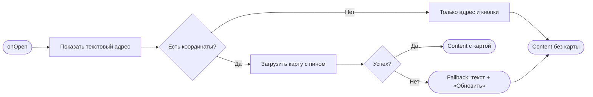
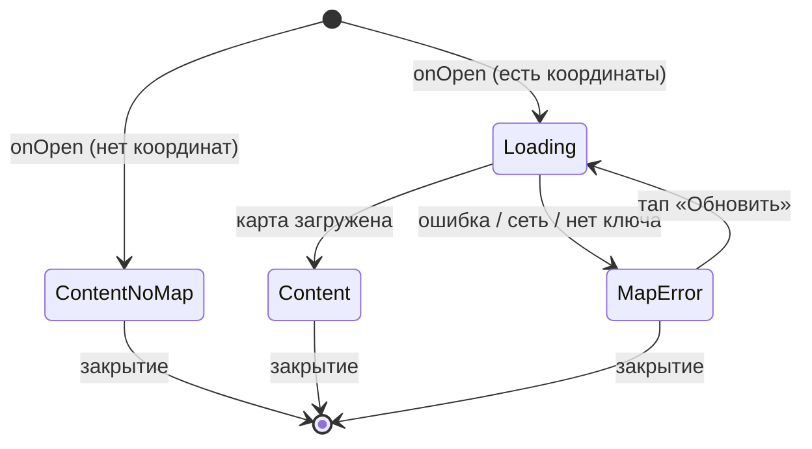

# Адрес студии

**ID:** BS-004  
**Тип:** Bottom Sheet  
**Домен:** 01. Просмотр классов  
**Приоритет:** Medium  
**Статус:** Черновик  
**Функциональные блоки:** FB-MAP-002 (Адрес и карта студии)  
**Зона авторизации:** АЗ  
**Дизайн-макет:** На основе `3-design-brief/BS-004-studio-address.md`

> **Основной носитель информации — текстовый адрес.** В отличие от SUP-клуба, где маршрут является ключевой информацией, для кулинарной студии карта — вспомогательный элемент. При отсутствии координат или ошибке загрузки карты всегда показывается текстовый адрес и кнопки для внешних карт.

---

## Содержание

- [История изменений](#история-изменений)
- [Обзор](#обзор)
- [Навигация](#навигация)
- [Входные данные](#входные-данные)
- [Применяемые логики](#применяемые-логики)
- [Свойства Bottom Sheet](#свойства-bottom-sheet)
- [Инициализация](#инициализация)
- [Используемые запросы](#используемые-запросы)
- [Макет экрана](#макет-экрана)
- [Элементы экрана](#элементы-экрана)
- [Состояния экрана](#состояния-экрана)
- [Действия пользователя](#действия-пользователя)
- [Связанные требования](#связанные-требования)
- [Критерии приёмки](#критерии-приёмки)

---

## История изменений

| Релиз | ТЗ | Описание изменений |
|-------|-----|-------------------|
| 0.1.0 | BS-004 «Адрес студии» | Первичная версия ТЗ на шторку с адресом и опциональной картой студии |

---

## Обзор

BS-004 — шторка (bottom sheet), показывающая адрес кулинарной студии «Шеф-стол» и, при наличии координат, интерактивную карту с пином студии. Вызывается с экранов SCR-003 «Карточка класса» и SCR-006 «Детали брони» тапом по адресу или мини-карте. Позволяет клиенту понять, где находится студия, и при необходимости построить маршрут через внешнее картографическое приложение.

**Ключевое отличие от «Волны»:** маршрут прогулки не показывается — только точка студии. Карта является вспомогательным элементом. Основным носителем информации всегда остаётся **текстовый адрес** (`studio_address`). При отсутствии координат или ошибке загрузки карты адрес и кнопки действий остаются доступны.

Контекст использования — кухня/студия, мобильный телефон: карта крупная, управление жестами, важная информация (адрес) дублируется текстом и читается при ярком освещении.

### User Story

> Как клиент, я хочу увидеть адрес студии на карте и при необходимости построить маршрут до неё, чтобы знать, куда идти на класс. (US-4)

### Бизнес-ценность

- Снятие неопределённости «куда идти» перед классом — меньше опозданий.
- Удобная навигация: возможность открыть адрес во внешнем картографическом приложении.
- Отказоустойчивость: при отсутствии координат или недоступности карты текстовый адрес и внешние кнопки остаются доступны.

---

## Навигация

### Входящая (откуда открывается)

| Источник | Триггер | Условие | Передаваемые параметры |
|----------|---------|---------|------------------------|
| SCR-003 «Карточка класса» | Тап по текстовому блоку адреса или мини-карте | Всегда | `studio_address`, `studio_lat` (опционально), `studio_lng` (опционально) |
| SCR-006 «Детали брони» | Тап по текстовому блоку адреса или мини-карте | Всегда | `studio_address`, `studio_lat` (опционально), `studio_lng` (опционально) |

### Исходящая (куда ведёт)

| Назначение | Триггер | Передаваемые параметры |
|------------|---------|------------------------|
| SCR-003 / SCR-006 | Закрытие (кнопка «Закрыть», свайп вниз, тап по бэкдропу) | — (возврат без изменений) |
| Внешнее картографическое приложение | Тап «Проложить маршрут» | `studio_lat`, `studio_lng` (или `studio_address`) |
| Внешнее картографическое приложение | Тап «Открыть в картах» | `studio_lat`, `studio_lng` (или `studio_address`) |

---

## Входные данные

| Название | Тип | Возможные значения | Описание |
|----------|-----|-------------------|----------|
| `studio_address` | Состояние (от SCR-003 / SCR-006) | строка | Полный почтовый адрес студии. Обязательное поле. |
| `studio_lat` | Состояние (от SCR-003 / SCR-006) | float / `null` | Широта студии для отображения карты. Опционально. |
| `studio_lng` | Состояние (от SCR-003 / SCR-006) | float / `null` | Долгота студии для отображения карты. Опционально. |
| `map_api_key` | Remote Config | строка | Ключ API картографического сервиса (Яндекс.Карты). Хранится как параметр конфигурации, не в коде. |

---

## Применяемые логики

| Логика | Элемент/Триггер | Описание |
|--------|-----------------|----------|
| LOGIC-006 Адрес студии | Интерактивная карта, кнопки handoff, текстовый fallback | Отображение текстового адреса; при наличии координат — интерактивная карта с пином; handoff во внешнее приложение; fallback на текст при недоступности карты; ключ из Remote Config. |

---

## Свойства Bottom Sheet

| Свойство | Значение |
|----------|----------|
| Высота | Расширенная (до ~90% экрана) при наличии карты; стандартная по контенту — если только текст |
| Закрытие свайпом | Да (свайп вниз; виден грабер) |
| Закрытие по тапу вне области | Да (тап по бэкдропу — BS-004 не критичное подтверждение) |
| Затемнение фона | Да (бэкдроп) |
| Кнопка закрытия | Да (в хедере справа, «✕ Закрыть») |

---

## Инициализация

При открытии BS-004 запросы к API не отправляются. Все данные (`studio_address`, координаты) передаются вызывающим экраном. Карта строится через внешний картографический сервис (Яндекс Static API / Maps JS API) с использованием ключа из Remote Config.

### Диаграмма загрузки



### Запросы при открытии

| № | Запрос | Критичный | Зависит от | Условие |
|---|--------|-----------|------------|---------|
| — | Запросы к нашему API отсутствуют | — | — | Данные переданы с SCR-003 / SCR-006 |

---

## Используемые запросы

### Интеграция: Яндекс Static API / Maps JS API

**Тип:** Внешний сервис (клиентский SDK / Static API)  
**Логика:** LOGIC-006 Адрес студии

**Триггер:** Открытие шторки BS-004 (если есть координаты).

**Параметры:**

| Параметр | Тип | Обязательность | Источник | Описание |
|----------|-----|----------------|----------|----------|
| ключ API | string | Да | `map_api_key` (Remote Config) | Авторизация картографического сервиса. |
| координаты студии | float | Да | `studio_lat`, `studio_lng` | Центр карты и позиция пина. |
| маркер (пин) | coords | Да | `studio_lat`, `studio_lng` | Метка студии на карте. |

**Обработка результата:**

| Результат | Условие | UI-реакция |
|-----------|---------|------------|
| Загрузка | Карта инициализируется | Скелетон на месте карты; текстовый адрес уже виден |
| Успех | Карта построена | Интерактивная карта с пином студии, зум/пан |
| Ошибка / офлайн / нет ключа | Карта не загрузилась | Fallback на текст: адрес + сообщение «Не удалось загрузить карту» + кнопка «Обновить» |

### Интеграция: Handoff во внешнее приложение

**Триггер:** Тап «Проложить маршрут» или «Открыть в картах».

| Действие | Параметры | Поведение |
|----------|-----------|-----------|
| «Проложить маршрут» | `studio_lat`, `studio_lng` (или `studio_address`) | Открывает внешнюю навигацию с построением маршрута до студии |
| «Открыть в картах» | `studio_lat`, `studio_lng` (или `studio_address`) | Открывает координаты/адрес во внешнем картографическом приложении |

При отсутствии координат обе кнопки используют текстовый адрес для поиска.

---

## Макет экрана

### Структура

```
┌─────────────────────────────────────┐
│                ▭▭▭                    │  ← грабер (swipe-to-close)
│  Адрес студии               ✕ Закрыть│  ← хедер
├─────────────────────────────────────┤
│                                      │
│  Лофт на ул. Заводской, 15           │  ← studio_address (крупно, текст)
│                                      │
│  ┌─────────────────────────────────┐ │
│  │  ░░░░░░░░░░░░░░░░░░░░░░░░░░░░░░░ │ │  ← интерактивная карта (если есть координаты)
│  │  ░░░░░░░░░░░░░░░░░░░░ 📍 ░░░░░ │ │  ← пин студии
│  │  ░░░░░░░░░░░░░░░░░░░░░░░░░░░░░░░ │ │     (зум/пан)
│  │  ░░░░░░░░░░░░░░░░░░░░░░░ [＋][－]│ │
│  └─────────────────────────────────┘ │
│                                      │
├─────────────────────────────────────┤
│  [ Проложить маршрут ]               │  ← навигация во внешнем приложении
│  [ Открыть в картах ]                │  ← просмотр адреса/точки на карте
└─────────────────────────────────────┘
        ░░░ бэкдроп (затемнение) ░░░
```

Если координаты не предоставлены, блок с картой скрывается, остаются текстовый адрес и кнопки действий.

### Компоненты

| Компонент | Описание | Обязательность |
|-----------|----------|----------------|
| Грабер | Полоска сверху, индикатор swipe-to-close | Да |
| Хедер | Заголовок «Адрес студии» + кнопка «✕ Закрыть» | Да |
| Текстовый адрес | Полный адрес студии, крупно и контрастно | Да |
| Интерактивная карта | Карта с пином студии, зум/пан | Опционально (при наличии координат) |
| Кнопка «Проложить маршрут» | Handoff во внешнюю навигацию | Да |
| Кнопка «Открыть в картах» | Handoff во внешнее картографическое приложение | Да |

---

## Элементы экрана

### 1. Хедер

| Элемент | Описание | Источник данных | Действие |
|---------|----------|-----------------|----------|
| Грабер | Индикатор перетаскивания, swipe-to-close | — | Свайп вниз → закрыть |
| Заголовок «Адрес студии» | Название шторки | Константа | — |
| Кнопка «✕ Закрыть» | Явная кнопка закрытия | — | Закрыть шторку → возврат на исходный экран |

### 2. Текстовый адрес

| Элемент | Описание | Источник данных |
|---------|----------|-----------------|
| Адрес студии | Полный почтовый адрес, крупно и контрастно (читаем при ярком свете) | `studio_address` |

**Логика:**
- Текстовый адрес — обязательный элемент, отображается всегда.
- Служит текстовым эквивалентом для доступности и fallback при отсутствии карты.
- Тап по адресу (если карта не показана) не дублирует действие — карта либо уже видна, либо её нет.

### 3. Интерактивная карта (опционально)

| Элемент | Описание | Источник данных | Действие |
|---------|----------|-----------------|----------|
| Полотно карты | Интерактивная карта с зумом/паном | `studio_lat`, `studio_lng`, `map_api_key` | Жесты зум/пан |
| Пин студии | Метка студии; по тапу — подпись с адресом | `studio_lat`, `studio_lng`, подпись `studio_address` | Тап по пину → короткая подпись с адресом |
| Контролы зума (＋/−) | Крупные тач-зоны | — | Изменение масштаба |

**Логика (LOGIC-006):**
- Карта строится только при наличии координат (`studio_lat`, `studio_lng`).
- При ошибке загрузки или отсутствии сети — fallback на текст и кнопки действий.
- Ключ API — из Remote Config, в макет не зашивается.

### 4. Кнопки действий

| Элемент | Описание | Действие |
|---------|----------|----------|
| Кнопка «Проложить маршрут» | Навигация до студии | Handoff во внешнее приложение с построением маршрута |
| Кнопка «Открыть в картах» | Просмотр адреса/точки | Handoff во внешнее картографическое приложение |

**Логика:**
- Обе кнопки доступны всегда, независимо от наличия карты.
- При отсутствии координат используется текстовый адрес для поиска.
- При неустановленном внешнем приложении — деградация в веб-версию; при полной неудаче — системная обработка / снек.

---

## Состояния экрана

### Таблица состояний

| Состояние | Условие | Отображение |
|-----------|---------|-------------|
| Loading | Карта инициализируется | Скелетон на месте карты; текстовый адрес уже виден |
| Content (с картой) | Координаты есть, карта загружена | Текстовый адрес + интерактивная карта с пином + кнопки |
| Content (без карты) | Координат нет | Текстовый адрес + кнопки действий |
| MapError | Ошибка загрузки карты / нет сети | Вместо карты — сообщение «Не удалось загрузить карту» + кнопка «Обновить»; адрес и кнопки действий доступны |

### Диаграмма переходов



---

## Действия пользователя

| Действие | Элемент | Триггер | Результат |
|----------|---------|---------|-----------|
| Закрыть свайпом | Грабер / полотно шторки | Swipe вниз | Возврат на исходный экран |
| Закрыть по бэкдропу | Затемнённый фон | Tap вне шторки | Возврат на исходный экран |
| Закрыть кнопкой | «✕ Закрыть» | Tap | Возврат на исходный экран |
| Масштабировать карту | Контролы зума / жесты | Tap / pinch | Изменение масштаба |
| Двигать карту | Полотно карты | Pan / drag | Перемещение по карте |
| Проложить маршрут | «Проложить маршрут» | Tap | Handoff во внешнюю навигацию |
| Открыть в картах | «Открыть в картах» | Tap | Handoff во внешнее картографическое приложение |
| Повторить загрузку карты | «Обновить» (в MapError) | Tap | Повторная попытка загрузки карты |

---

## Связанные требования

### Функциональные (FR-*)

| ID | Название | Приоритет |
|----|----------|-----------|
| FR-9a | Карточка класса со всеми параметрами, включая адрес студии | Must |

### Нефункциональные (NFR-*)

| ID | Название | Приоритет |
|----|----------|-----------|
| NFR-26 | Отображение адреса студии; fallback на текст при недоступности карты | Средний |

### UI/UX

| ID | Название |
|----|----------|
| US-4 | Клиент видит все детали класса перед записью (включая адрес) |

---

## Критерии приёмки

### Позитивные

| ID | Критерий | P |
|----|----------|----|
| AC-001 | **Дано** API передал координаты, **Когда** BS-004 открыта, **Тогда** показан текстовый адрес и интерактивная карта с пином студии. | P0 |
| AC-002 | **Дано** API не передал координаты, **Когда** BS-004 открыта, **Тогда** показан только текстовый адрес и кнопки действий. | P0 |
| AC-003 | **Дано** открыта BS-004, **Когда** клиент тапает «Проложить маршрут», **Тогда** открывается внешняя навигация с маршрутом до студии. | P1 |
| AC-004 | **Дано** открыта BS-004, **Когда** клиент тапает «Открыть в картах», **Тогда** координаты/адрес открываются во внешнем картографическом приложении. | P1 |

### Негативные

| ID | Критерий | P |
|----|----------|----|
| AC-N01 | **Дано** карта не загрузилась (сеть, ошибка API), **Когда** BS-004 открыта, **Тогда** вместо карты — сообщение «Не удалось загрузить карту» и кнопка «Обновить»; текстовый адрес и кнопки действий доступны. | P1 |

### Граничные

| ID | Критерий | P |
|----|----------|----|
| AC-E01 | **Дано** закрытие свайпом или тапом по бэкдропу, **Когда** BS-004 открыта, **Тогда** возврат на исходный экран без изменений. | P0 |
| AC-E02 | **Дано** внешнее картографическое приложение не установлено, **Когда** тап «Проложить маршрут», **Тогда** деградация в веб-версию; при полной неудаче — снек. | P2 |

---
