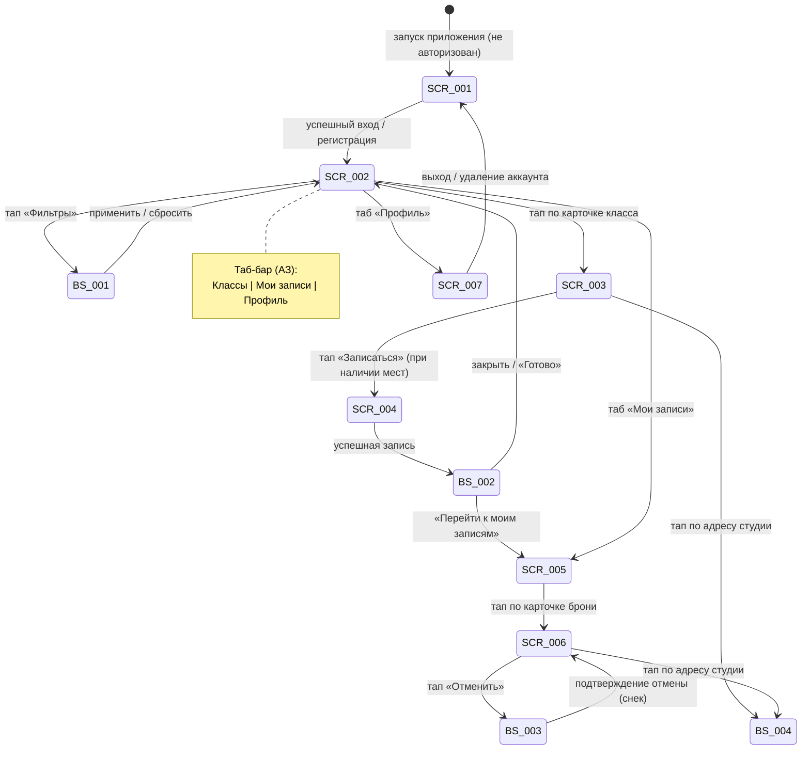

# ТЗ на мобильное приложение «Шеф-стол»

Детальное техническое задание на клиентское мобильное приложение «Шеф-стол» (самостоятельная запись на кулинарные классы, роль «Клиент»).

**Статус:** Актуален · **Версия:** 1.0 · **Дата:** 2026-07-05

ТЗ детализирует требования до уровня реализации: каждый экран/шторка описаны по шаблону `_SCREEN_TEMPLATE.md`, переиспользуемая логика — по `_LOGIC_TEMPLATE.md`.

**Источники:** Бизнес-требования · Функциональные требования · Нефункциональные требования · Use cases · User stories · Дизайн-брифы (3-design-brief) · Модель данных · API-последовательности (4-design)

---

## Экраны и шторки

| ID | Экран / Шторка | Тип | Зона | Приоритет | ТЗ |
|----|----------------|-----|------|-----------|----|
| SCR-001 | Регистрация / Вход | Экран | НЗ | Critical | `SCR-001-registration.md` |
| SCR-002 | Список классов | Экран | АЗ | Critical | `SCR-002-slot-list.md` |
| BS-001 | Фильтры | Bottom Sheet | АЗ | High | `BS-001-filters.md` |
| SCR-003 | Карточка класса | Экран | АЗ | Critical | `SCR-003-slot-card.md` |
| SCR-004 | Оформление записи | Экран | АЗ | Critical | `SCR-004-booking.md` |
| BS-002 | Подтверждение записи (экран успеха) | Экран | АЗ | High | `BS-002-booking-success.md` |
| SCR-005 | Мои бронирования | Экран | АЗ | Critical | `SCR-005-my-bookings.md` |
| SCR-006 | Детали брони + отмена | Экран | АЗ | Critical | `SCR-006-booking-details.md` |
| BS-003 | Подтверждение отмены | Bottom Sheet | АЗ | High | `BS-003-cancel-confirm.md` |
| BS-004 | Адрес студии | Bottom Sheet | АЗ | Medium | `BS-004-studio-address.md` |
| SCR-007 | Профиль клиента | Экран | АЗ | Medium | `SCR-007-profile.md` |

**Зоны:** НЗ — неавторизованная, АЗ — авторизованная.

---

## Переиспользуемые логики

Бизнес- и UI-логика, общая для нескольких экранов, будет вынесена в папку `09_Логики/`. Каждая логика описана по шаблону `_LOGIC_TEMPLATE.md`. Экраны подключают их через секцию «Применяемые логики».

Планируемые логики для MVP (8 шт.):
1. **LOGIC-001** — OTP-авторизация (SCR-001, SCR-007)
2. **LOGIC-002** — Расчёт доступности: `max_seats = min(free_seats, program.capacity_cap, 3)` и `rental_count ≤ free_rental_kits` (SCR-004)
3. **LOGIC-003** — Расчёт итоговой цены: `price_total = price × seats_count + rental_price × rental_count` (SCR-004, BS-002, SCR-006)
4. **LOGIC-004** — Правило отмены: определение ранней (≥2 ч) / поздней (<2 ч) с границей «ровно 2 часа = ранняя» (SCR-006, BS-003)
5. **LOGIC-005** — Фильтрация слотов: множественный выбор типа программы и шефа (SCR-002, BS-001)
6. **LOGIC-006** — Адрес студии: отображение текстового адреса и опциональной карты с fallback (SCR-003, SCR-006, BS-004)
7. **LOGIC-007** — Запрос push-разрешения после первой успешной записи (BS-002)
8. **LOGIC-008** — Паттерн состояний экрана (Loading / Content / Empty / Error) и единый Error/Retry (все экраны)

---

## Навигация

Полная карта переходов между экранами (роль «Клиент»):

---

## Соглашения

- **Платформа:** нативное мобильное приложение (iOS + Android), распространение через App Store / Google Play. Доступ к нативному push (APNs/FCM) и защищённому хранилищу (Keychain / Keystore).
- **API:** все запросы REST, контракты в `../api/`. В ТЗ указываются точные operationId, метод и путь.
- **Числа не хардкодятся:** потолки программ, прокатный фонд (15 наборов), цены, лимиты берутся из данных слота/программы. Клиент не пересчитывает `price_total` (сервер — источник истины).
- **Дизайн-макеты:** на момент MVP не зафиксированы. ТЗ опирается на функционально-структурные требования из `3-design-brief/`. Визуальный язык определяет дизайнер.