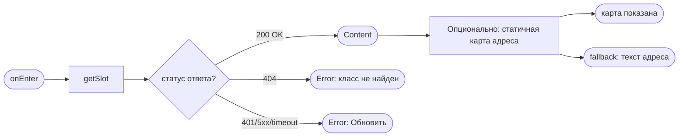
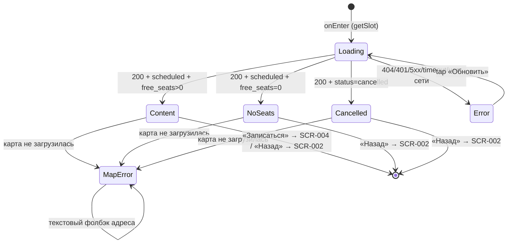

# Карточка класса

**ID:** SCR-003  
**Тип:** Экран  
**Домен:** 01. Просмотр классов  
**Приоритет:** Critical  
**Статус:** Черновик  
**Функциональные блоки:** FB-SLOT-001 (Просмотр класса), FB-SLOT-002 (Переход к записи)  
**Зона авторизации:** АЗ  
**Дизайн-макет:** На основе `3-design-brief/SCR-003-slot-card.md`

---

## Содержание

- [История изменений](#история-изменений)
- [Обзор](#обзор)
- [Навигация](#навигация)
- [Входные данные](#входные-данные)
- [Применяемые логики](#применяемые-логики)
- [Инициализация](#инициализация)
- [Используемые запросы](#используемые-запросы)
- [Макет экрана](#макет-экрана)
- [Элементы экрана](#элементы-экрана)
- [Состояния экрана](#состояния-экрана)
- [Действия пользователя](#действия-пользователя)
- [Связанные требования](#связанные-требования)
- [Критерии приёмки](#критерии-приёмки)

---

## История изменений

| Релиз | ТЗ | Описание изменений |
|-------|-----|-------------------|
| 0.1.0 | SCR-003 «Карточка класса» | Первичная версия ТЗ на основе дизайн-брифа SCR-003 v0.1 |

---

## Обзор

Экран показывает **все параметры одного кулинарного класса (слота)** — дату/время, программу и её тип, описание (при наличии), длительность, шефа, цену за место, доступность рабочих мест и прокатных наборов, адрес студии. Назначение — дать клиенту полную информацию для принятия решения о записи и предоставить единственный очевидный следующий шаг: кнопку «Записаться», либо понятно объяснить, почему запись сейчас невозможна (мест нет / класс отменён).

Это вложенный экран без таб-бара — промежуточный шаг между списком классов (SCR-002) и оформлением записи (SCR-004). Контекст использования — кухня/студия, возможна спешка, мокрые руки: интерфейс должен быть «крупным и контрастным», ключевые числа читаться с первого взгляда.

### User Story

> Как клиент, я хочу открыть карточку класса со всеми параметрами, чтобы понять детали перед записью и выбрать подходящий класс. (US-4)

### Бизнес-ценность

- Снижает число ошибочных записей: клиент принимает решение, видя программу, шефа, цену, доступность инвентаря.
- Сокращает путь к записи до ≤ 3 экранов (NFR-2): SCR-002 → SCR-003 → SCR-004.
- Честно показывает отсутствие мест и отмену класса без давления (P6), сохраняя доверие к сервису.

---

## Навигация

### Входящая (откуда открывается)

| Источник | Триггер | Условие | Передаваемые параметры |
|----------|---------|---------|------------------------|
| SCR-002 Список классов | Тап по карточке класса | Всегда (карточка кликабельна только при `free_seats > 0` на SCR-002) | `slotId` |

### Исходящая (куда ведёт)

| Назначение | Триггер | Передаваемые параметры |
|------------|---------|------------------------|
| SCR-004 Оформление записи | Тап «Записаться» (активна при `free_seats > 0`) | `slotId` |
| BS-004 Адрес студии | Тап по адресу / кнопке «Открыть карту» (если координаты доступны) | `slotId` |
| SCR-002 Список классов | Тап «Назад» / системный жест | — |

> **Примечание (снеки действия записи):** на SCR-003 «Записаться» — это **только переход** на SCR-004 (передаётся `slotId`); запрос на создание брони здесь **не отправляется**. Все снеки/нотисы ошибок самого действия записи (нет мест / слот закрыт / гонка-овербукинг) обрабатываются **на SCR-004**.

---

## Входные данные

| Название | Тип | Возможные значения | Описание |
|----------|-----|-------------------|----------|
| `slotId` | Состояние (параметр навигации) | UUID | Идентификатор класса, выбранного на SCR-002. Используется как path-параметр для [getSlot](#getslot). |

---

## Применяемые логики

| Логика | Элемент/Триггер | Описание |
|--------|-----------------|----------|
| LOGIC-002 Расчёт доступности | CTA «Записаться», блоки «Места» / «Прокатные наборы» | Определяет активность CTA (`free_seats > 0`) и отображение доступности мест/прокатных наборов; числа подставляются из данных класса, не хардкодятся. |
| LOGIC-006 Адрес студии | Блок «Адрес студии» | Текстовый адрес + опциональная статическая карта с пином; состояния загрузки/ошибки и текстовый fallback. |
| LOGIC-008 Паттерн состояний экрана | Весь экран | Loading / Content / Error и кнопка «Обновить» поверх ответа [getSlot](#getslot). |

---

## Инициализация

> **Примечание:** При открытии экрана отправляется один запрос [getSlot](#getslot) по `slotId`. Карта адреса рендерится из `studio_address` и, опционально, координат уже полученного ответа (отдельным запросом к API приложения не идёт — статичный тайл карты грузится через картографический сервис, см. LOGIC-006).

### Диаграмма загрузки



### Запросы при открытии

| № | Запрос | Критичный | Зависит от | Условие |
|---|--------|-----------|------------|---------|
| 1 | [getSlot](#getslot) | Да | — | Всегда |
| 2 | Статичный тайл карты (Яндекс Static API) | Нет | №1 | `studio_lat` и `studio_lng` не `null` |

> Полное описание запросов см. в секции [Используемые запросы](#используемые-запросы).

---

## Используемые запросы

> Все API-запросы экрана с полным описанием параметров и обработки ответов. REST; GraphQL не используется.

### getSlot

**Тип:** REST  
**Метод:** GET  
**Спецификация:** `../api/slots/api.yaml` → `getSlot` (`GET /slots/{slotId}`)

**Триггер:** Инициализация

**Параметры:**

| Параметр | Тип | Обязательность | Источник | Описание |
|----------|-----|----------------|----------|----------|
| `slotId` | string (uuid), path | Да | Параметр навигации из SCR-002 | Идентификатор запрашиваемого класса. |

**Возвращаемая модель `Slot`** (`../api/slots/models.yaml` → `Slot`):

| Поле | Тип | Использование на экране |
|------|-----|-------------------------|
| `id` | uuid | Идентификатор; передаётся далее в SCR-004 / BS-004. |
| `start_at` | date-time | Дата и время начала (крупно, контрастно). |
| `program.name` | string | Название программы (меню), например «Итальянская паста». |
| `program.type` | enum `beginner` / `experienced` | Бейдж типа программы (новичковая / опытная) с текстовой подписью. |
| `program.description` | string / null | Описание программы (если есть); при отсутствии блок скрывается. |
| `program.duration_min` | integer / null | Длительность класса в минутах; показывается, если значение есть. |
| `chef.name` | string | Имя шефа (без контактов). |
| `total_seats` | integer | Всего рабочих мест. |
| `free_seats` | integer | Свободно рабочих мест (ключевое число; влияет на CTA). |
| `free_rental_kits` | integer | Свободно прокатных наборов. |
| `price` | integer (RUB) | Цена за одно место. |
| `studio_address` | string | Адрес студии (обязательный текстовый блок). |
| `studio_lat` / `studio_lng` | float / null | Координаты студии для карты; опциональны. |
| `status` | enum `scheduled` / `cancelled` | `cancelled` → состояние «Класс отменён». |

> `rental_price` приходит в модели, но на SCR-003 не отображается (используется при расчёте итоговой суммы на SCR-004).

**Обработка ответа:**

| Результат | Условие | UI-реакция |
|-----------|---------|------------|
| Загрузка | — | Скелетон-шиммер в форме блоков параметров + место под CTA |
| Успех | `status = scheduled` И `free_seats > 0` | Состояние **Content**: все параметры + активный CTA «Записаться» |
| Успех | `status = scheduled` И `free_seats = 0` | Состояние **NoSeats**: все параметры; CTA неактивна, пометка «Мест нет» |
| Успех | `status = cancelled` | Состояние **Cancelled**: параметры с пометкой «Класс отменён»; CTA неактивна/скрыта |
| HTTP 404 | Класс не найден/удалён | Состояние **Error**: «Не удалось загрузить. Проверьте соединение и попробуйте снова.» + «Обновить» |
| HTTP 401 | — | Error state + «Обновить» (повторная авторизация по флоу приложения) |
| HTTP 5xx / default | — | Error state с кнопкой «Обновить» |
| Сеть | Нет соединения / timeout | Error state с кнопкой «Обновить» |

---

## Макет экрана

### Структура

```
┌─────────────────────────────────┐
│ ‹ Назад      Карточка класса     │  ← фикс. хедер
├─────────────────────────────────┤
│                                  │
│  Сб, 20 июня · 10:00             │  ← start_at (крупно)
│                                  │
│  ┌─────────────────────────────┐ │
│  │ Программа                   │ │
│  │ Итальянская паста           │ │  ← program.name
│  │ [ Новичковая ] · ~180 мин   │ │  ← program.type · duration_min (если есть)
│  │ Описание: готовим пасту      │ │  ← program.description (если есть)
│  └─────────────────────────────┘ │
│  ┌─────────────────────────────┐ │
│  │ Шеф                         │ │
│  │ Анна                        │ │  ← chef.name
│  └─────────────────────────────┘ │
│  ┌─────────────────────────────┐ │
│  │ 📍 Адрес студии              │ │  ← studio_address (текст)
│  │ Лофт на ул. Заводской, 15   │ │
│  │ (опционально: статичная     │ │  ← если есть координаты
│  │  карта с пином)              │ │
│  │ [ Открыть карту › ]         │ │  ← тап → BS-004
│  └─────────────────────────────┘ │
│  ┌─────────────────────────────┐ │
│  │ Места                       │ │
│  │ Свободно 4 из 8             │ │  ← free_seats / total_seats
│  └─────────────────────────────┘ │
│  ┌─────────────────────────────┐ │
│  │ Прокатные наборы            │ │
│  │ Свободно 5                  │ │  ← free_rental_kits (числом)
│  └─────────────────────────────┘ │
│  ┌─────────────────────────────┐ │
│  │ Цена                        │ │
│  │ 1200 ₽ за место             │ │  ← price (per-seat)
│  └─────────────────────────────┘ │
│  Оплата на месте: наличные или   │  ← напоминание (foundations §6)
│  перевод на карту.               │
│                                  │
├─────────────────────────────────┤
│        [   Записаться   ]        │  ← фикс. CTA
└─────────────────────────────────┘
```

### Компоненты

| Компонент | Описание | Обязательность |
|-----------|----------|----------------|
| Хедер «Назад» + заголовок | Фикс. хедер, кнопка «Назад» → SCR-002, заголовок «Карточка класса» / название программы | Да |
| Блок «Дата и время» | `start_at`, крупно и контрастно | Да |
| Блок «Программа» | `program.name` + бейдж `program.type` + длительность `program.duration_min` (опционально) + описание `program.description` (опционально) | Да |
| Блок «Шеф» | `chef.name` | Да |
| Блок «Адрес студии» | Текстовый адрес `studio_address`; опциональная статическая карта с пином при наличии координат | Да |
| Блок «Места» | «Свободно `free_seats` из `total_seats`» | Да |
| Блок «Прокатные наборы» | «Свободно `free_rental_kits` прокатных» | Да |
| Блок «Цена» | «`price` ₽ за место» | Да |
| Напоминание об офлайн-оплате | Текст из foundations §6 | Да |
| Фикс. CTA «Записаться» | Во всю ширину, всегда виден | Да |

---

## Элементы экрана

> **Примечания:**
> - Числа не хардкодятся — подставляются из данных класса.
> - Состояния не передаются только цветом — дублируются текстом/иконкой/формой.

### 1. Хедер

| Элемент | Описание | Источник данных | Валидация | Действие |
|---------|----------|-----------------|-----------|----------|
| Кнопка «Назад» | Возврат к списку | — | — | Возврат на SCR-002 |
| Заголовок | «Карточка класса» / `program.name` | `program.name` из [getSlot](#getslot) | — | — |

### 2. Параметры класса (скролл-контент)

| Элемент | Описание | Источник данных | Валидация | Действие |
|---------|----------|-----------------|-----------|----------|
| Дата и время | Старт класса, крупно | `start_at` из [getSlot](#getslot) | — | — |
| Название программы | Заголовок блока «Программа» | `program.name` из [getSlot](#getslot) | — | — |
| Бейдж типа программы | «Новичковая» / «Опытная» (текст, не только цвет) | `program.type` из [getSlot](#getslot) | — | — |
| Длительность | «~`program.duration_min` мин» | `program.duration_min` из [getSlot](#getslot) | — | — |
| Описание программы | Текстовое описание (блюда, техники) | `program.description` из [getSlot](#getslot) | — | — |
| Шеф | Имя, без контактов | `chef.name` из [getSlot](#getslot) | — | — |
| Адрес студии (текст) | Полный адрес | `studio_address` из [getSlot](#getslot) | — | Тап → BS-004 |
| Статичная карта (опционально) | Превью карты с пином студии | `studio_lat`, `studio_lng` из [getSlot](#getslot) | — | Тап → BS-004 |
| Кнопка «Открыть карту» | Ссылка под адресом/картой | — | — | Открыть BS-004 |
| Места | «Свободно `free_seats` из `total_seats`» | `free_seats`, `total_seats` из [getSlot](#getslot) | — | — |
| Прокатные наборы | «Свободно `free_rental_kits` прокатных» | `free_rental_kits` из [getSlot](#getslot) | — | — |
| Цена | «`price` ₽ за место» | `price` из [getSlot](#getslot) | — | — |
| Напоминание об оплате | «Оплата на месте: наличные или перевод на карту.» | Статичный текст (foundations §6) | — | — |

**Логика:**
- Блок «Длительность»: показывается только при наличии `program.duration_min`; при отсутствии скрывается без «прочерков».
- Блок «Описание»: показывается только при наличии `program.description`; при отсутствии скрывается.
- Блоки «Места» / «Прокатные наборы»: LOGIC-002 — числа из данных класса; детальный лимит `min(free_seats, program.capacity_cap, 3)` применяется на SCR-004.
- Блок «Адрес студии»: LOGIC-006 — текстовый адрес обязателен; при наличии координат — опциональная статическая карта с пином. При ошибке/офлайн — текстовый fallback (адрес + ссылка «Открыть в картах»).

### 3. Фикс. нижний CTA

| Элемент | Описание | Источник данных | Валидация | Действие |
|---------|----------|-----------------|-----------|----------|
| Кнопка «Записаться» | Primary, во всю ширину | `free_seats`, `status` из [getSlot](#getslot) | — | Переход на SCR-004 с `slotId` |
| Пометка «Мест нет» | Текст рядом/на кнопке при недоступности | `free_seats` из [getSlot](#getslot) | — | — |
| Пометка «Класс отменён» | Текст при `status = cancelled` | `status` из [getSlot](#getslot) | — | — |

**Логика:**
- Кнопка «Записаться»: LOGIC-002 — при тапе на активную кнопку → переход на SCR-004, передаётся `slotId`. Это **только переход**: создание брони (`createBooking`) и связанные снеки/нотисы ошибок действия — на SCR-004.

**Условия доступности:**
- Кнопка «Записаться» **активна**, если: `status = scheduled` И `free_seats > 0`.
- Кнопка «Записаться» **неактивна** с пометкой «Мест нет» (дублируется текстом, не только прозрачностью), если: `status = scheduled` И `free_seats = 0`. Тап не выполняет переход.
- Кнопка «Записаться» **неактивна/скрыта** с пометкой «Класс отменён», если: `status = cancelled`.

---

## Состояния экрана

### Таблица состояний

| Состояние | Условие | Отображение |
|-----------|---------|-------------|
| Loading | Ожидание ответа [getSlot](#getslot) | Скелетон-шиммер в форме блоков + место под CTA |
| Content | 200 OK, `status = scheduled`, `free_seats > 0` | Все параметры + активный CTA «Записаться» |
| NoSeats | 200 OK, `status = scheduled`, `free_seats = 0` | Все параметры; CTA неактивна, пометка «Мест нет» |
| Cancelled | 200 OK, `status = cancelled` | Все параметры + пометка «Класс отменён»; CTA неактивна/скрыта |
| Error | 404 / 401 / 5xx / timeout / нет сети | Заглушка «Не удалось загрузить. Проверьте соединение и попробуйте снова.» + «Обновить» |
| MapError | Карта не загрузилась (подсостояние карты) | Вместо карты — текст адреса + ссылка «Открыть в картах»; остальной экран и CTA работают |

### Диаграмма переходов



> **Примечание (Empty неприменим).** `getSlot` возвращает один объект `Slot` или 404. Состояния «успех, но пусто» не существует. Недоступность класса (нет мест / отменён) — это варианты Content с изменённым CTA, а не Empty. 404 — это Error.

---

## Действия пользователя

| Действие | Элемент | Триггер | Результат |
|----------|---------|---------|-----------|
| Записаться | Кнопка «Записаться» | Tap | При `free_seats > 0` и `status = scheduled` → переход на SCR-004 с `slotId` |
| Записаться (заблокировано) | Кнопка «Записаться» | Tap | При `free_seats = 0` или `status = cancelled` → перехода нет (кнопка неактивна) |
| Открыть адрес на карте | Статичная карта / «Открыть карту» | Tap | Открытие шторки BS-004 с `slotId` |
| Вернуться | Кнопка «Назад» / системный жест | Tap / Swipe | Возврат на SCR-002 |
| Повторить загрузку | Кнопка «Обновить» (Error) | Tap | Повторный запрос [getSlot](#getslot) |

---

## Связанные требования

### Функциональные (FR-*)

| ID | Название | Приоритет |
|----|----------|-----------|
| FR-9a | Карточка класса со всеми параметрами (дата/время, программа и тип, шеф, цена, всего/свободно мест, доступность прокатных наборов, адрес студии) | Must |
| FR-30 | Показ цены класса и фиксация записи; оплата офлайн (наличные / перевод) | Must |

### Интеграции

| ID | Название | Приоритет |
|----|----------|-----------|
| getSlot | `GET /slots/{slotId}` — полные данные класса (`../api/slots/api.yaml`) | Must |
| Яндекс Static API | Статичный превью карты адреса (см. LOGIC-006) | Must |

### UI/UX

| ID | Название |
|----|----------|
| US-4 | Клиент видит все детали класса перед записью |

### Нефункциональные (NFR-*)

| ID | Название | Приоритет |
|----|----------|-----------|
| NFR-1 | Mobile-first для кухни/студии: крупные числа, контраст, тач-зоны ≥ 44–48 pt (foundations §3) | Высокий |

### Данные

| ID | Название | Приоритет |
|----|----------|-----------|
| Модель `Slot` | (`../api/slots/models.yaml`) — read-only | Critical |
| `chef.name` | без контактов шефа (foundations §8.2) | Critical |

---

## Критерии приёмки

### Позитивные сценарии

| ID | Критерий | Приоритет |
|----|----------|-----------|
| AC-001 | **Дано** клиент открыл карточку класса со `status = scheduled` и `free_seats > 0`, **Когда** экран загружен, **Тогда** показаны дата/время начала, название и тип программы, имя шефа, цена за место, «свободно из всего» мест, число свободных прокатных наборов, адрес студии (текстом) и, опционально, карта. | P0 |
| AC-002 | **Дано** класс с `free_seats > 0` и `status = scheduled`, **Когда** клиент тапает «Записаться», **Тогда** происходит переход на SCR-004 с передачей `slotId`. | P0 |
| AC-003 | **Дано** в данных класса присутствует `program.duration_min`, **Когда** экран загружен, **Тогда** показан блок длительности; **Дано** `program.duration_min` отсутствует, **Тогда** блок скрыт без прочерка. | P1 |
| AC-004 | **Дано** клиент видит блок цены, **Когда** экран загружен, **Тогда** показано напоминание «Оплата на месте: наличные или перевод на карту.» (FR-30). | P0 |
| AC-005 | **Дано** клиент на карточке класса, **Когда** тапает по адресу или «Открыть карту», **Тогда** открывается шторка BS-004. | P1 |
| AC-006 | **Дано** клиент на карточке класса, **Когда** тапает «Назад», **Тогда** возврат к списку SCR-002. | P1 |

### Негативные сценарии

| ID | Критерий | Приоритет |
|----|----------|-----------|
| AC-N01 | **Дано** ответ [getSlot](#getslot) завершился ошибкой (404 / 5xx / нет сети), **Когда** открытие экрана, **Тогда** показана заглушка «Не удалось загрузить. Проверьте соединение и попробуйте снова.» и кнопка «Обновить»; **Когда** клиент тапает «Обновить», **Тогда** запрос повторяется. | P0 |
| AC-N02 | **Дано** к моменту открытия класс заполнен (`status = scheduled`, `free_seats = 0`), **Когда** экран загружен, **Тогда** **все параметры класса остаются видны без изменений**, **меняется только CTA**: «Записаться» неактивна с текстовой пометкой «Мест нет» (дублируется текстом, не только прозрачностью); **Когда** клиент тапает по кнопке, **Тогда** перехода не происходит и снек действия не показывается. | P0 |
| AC-N03 | **Дано** к моменту открытия класс отменён (`status = cancelled`), **Когда** экран загружен, **Тогда** **все параметры класса остаются видны**, **меняется только CTA**: «Записаться» неактивна или скрыта с пометкой «Класс отменён», переход на запись недоступен. | P0 |

### Граничные условия (Edge Cases)

| ID | Критерий | Приоритет |
|----|----------|-----------|
| AC-E01 | **Дано** карта адреса не загрузилась (ошибка / офлайн / нет координат), **Когда** экран открыт, **Тогда** вместо карты показан текстовый адрес (`studio_address`) и ссылка «Открыть в картах», а остальные параметры и кнопка «Записаться» остаются доступны. | P0 |
| AC-E02 | **Дано** включено системное увеличение шрифта, **Когда** экран открыт, **Тогда** layout не ломается, ключевые числа и CTA остаются читаемыми и не перекрыты (foundations §7). | P2 |
| AC-E03 | **Дано** `free_seats = 1` (последнее место), **Когда** экран загружен, **Тогда** показано «Свободно 1 из `total_seats`» и CTA «Записаться» активна. | P2 |
| AC-E04 | **Дано** `free_rental_kits = 0` при `free_seats > 0`, **Когда** экран загружен, **Тогда** показано «Свободно 0 прокатных», CTA «Записаться» остаётся активной (запись со своим инвентарём возможна; лимит проката применяется на SCR-004). | P2 |

---
