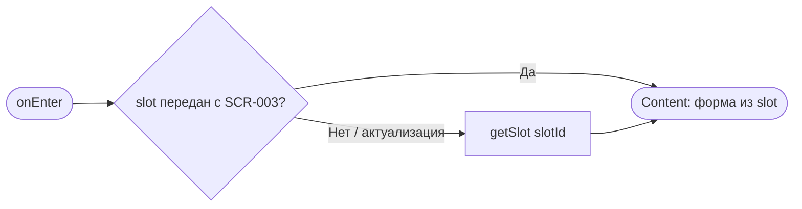
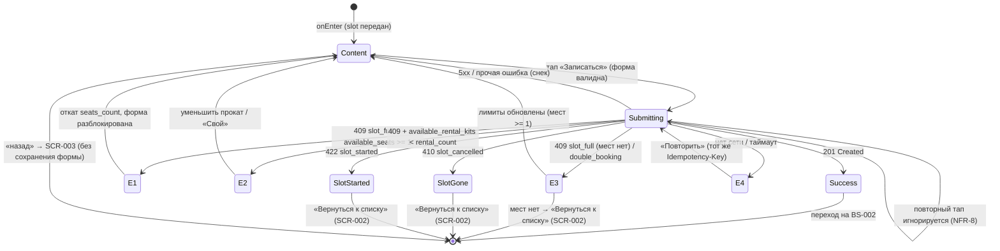

# Оформление записи

**ID:** SCR-004  
**Тип:** Экран  
**Домен:** 02. Запись на класс  
**Приоритет:** Critical  
**Статус:** Черновик  
**Функциональные блоки:** FB-BOOKING-001 (Запись на класс), FB-BOOKING-002 (Выбор инвентаря)  
**Зона авторизации:** АЗ  
**Дизайн-макет:** На основе `3-design-brief/SCR-004-booking.md`

---

## Содержание

- [История изменений](#история-изменений)
- [Обзор](#обзор)
- [Навигация](#навигация)
- [Входные данные](#входные-данные)
- [Применяемые логики](#применяемые-логики)
- [Инициализация](#инициализация)
- [Используемые запросы](#используемые-запросы)
- [Макет экрана](#макет-экрана)
- [Элементы экрана](#элементы-экрана)
- [Состояния экрана](#состояния-экрана)
- [Действия пользователя](#действия-пользователя)
- [Связанные требования](#связанные-требования)
- [Критерии приёмки](#критерии-приёмки)

---

## История изменений

| Релиз | ТЗ | Описание изменений |
|-------|-----|-------------------|
| 0.1.0 | SCR-004 «Оформление записи» | Первоначальная документация экрана |

---

## Обзор

Экран собирает параметры брони кулинарного класса: число мест (1–3), вариант инвентаря на каждое место (свой или прокатный), пищевые ограничения (опционально) и итоговую цену. Это **ключевой экран** клиентского сценария: на нём пересекаются два независимых лимита (рабочие места и прокатный фонд) и обрабатываются конкурентные записи.

Экран — **последний шаг перед подтверждением** в потоке: список классов → карточка → оформление → подтверждение. Соблюдается правило **≤ 3 экранов до подтверждения** (NFR-2): от SCR-002 до BS-002 клиент проходит карточку (SCR-003) и этот экран, без лишних шагов. Таб-бар скрыт — это вложенный экран потока.

Оплата офлайн: экран показывает итоговую цену (превью) и фиксирует запись, онлайн-оплаты нет. Итоговая цена созданной брони берётся из серверного ответа (`price_total`), клиент её не пересчитывает.

### User Story

> Как **Клиент**, я хочу записаться на выбранный кулинарный класс, указать число мест (себя и до 2 гостей), выбрать для каждого инвентарь (свой или прокатный), указать пищевые ограничения, увидеть итоговую цену и подтвердить бронь, чтобы гарантированно занять место.

### Бизнес-ценность

- Замена ручной записи через WhatsApp и Google-таблицу — самостоятельная запись клиента.
- Исключение двойных броней и овербукинга (главная боль заказчика, NFR-8) за счёт серверного арбитража лимитов при атомарном создании брони.
- Прозрачность стоимости до подтверждения (цена места + отдельный тариф проката), офлайн-оплата.
- Сбор пищевых ограничений заранее (FR-50), чтобы шеф мог подготовиться.

---

## Навигация

### Входящая (откуда открывается)

| Источник | Триггер | Условие | Передаваемые параметры |
|----------|---------|---------|------------------------|
| SCR-003 «Карточка класса» | Тап на кнопку «Записаться» | Только при наличии свободных мест (на SCR-003 кнопка неактивна, если мест нет) | `slotId` |

> Deep link и push на этот экран не ведут — экран открывается только из потока записи.

### Исходящая (куда ведёт)

| Назначение | Триггер | Передаваемые параметры |
|------------|---------|------------------------|
| BS-002 «Подтверждение записи» | Успешное создание брони (`createBooking` → 201) | `booking` (объект `CreateBookingResponse`: `Booking` с серверным `price_total`, `is_first_booking`, `reminder_hours`) |
| SCR-003 «Карточка класса» | Системный/экранный «назад» | — (незавершённая бронь **не сохраняется**) |
| SCR-002 «Список классов» | Кнопка «Вернуться к списку» в состоянии, когда мест не осталось (E3) | — |

---

## Входные данные

| Название | Тип | Возможные значения | Описание |
|----------|-----|-------------------|----------|
| `slotId` | Параметр навигации | UUID | Идентификатор класса, переданный с SCR-003. |
| `slot` | Кэш / Состояние | объект `Slot` | Данные класса: `start_at`, `program` (с `capacity_cap`), `chef`, `free_seats`, `free_rental_kits`, `price`, `rental_price`, `status`. Источник всех чисел экрана — **без хардкода**. |
| `seats_count` | Состояние формы | `1…max_seats` | Число мест. По умолчанию `1`. Верхняя граница — см. LOGIC-002. |
| `equipment_choice[i]` | Состояние формы | `own` / `rental` | Для каждого места `i` (`1…seats_count`) — вариант инвентаря. |
| `rental_count` | Состояние (производное) | `0…seats_count` | Число мест с `equipment_choice = rental`. Считается из переключателей. |
| `dietary_restrictions` | Состояние формы | string / `null` | Пищевые ограничения (необязательное поле, FR-50). |
| `idempotencyKey` | Состояние (генерируется на клиенте) | UUID | Ключ идемпотентности, **обязателен** при `createBooking` (R-022). Генерируется один раз на попытку отправки и переиспользуется при повторе после сетевого сбоя (E4, NFR-9). |

> Числовые лимиты и цены приходят из данных класса и **не зашиваются** в макет или тексты. Единственная константа — групповой лимит **3** (себя + до 2 гостей, FR-12).

**Инициализация формы.** При открытии экрана форма строится из переданного/закэшированного `slot`:
- `seats_count = 1` (по умолчанию — сам клиент).
- `equipment_choice[1]` — «Прокатный», если `free_rental_kits ≥ 1`, иначе «Свой».
- `dietary_restrictions = null`.
- Полей профиля на экране **нет** — форма профилем (имя, телефон) **не предзаполняется**.

---

## Применяемые логики

| Логика | Элемент/Триггер | Описание |
|--------|-----------------|----------|
| LOGIC-002 Расчёт доступности | Степпер «Число мест», переключатели «Свой / Прокатный», доступность CTA | Два независимых лимита: `1 ≤ seats_count ≤ min(free_seats, program.capacity_cap, 3)` и `rental_count ≤ free_rental_kits`. Считает `max_seats`, доступность опции «Прокатный», доступность CTA. |
| LOGIC-003 Расчёт цены брони | Блок цены, сумма на CTA | **Превью** итога (брони ещё нет) = `slot.price × seats_count + slot.rental_price × rental_count`. Пересчёт в реальном времени; строка «Прокат» скрыта при `rental_count = 0`. Итог созданной брони — серверный `price_total` (R-005). |

---

## Инициализация

Экран открывается с уже полученными данными класса (`slot`), переданными с SCR-003. При открытии **сетевые запросы не отправляются** — форма строится из переданного `slot`. Создание брони (`createBooking`) — это запрос **по действию** (тап CTA), а не при инициализации.

### Диаграмма загрузки



### Запросы при открытии

| № | Запрос | Критичный | Зависит от | Условие |
|---|--------|-----------|------------|---------|
| 1 | — (данные из `slot`, переданного с SCR-003) | Да | — | Всегда (базовый сценарий) |
| 2 | [getSlot](#getslot) | Нет | — | `slot` не передан / требуется актуализация лимитов |

> Создание брони — запрос по действию, см. [createBooking](#createbooking).

---

## Используемые запросы

> REST. GraphQL не используется.

### getSlot

**Тип:** REST  
**Метод:** GET  
**Спецификация:** `../api/slots/api.yaml` → `getSlot`

**Триггер:** Инициализация (только если `slot` не передан или нужна актуализация лимитов)

**Параметры:**

| Параметр | Тип | Обязательность | Источник | Описание |
|----------|-----|----------------|----------|----------|
| `slotId` | string (uuid) | Да | Параметр навигации | Идентификатор класса. |

**Обработка ответа:**

| Результат | Условие | UI-реакция |
|-----------|---------|------------|
| Загрузка | — | Скелетон-шиммер формы |
| Успех 200 | `status = scheduled`, `free_seats > 0` | Построить форму; пересчитать лимиты (LOGIC-002) |
| Успех 200 | `free_seats = 0` или `status = cancelled` | Состояние «нет мест / класс недоступен», CTA скрыт, кнопка «Вернуться к списку» |
| 4xx с `message` | тело `Error` с непустым `message` | Снек с текстом из `message` (`00-foundations` §6 / LOGIC-008 Шаг 6) |
| 5xx | `internal_error` | Error-state первичной загрузки: заглушка + кнопка «Обновить» (повтор `getSlot`). Это **не** снек действия — показывать нечего (`00-foundations` §6.3). |
| Сеть | Нет соединения / таймаут | Error-state первичной загрузки: заглушка «Не удалось загрузить. Проверьте соединение и попробуйте снова.» + кнопка «Обновить» (`00-foundations` §6 / §6.3) |

---

### createBooking

**Тип:** REST  
**Метод:** POST  
**Спецификация:** `../api/bookings/api.yaml` → `createBooking`

**Триггер:** Тап на кнопку «Записаться» (CTA)

**Заголовки:**

| Заголовок | Тип | Обязательность | Источник | Описание |
|-----------|-----|----------------|----------|----------|
| `Idempotency-Key` | string (uuid) | **Да (обязателен, R-022)** | `idempotencyKey` из состояния | Обязательный ключ идемпотентности (NFR-9, R-022). Один и тот же ключ переиспользуется при повторе после сетевого сбоя (E4): повтор с тем же ключом и **тем же телом** → идентичный ответ ранее созданной брони (тот же 201), дубль не создаётся; тот же ключ с **другим телом** → 409 `idempotency_key_conflict`. Ключ хранится на сервере ≥ 24 ч. |

**Тело запроса** (`CreateBookingRequest`):

| Параметр | Тип | Обязательность | Источник | Описание |
|----------|-----|----------------|----------|----------|
| `slot_id` | string (uuid) | Да | `slotId` | Идентификатор класса. |
| `seats_count` | integer `1…3` | Да | Состояние формы | Число мест. |
| `rental_count` | integer `0…seats_count` | Да | Производное из переключателей | Число прокатных наборов. |
| `dietary_restrictions` | string / null | Нет | Состояние формы | Пищевые ограничения. |

**Обработка ответа:**

| Результат | Условие (`code` в теле `Error`) | UI-реакция |
|-----------|--------------------------------|------------|
| Загрузка | — | CTA → индикатор загрузки; форма блокируется; повторный тап игнорируется (NFR-8) |
| Успех **201** | тело `CreateBookingResponse` (`Booking` + `price_total` + `is_first_booking` + `reminder_hours`) | Переход на BS-002 с объектом `booking` (итог берётся из серверного `price_total`, R-005) |
| **409 Conflict** | `slot_full` | **E1/E3** — нехватка мест / гонка. Запись не создана. Прочитать `details.available_seats` → обновить `free_seats`, пересчитать лимиты, при необходимости откатить `seats_count`. Снек/нотис с текстом. CTA снова активен (если бронь снова валидна). |
| **409 Conflict** | `double_booking` | **E3** — двойная бронь (та же бронь уже создана). Запись не дублируется. Показать сообщение и увести на BS-002/«Мои записи» либо на SCR-003. |
| **409 Conflict** | нехватка прокатных наборов (`details.available_rental_kits` < `rental_count`) | **E2** — обновить `free_rental_kits`, предложить уменьшить число прокатных мест или переключить место(а) на «Свой». |
| **409 Conflict** | `idempotency_key_conflict` | Тот же `Idempotency-Key` повторно отправлен с **другим телом** (R-022). Защитный сценарий: сгенерировать новый `idempotencyKey` для изменённой формы; снек «Не удалось оформить запись. Попробуйте ещё раз.» CTA снова активен. |
| **410 Gone** | `slot_cancelled` | Класс отменён студией. Показать «Класс отменён и больше недоступен.»; CTA скрыт; кнопка «Вернуться к списку» → SCR-002. |
| **422 Unprocessable** | `slot_started` | Класс уже начался. Показать «Класс уже начался — запись недоступна.»; CTA скрыт; «Вернуться к списку». |
| **400 Bad Request** | `bad_request` | Параметры вне диапазона (защитный сценарий — UI не должен такое отправлять). Снек «Не удалось оформить запись. Проверьте параметры.» |
| **401** | `unauthorized` | Снек «Сессия истекла, войдите снова», затем перевод на повторную авторизацию (SCR-001). |
| **Прочие 4xx с `message`** | любой `code`, тело `Error` с непустым `message` | Снек с текстом из `message` (общее правило `00-foundations` §6 / LOGIC-008 Шаг 6). CTA возвращается в активное состояние. |
| **4xx без `message`** (дефолт) | тело `Error` без `message` | Снек «Не удалось выполнить. Попробуйте ещё раз.» (`00-foundations` §6). CTA возвращается в активное состояние. |
| **5xx / default** | `internal_error` | Снек «Что-то пошло не так. Попробуйте ещё раз позже.» (`00-foundations` §6). CTA возвращается в активное состояние. |
| **Сеть** | Нет соединения / таймаут | **E4** — «Не удалось выполнить. Проверьте соединение и повторите.» + кнопка «Повторить». Повтор отправляется с **тем же** `Idempotency-Key` (дубль не создаётся, NFR-9). До получения ответа CTA остаётся в загрузке. |

#### Матрица ошибок создания брони (код → HTTP → UX, R-023)

| `code` | HTTP | UX-реакция |
|--------|------|------------|
| `slot_full` (`available_seats ≥ 1`) | 409 | E1 — нехватка мест; откат `seats_count` к `available_seats`, форма разблокирована. |
| `slot_full` (мест нет) / `double_booking` | 409 | E3 — гонка/двойная бронь; обновить лимиты; при нуле мест «Вернуться к списку». |
| нехватка проката (`available_rental_kits < rental_count`) | 409 | E2 — предложить уменьшить прокат / выбрать «Свой». |
| `idempotency_key_conflict` | 409 | Тот же ключ + другое тело (R-022); сгенерировать новый `idempotencyKey`, снек, CTA активен. |
| `slot_cancelled` | 410 | Класс отменён; «Класс отменён и больше недоступен.», CTA скрыт, «Вернуться к списку». |
| `slot_started` | 422 | Класс начался; «Класс уже начался — запись недоступна.», CTA скрыт, «Вернуться к списку». |
| `bad_request` | 400 | Параметры вне диапазона (защитно); снек «Не удалось оформить запись. Проверьте параметры.» |
| `unauthorized` | 401 | Снек «Сессия истекла, войдите снова» → SCR-001. |
| `internal_error` | 5xx | Снек «Что-то пошло не так. Попробуйте ещё раз позже.»; CTA снова активен. |

---

## Макет экрана

### Структура

```
┌─────────────────────────────────────┐
│ ←  Оформление записи                 │  хедер (фикс., без таб-бара)
├─────────────────────────────────────┤
│ Сб, 21 июн · 10:00                    │  сводка класса
│ Итальянская паста · Анна             │  (read-only)
│ Свободно мест: N · прокат: M         │
│ ─────────────────────────────────── │
│ Число мест                           │  счётчик
│            [ − ]   2   [ + ]          │  (макс = min(free_seats, потолок, 3))
│ Можно записать до K мест             │  подпись лимита (из данных)
│ ─────────────────────────────────── │
│ Инвентарь для каждого места          │  блок выбора инвентаря
│ Место 1 (вы)     [Свой │•Прокатный] │
│ Место 2 (гость)  [•Свой │ Прокатный]│
│ Прокатных выбрано: 1 из M            │  подпись фонда (из данных)
│ ─────────────────────────────────── │
│ Пищевые ограничения                  │  необязательное поле
│ [                            ]       │
│ Укажите аллергии и ограничения      │  hint
│ ─────────────────────────────────── │
│ Места: 1 200 ₽ × 2        2 400 ₽    │  блок цены: места
│ Прокат: 500 ₽ × 1           500 ₽    │  прокат (только если rental_count>0)
│ Итого                     2 900 ₽    │  крупно, контрастно
│ Оплата на месте: наличные/перевод    │  текст (foundations §6)
├─────────────────────────────────────┤
│ [        Записаться · 2 900 ₽      ] │  фикс. нижний CTA
└─────────────────────────────────────┘
```

### Компоненты

| Компонент | Описание | Обязательность |
|-----------|----------|----------------|
| Хедер | «Назад» + заголовок «Оформление записи». Таб-бар скрыт. | Да |
| Сводка класса | Дата/время начала, программа, шеф; свободно мест и прокатных наборов (read-only). | Да |
| Счётчик мест | Степпер `seats_count` 1…`max_seats` с подписью лимита. | Да |
| Блок выбора инвентаря | `seats_count` строк с переключателем «Свой / Прокатный» + счётчик «Прокатных выбрано». | Да |
| Поле «Пищевые ограничения» | Необязательное текстовое поле (FR-50). | Да |
| Блок цены | Строки «Места», «Прокат» (опц.), «Итого» + напоминание об офлайн-оплате. | Да |
| CTA «Записаться» | Фикс. нижняя кнопка во всю ширину с продублированной суммой. | Да |

---

## Элементы экрана

### 1. Сводка класса (read-only)

| Элемент | Описание | Источник данных | Валидация | Действие |
|---------|----------|-----------------|-----------|----------|
| Дата/время начала | Строка вида «Сб, 21 июн · 10:00» | `slot.start_at` | — | — |
| Программа и шеф | «Итальянская паста · Анна» | `slot.program`, `slot.chef` | — | — |
| Свободно мест / прокат | «Свободно мест: N · прокат: M» | `slot.free_seats`, `slot.free_rental_kits` | — | — |

### 2. Счётчик мест (`seats_count`)

| Элемент | Описание | Источник данных | Валидация | Действие |
|---------|----------|-----------------|-----------|----------|
| Кнопка «−» | Уменьшить число мест | состояние `seats_count` | — | `seats_count -= 1`, убрать последнюю строку инвентаря |
| Число | Текущее `seats_count` | состояние | — | — |
| Кнопка «+» | Увеличить число мест | состояние `seats_count` | — | `seats_count += 1`, добавить строку инвентаря со значением по умолчанию |
| Подпись лимита | «Можно записать до K мест» (`K = max_seats`) | LOGIC-002 | — | — |

**Логика:**
- Степпер: LOGIC-002 — `max_seats = min(free_seats, program.capacity_cap, 3)`.
- При уменьшении `seats_count` лишние строки инвентаря (с конца) убираются; при увеличении — добавляется строка со значением по умолчанию (см. блок 3).

**Условия доступности:**
- «−» disabled при `seats_count = 1` (минимум — сам клиент).
- «+» disabled при `seats_count = max_seats` (граница видна, без скрытой блокировки).

### 3. Блок выбора инвентаря (на каждое место)

| Элемент | Описание | Источник данных | Валидация | Действие |
|---------|----------|-----------------|-----------|----------|
| Строка «Место i» | «Место 1 (вы)», «Место 2 (гость)»… | состояние формы | — | — |
| Переключатель «Свой / Прокатный» | Сегментный, 2 опции: «Свой фартук и ножи» / «Прокатный набор» | `equipment_choice[i]` | — | Переключить значение → пересчитать `rental_count` и цену |
| Счётчик проката | «Прокатных выбрано: `rental_count` из `free_rental_kits`» | LOGIC-002 | — | — |

**Логика:**
- Переключатели: LOGIC-002 — `rental_count ≤ free_rental_kits`.
- **Значение по умолчанию нового места:** «Прокатный», если `rental_count < free_rental_kits`; иначе «Свой».
- «Свой» занимает место в группе, но **не** уменьшает прокатный фонд; «Прокатный» уменьшает фонд (FR-14, UC-1 A1/A2).

**Условия доступности:**
- Опция «Прокатный» на ещё не-прокатных местах недоступна, когда `rental_count = free_rental_kits` (поясняющая подпись, E2). При `free_rental_kits = 0` «Прокатный» недоступен на всех местах.

### 4. Поле «Пищевые ограничения»

| Элемент | Описание | Источник данных | Валидация | Действие |
|---------|----------|-----------------|-----------|----------|
| Поле ввода | Многострочное текстовое поле | `dietary_restrictions` (состояние формы) | — | Сохранить в состояние |
| Подсказка | «Укажите аллергии и ограничения заранее» | статичный текст | — | — |

**Логика:**
- Поле необязательное (FR-50). Значение передаётся в `createBooking` как `dietary_restrictions`.
- Введённый текст отображается в деталях брони (SCR-006).

### 5. Блок цены

| Элемент | Описание | Источник данных | Валидация | Действие |
|---------|----------|-----------------|-----------|----------|
| Строка «Места» | `slot.price × seats_count` | `slot.price`, `seats_count` | — | — |
| Строка «Прокат» | `slot.rental_price × rental_count` (скрыта при `rental_count = 0`) | `slot.rental_price`, `rental_count` | — | — |
| «Итого» (превью) | `slot.price × seats_count + slot.rental_price × rental_count` | LOGIC-003 (R-010; итог брони — серверный `price_total`, R-005) | — | — |
| Напоминание об оплате | «Оплата на месте: наличные или перевод на карту.» | foundations §6 | — | — |

**Логика:**
- Цена: LOGIC-003. Пересчёт в реальном времени при изменении `seats_count` **и** варианта инвентаря. Итог дублируется на CTA.

**Источник истины по цене:**
- **На SCR-004 брони ещё нет** — итог в форме это **превью**, клиентский расчёт из актуальных тарифов класса: `slot.price × seats_count + slot.rental_price × rental_count`. «Свой» инвентарь бесплатен.
- Актуальные `price` и `rental_price` берутся из текущего объекта `slot`.
- **После создания брони источник истины — сервер:** ответ `createBooking` (201) содержит серверное поле `booking.price_total` (R-005), которое и показывается на BS-002 и далее (SCR-005/SCR-006). Клиент `price_total` **не пересчитывает**.

### 6. CTA «Записаться»

| Элемент | Описание | Источник данных | Валидация | Действие |
|---------|----------|-----------------|-----------|----------|
| Кнопка «Записаться · `Итого` ₽» | Фикс. нижняя, во всю ширину | итог из LOGIC-003 | — | Отправить [createBooking](#createbooking) |

**Момент валидации:** UI-ограничения применяются непрерывно (степпер/переключатели). Финальный арбитраж лимитов — на сервере при создании брони.

**Логика:**
- При тапе → перевести CTA в загрузку, заблокировать форму, сгенерировать (если ещё нет) `idempotencyKey`, отправить [createBooking](#createbooking) с заголовком `Idempotency-Key`.

**Условия доступности:**
- CTA enabled, когда бронь валидна по LOGIC-002: `1 ≤ seats_count ≤ max_seats` и `rental_count ≤ free_rental_kits`.
- CTA заблокирован от повторного тапа во время отправки (NFR-8).

---

## Состояния экрана

### Таблица состояний

| Состояние | Условие | Отображение |
|-----------|---------|-------------|
| Content | Данные класса есть, форма готова | Форма брони с пересчётом цены в реальном времени |
| Submitting | Тап «Записаться», ожидание ответа | Индикатор на CTA, форма заблокирована, повторный тап невозможен |
| E1 (нехватка мест) | 409 `slot_full`, `details.available_seats ≥ 1` | Нотис «Недостаточно мест. Свободно: N. Уменьшите бронь до N мест.»; откат `seats_count` к N; форма разблокирована |
| E2 (нехватка проката) | 409 с `details.available_rental_kits < rental_count` | Нотис «Недостаточно прокатных наборов. Свободно: M. Выберите меньше прокатных или свой инвентарь.»; опция «Прокатный» сверх M недоступна |
| E3 (гонка/овербукинг) | 409 `slot_full` (мест нет) / `double_booking` | Нотис «Класс заполнен другим пользователем. Список обновлён.»; обновить `free_seats`/`free_rental_kits`; при нуле мест — кнопка «Вернуться к списку» (без авто-перехода) |
| E4 (сеть) | Нет соединения / таймаут | Нотис «Не удалось выполнить. Проверьте соединение и повторите.» + «Повторить» (тот же `Idempotency-Key`) |
| Класс отменён | 410 `slot_cancelled` | «Класс отменён и больше недоступен.»; CTA скрыт; «Вернуться к списку» |
| Класс начался | 422 `slot_started` | «Класс уже начался — запись недоступна.»; CTA скрыт; «Вернуться к списку» |

### Диаграмма переходов



**Защита от двойной брони и овербукинга (NFR-8):**
- Повторный тап «Записаться» во время отправки заблокирован — второй запрос не уходит.
- Финальную проверку лимитов делает бэкенд при атомарном создании записи; UI-ограничения — предупреждающие, не заменяют серверную проверку. При проигрыше гонки — E3.

**Идемпотентность повтора (NFR-9):**
- `Idempotency-Key` (UUID) генерируется один раз на попытку отправки и переиспользуется при повторе после сетевого сбоя — сервер по тому же ключу не создаёт дублирующую бронь.

---

## Действия пользователя

| Действие | Элемент | Триггер | Результат |
|----------|---------|---------|-----------|
| Изменить число мест | Степпер «−»/«+» | Tap | Пересчёт `seats_count`, строк инвентаря, цены |
| Выбрать вариант инвентаря | Переключатель «Свой / Прокатный» | Tap | Пересчёт `rental_count`, счётчика проката, цены |
| Ввести пищевые ограничения | Поле «Пищевые ограничения» | Ввод текста | Сохранение в состояние формы |
| Подтвердить бронь | CTA «Записаться» | Tap | `createBooking` → при 201 переход на BS-002 |
| Повторить после сбоя сети | Кнопка «Повторить» (E4) | Tap | Повторный `createBooking` с тем же `Idempotency-Key` |
| Вернуться к списку | Кнопка (E3 без мест / 410 / 422) | Tap | Переход на SCR-002 |
| Назад | Хедер «←» | Tap | Возврат на SCR-003, форма не сохраняется |

---

## Связанные требования

### Функциональные (FR-*)

| ID | Название | Приоритет |
|----|----------|-----------|
| FR-10 | Запись клиента на выбранный класс | Must |
| FR-11 | Выбор варианта инвентаря (свой / прокатный) | Must |
| FR-12 | Бронь нескольких мест (себя + 1–2 гостя) | Must |
| FR-13 | Лимит мест `min(свободные места, потолок программы, 3)` | Must |
| FR-14 | Отдельный учёт прокатного фонда («свой» не занимает прокатный набор) | Must |
| FR-15 | Запрет записи сверх лимита, без двойной брони/овербукинга | Must |
| FR-30 | Показ цены и фиксация записи; оплата офлайн | Must |
| FR-50 | Поле «Пищевые ограничения» при бронировании (необязательное) | Should |

### Сценарии (UC) и истории (US)

| ID | Название |
|----|----------|
| UC-1 | Запись на класс (основной поток A, A1 «все свои», A2 «часть прокат», ошибки E1–E4) |
| US-5 | Записаться на класс |
| US-6 | Выбрать свой/прокатный инвентарь |
| US-7 | Забронировать несколько мест |
| US-8 | Защита от записи сверх лимита |
| US-11 | Видеть цену класса |
| US-16 | Указать пищевые ограничения при бронировании |

### Нефункциональные (NFR-*)

| ID | Название | Приоритет |
|----|----------|-----------|
| NFR-2 | ≤ 3 экранов до подтверждения | Высокий |
| NFR-8 | Без двойной брони/овербукинга при параллельных записях | Высокий (Must) |
| NFR-9 | Идемпотентность повтора (Idempotency-Key обязателен, R-022) при сбоях | Высокий |

---

## Критерии приёмки

### Позитивные сценарии

| ID | Критерий | Приоритет |
|----|----------|-----------|
| AC-001 | **Дано** клиент на экране со свободными местами, **Когда** оставляет `seats_count = 1` и выбирает «Свой» инвентарь, **Тогда** итог = `price × 1` (строка «Прокат» скрыта), CTA активен, и по 201 происходит переход на BS-002 с объектом `booking`. | P0 |
| AC-002 | **Дано** `min(free_seats, потолок программы, 3) = 3`, **Когда** клиент ставит `seats_count = 3` и все места «Свой» инвентарь, **Тогда** показываются 3 строки выбора инвентаря, итог = `price × 3`, `rental_count = 0`, CTA активен. | P0 |
| AC-003 | **Дано** `free_rental_kits ≥ 1`, **Когда** клиент выбирает часть мест «Прокатный», остальные «Свой», **Тогда** счётчик «Прокатных выбрано» отражает только прокатные, итог = `price × seats_count + rental_price × rental_count`, строка «Прокат» видна, CTA активен. | P0 |
| AC-004 | **Дано** валидная форма, **Когда** приходит 201 с телом `CreateBookingResponse` (`Booking` + серверный `price_total` + `is_first_booking` + `reminder_hours`), **Тогда** экран переходит на BS-002 и передаёт `booking`; итог на BS-002 берётся из `price_total` (R-005). | P0 |
| AC-005 | **Дано** клиент заполнил поле «Пищевые ограничения», **Когда** бронь создана, **Тогда** введённый текст сохраняется и отображается в деталях брони (SCR-006). | P1 |

### Негативные сценарии

| ID | Критерий | Приоритет |
|----|----------|-----------|
| AC-N01 (E1) | **Дано** клиент подтверждает бронь, **Когда** сервер возвращает 409 `slot_full` с `details.available_seats = N` (N ≥ 1), **Тогда** показывается «Недостаточно мест. Свободно: N. Уменьшите бронь до N мест.», `seats_count` откатывается к N, запись не создаётся, форма разблокирована. | P0 |
| AC-N02 (E2) | **Дано** клиент выбрал прокатных больше, чем свободно наборов, **Когда** сервер возвращает 409 с `details.available_rental_kits = M`, **Тогда** показывается «Недостаточно прокатных наборов. Свободно: M. Выберите меньше прокатных или свой инвентарь.», опция «Прокатный» сверх M недоступна, запись не создаётся. | P0 |
| AC-N03 (E3) | **Дано** клиент тапнул «Записаться», **Когда** сервер сообщает 409 `slot_full` (мест уже нет, гонка) или `double_booking`, **Тогда** показывается «Класс заполнен другим пользователем. Список обновлён.», отображаются обновлённые `free_seats`/`free_rental_kits`, двойная бронь/овербукинг не возникают. | P0 |
| AC-N04 (E4) | **Дано** сеть прервалась при подтверждении, **Когда** клиент жмёт «Повторить», **Тогда** запрос уходит с тем же **обязательным** `Idempotency-Key` и тем же телом, сервер возвращает **идентичный** ответ ранее созданной брони (тот же 201), вторая бронь не создаётся (NFR-9, R-022). | P0 |
| AC-N05 | **Дано** валидная форма, **Когда** сервер возвращает 410 `slot_cancelled`, **Тогда** показывается «Класс отменён и больше недоступен.», CTA скрыт, доступна кнопка «Вернуться к списку». | P1 |
| AC-N06 | **Дано** валидная форма, **Когда** сервер возвращает 422 `slot_started`, **Тогда** показывается «Класс уже начался — запись недоступна.», CTA скрыт, доступна кнопка «Вернуться к списку». | P1 |

### Граничные условия (Edge Cases)

| ID | Критерий | Приоритет |
|----|----------|-----------|
| AC-E01 | **Дано** `seats_count` достиг `min(free_seats, потолок программы, 3)`, **Когда** клиент пытается увеличить, **Тогда** кнопка «+» неактивна и больше мест выбрать нельзя. | P0 |
| AC-E02 | **Дано** `seats_count = 1`, **Когда** клиент пытается уменьшить, **Тогда** кнопка «−» неактивна (минимум — сам клиент). | P1 |
| AC-E03 | **Дано** `free_rental_kits = 0`, **Когда** открыта форма, **Тогда** опция «Прокатный» недоступна на всех местах, доступна запись только со своим инвентарём, CTA активен. | P0 |
| AC-E04 (двойной тап, NFR-8) | **Дано** CTA в состоянии отправки, **Когда** клиент повторно тапает «Записаться», **Тогда** второй запрос не отправляется. | P0 |
| AC-E05 | **Дано** клиент уменьшил `seats_count` так, что место с «Прокатным» удалено, **Когда** пересчитывается форма, **Тогда** `rental_count`, счётчик проката и цена пересчитываются в реальном времени, строка «Прокат» скрывается при `rental_count = 0`. | P1 |
| AC-E06 (E3 без мест) | **Дано** E3 и `details.available_seats = 0`, **Когда** показан нотис, **Тогда** авто-перехода нет, отображается явная кнопка «Вернуться к списку» → SCR-002. | P1 |

---
