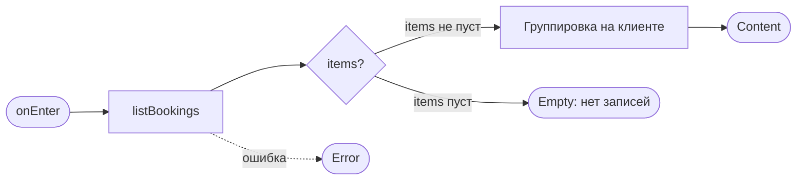
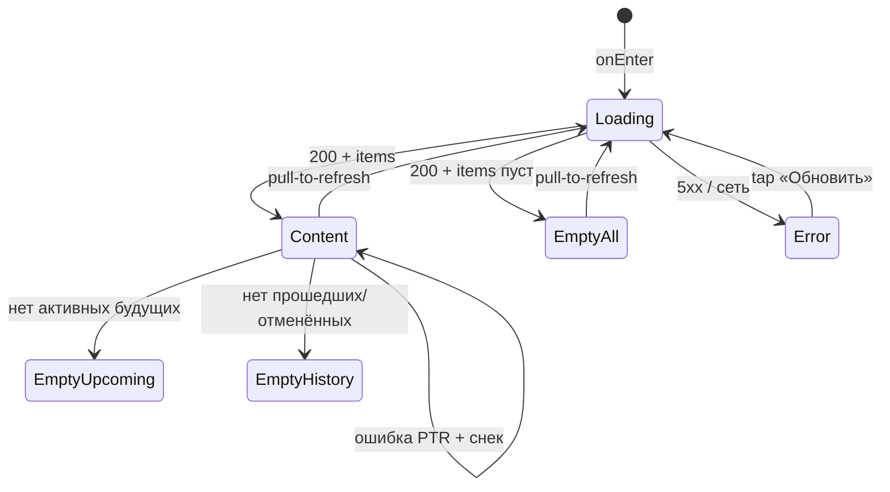

# Мои бронирования

**ID:** SCR-005  
**Тип:** Экран  
**Домен:** 02. Бронирования  
**Приоритет:** Critical  
**Статус:** Черновик  
**Функциональные блоки:** FB-005-001 (Список броней), FB-005-002 (Разделение предстоящие/прошедшие), FB-005-003 (Пустые состояния)  
**Зона авторизации:** АЗ  
**Дизайн-макет:** На основе `3-design-brief/SCR-005-my-bookings.md`

---

## Содержание

- [История изменений](#история-изменений)
- [Обзор](#обзор)
- [Навигация](#навигация)
- [Входные данные](#входные-данные)
- [Применяемые логики](#применяемые-логики)
- [Инициализация](#инициализация)
- [Используемые запросы](#используемые-запросы)
- [Макет экрана](#макет-экрана)
- [Элементы экрана](#элементы-экрана)
- [Состояния экрана](#состояния-экрана)
- [Действия пользователя](#действия-пользователя)
- [Связанные требования](#связанные-требования)
- [Критерии приёмки](#критерии-приёмки)

---

## История изменений

| Релиз | ТЗ | Описание изменений |
|-------|-----|-------------------|
| 0.1.0 | SCR-005 «Мои бронирования» | Первичная версия ТЗ на основе дизайн-брифа SCR-005 |

---

## Обзор

Корневой экран вкладки **«Мои записи»** таб-бара авторизованной зоны приложения «Шеф-стол». Даёт клиенту полный контроль над своими записями на кулинарные классы: показывает все его брони, автоматически разделённые на **«Предстоящие»** и **«История»**. Это центральный узел для проверки «куда и когда я записан», быстрого входа в детали брони и, при необходимости, запуска отмены.

Контекст использования — кухня или студия, часто при ярком освещении, в спешке или с мокрыми руками. Интерфейс должен позволять **с одного взгляда** оценить ближайший класс (дата, программа, шеф, статус, состав инвентаря) и сразу перейти к нужной брони. Карточка брони — это компактная сводка; полная информация и кнопка отмены находятся на экране SCR-006.

Данные загружаются через `listBookings` и содержат только брони текущего клиента. Поддерживается **постраничная загрузка** с автоматической догрузкой при скролле. Разделение на «Предстоящие» и «Историю», а также признак «прошедшего» класса **вычисляются на клиенте** на основе `start_at` и `status`. Все отменённые брони (ранняя, поздняя, отмена студией) сохраняются в истории с соответствующим визуальным статусом и, где применимо, с указанием причины.

### User Story

> Как клиент, я хочу видеть список всех своих записей на классы — и предстоящих, и уже прошедших — чтобы контролировать своё расписание, быстро находить нужную бронь и при необходимости отменять её.

### Бизнес-ценность

- **Снижение неявок:** клиент заранее видит дату, время и программу ближайшего класса.
- **Самообслуживание:** вся история и возможность отмены доступны без звонков в студию.
- **Прозрачность:** полная картина по всем броням (активные, отменённые, с указанием причин) формирует доверие к сервису.

---

## Навигация

### Входящая (откуда открывается)

| Источник | Триггер | Условие | Передаваемые параметры |
|----------|---------|---------|------------------------|
| Таб-бар, вкладка «Мои записи» | Тап на таб | Всегда (с любого корневого экрана АЗ) | — |
| BS-002 Подтверждение записи | Тап «Мои записи» | Сразу после успешного бронирования | — |

### Исходящая (куда ведёт)

| Назначение | Триггер | Передаваемые параметры |
|------------|---------|------------------------|
| SCR-006 Детали брони + отмена | Тап по карточке любой брони | `bookingId` |
| SCR-002 Список классов | Тап «К списку классов» в любом Empty-состоянии | — |
| SCR-002 Список классов | Тап на таб «Классы» | — |
| SCR-007 Профиль | Тап на таб «Профиль» | — |

---

## Входные данные

| Название | Тип | Возможные значения | Описание |
|----------|-----|-------------------|----------|
| `now` | Состояние (клиентское время) | timestamp | Текущий момент, используемый для отнесения брони к предстоящим или прошедшим. |
| `selectedTab` | Состояние (UI) | `upcoming`, `history` | Активная вкладка. По умолчанию — `upcoming` (Предстоящие). |

> Экран не принимает входящих параметров навигации. Все данные загружаются через API при открытии.

---

## Применяемые логики

| Логика | Элемент/Триггер | Описание |
|--------|-----------------|----------|
| LOGIC-003 Расчёт цены брони | Карточка записи (цена) | Итоговая стоимость брони **всегда** отображается из серверного поля `price_total`. Клиент не выполняет пересчёт. |
| LOGIC-008 Паттерн состояний экрана | Весь экран | Единый паттерн Loading → Content / Empty / Error, поведение при pull-to-refresh, каталог снеков для ошибок обновления. |

---

## Инициализация

### Диаграмма загрузки



### Запросы при открытии

| № | Запрос | Критичный | Зависит от | Условие |
|---|--------|-----------|------------|---------|
| 1 | [listBookings](#listbookings) | Да | — | Всегда |

---

## Используемые запросы

### listBookings

**Тип:** REST  
**Метод:** GET  
**Спецификация:** `../api/bookings/api.yaml` → `listBookings`

**Триггер:** Инициализация экрана, pull-to-refresh, кнопка «Обновить» в Error-состоянии.

**Параметры:**

| Параметр | Тип | Обязательность | Источник | Описание |
|----------|-----|----------------|----------|----------|
| `limit` | integer | Нет | Конфигурация | Размер страницы (по умолчанию из API). |
| `offset` | integer | Нет | Состояние | Смещение для пагинации. Стартует с 0. |

> **Важно:** Параметр `status` **не передаётся** — клиент всегда запрашивает полную историю, чтобы самостоятельно разделить её на табы. Сервер возвращает только брони текущего пользователя (идентификация по токену).

**Ответ (200):** `BookingListResponse`:
- `items: BookingSummary[]` (минимум полей: `id`, `seats_count`, `rental_count`, `price_total`, `status`, `cancelled_at`, `cancellation_reason`, `dietary_restrictions`, `slot` с `start_at`, `program.name`, `program.type`, `chef.name`).
- `meta: { limit, offset, total }` — для управления пагинацией.

**Обработка ответа:**

| Результат | Условие | UI-реакция |
|-----------|---------|------------|
| Загрузка | — | Скелетоны карточек в форме будущего контента |
| Успех | `items` не пуст | Группировка на клиенте и отрисовка секций «Предстоящие» / «История» |
| Успех | `items` пуст | Empty «У вас пока нет записей» + кнопка «К списку классов» |
| Успех | Есть брони, но нет активных на будущее | Вкладка «Предстоящие» показывает свой Empty; «История» доступна |
| Успех | Есть брони, но все активны на будущее | Вкладка «История» показывает свой Empty; «Предстоящие» доступны |
| HTTP 5xx / сеть (первая загрузка) | — | Error state с кнопкой «Обновить» |
| Ошибка при PTR | Сеть / 5xx / timeout | Список не сбрасывается, показывается снек «Не удалось обновить…» |

**Клиентская группировка (применяется к каждому элементу `items`):**

- **Предстоящие** — `status = active` **И** `slot.start_at > now`.
- **История** — все остальные: `slot.start_at <= now` **ИЛИ** `status ∈ {cancelled, late_cancel, studio_cancelled}`.
- **Сортировка:**
  - В «Предстоящих» — по возрастанию `start_at` (ближайший класс вверху).
  - В «Истории» — по убыванию `start_at` (свежие записи вверху).

---

## Макет экрана

### Структура

```
┌──────────────────────────────┐
│  Мои записи                  │  ← заголовок экрана
│  [ Предстоящие | История ]   │  ← сегмент-переключатель (sticky-секции опциональны)
├──────────────────────────────┤
│ ┌──────────────────────────┐ │  ← скролл-список карточек
│ │ сб, 21 июн · 09:00       │ │
│ │ Итальянская паста         │ │  ← program.name
│ │ Новичковая · Шеф: Анна   │ │
│ │ 2 места · 1 прокатный    │ │
│ │ 2900 ₽          [Активна]│ │  ← бейдж статуса (текст+форма)
│ └──────────────────────────┘ │
│ ┌──────────────────────────┐ │
│ │ пт, 15 июн · 18:00       │ │
│ │ Сложная выпечка           │ │
│ │ Опытная · Шеф: Игорь     │ │
│ │ 1 место · свой инвентарь │ │
│ │ 1500 ₽      [Отменена]   │ │
│ └──────────────────────────┘ │
├──────────────────────────────┤
│ Классы · Мои записи · Профиль│  ← таб-бар
└──────────────────────────────┘
```

### Компоненты

| Компонент | Описание | Обязательность |
|-----------|----------|----------------|
| Хедер | Заголовок «Мои записи» | Да |
| Сегмент-переключатель | «Предстоящие» / «История». Допускается вариант с двумя sticky-секциями. | Да |
| Скролл-список | Вертикальный список с поддержкой pull-to-refresh и бесконечной догрузки. | Да |
| Карточка брони | Кликабельная область с ключевой информацией. | Да |
| Бейдж статуса | Текстовый индикатор (`Активна`, `Отменена`, `Поздняя отмена`, `Отменена студией`). | Да |
| Индикатор «Пищевые ограничения» | Иконка/текст, если в брони заполнено поле `dietary_restrictions`. | Опционально |
| Empty-заглушки | Разные тексты и CTA для случаев «нет ни одной брони», «нет предстоящих» и «нет истории». | По состоянию |
| Снек | Для ошибок обновления (PTR). | По состоянию |
| Таб-бар | Корневой экран — таб-бар виден. | Да |

---

## Элементы экрана

### 1. Хедер и переключатель

| Элемент | Описание | Источник данных | Действие |
|---------|----------|-----------------|----------|
| Заголовок «Мои записи» | Статичный | — | — |
| Сегмент «Предстоящие» | Активен по умолчанию | Состояние `selectedTab` | Фильтрует список до активных броней с будущим стартом |
| Сегмент «История» | Включает прошедшие и все отменённые брони | Состояние `selectedTab` | Показывает соответствующую группу |

**Логика:**
- Активный сегмент выделяется визуально (не только цветом). Переключение мгновенное, без дополнительных запросов к API.

### 2. Карточка брони

| Элемент | Описание | Источник данных |
|---------|----------|-----------------|
| Дата и время начала | Крупно, основной ориентир | `slot.start_at` |
| Название программы | Например, «Итальянская паста» | `slot.program.name` |
| Тип программы и шеф | «Новичковая · Шеф: Анна» | `slot.program.type`, `slot.chef.name` |
| Состав | «2 места (1 прокатный набор, 1 свой инвентарь)» | `seats_count`, `rental_count` |
| Итоговая цена | Сумма к оплате офлайн | `price_total` (серверное поле) |
| Бейдж статуса | `active` → «Активна», `cancelled` → «Отменена», `late_cancel` → «Поздняя отмена», `studio_cancelled` → «Отменена студией» | `status` |
| Индикатор ограничений | Иконка + текст «Есть особые пожелания», если поле не пустое | `dietary_restrictions` |
| Вся карточка | Тап-зона для перехода к деталям | `id` → SCR-006 |

**Логика:**
- **Цена:** используется исключительно `price_total`, без клиентского пересчёта.
- **Статус:** смысл дублируется иконкой/формой, а не только цветом.
- **Пищевые ограничения:** не раскрываются полностью — только индикатор наличия. Детали — на SCR-006.
- **Причина отмены студией:** для `studio_cancelled` в карточке кратко выводится `cancellation_reason`.

**Условия доступности:**
- Карточка кликабельна всегда, включая отменённые брони.

### 3. Пустые состояния (Empty)

| Состояние | Заголовок | Действие |
|-----------|-----------|----------|
| Нет ни одной брони | «У вас пока нет записей» | Кнопка «К списку классов» → SCR-002 |
| Вкладка «Предстоящие» пуста (но история есть) | «Нет предстоящих записей» | Кнопка «К списку классов» → SCR-002 |
| Вкладка «История» пуста (но есть предстоящие) | «История посещений появится здесь» | Кнопка «К списку классов» → SCR-002 |

**Логика:**
- Все три состояния используют один и тот же CTA, но с разными поясняющими текстами.
- При использовании sticky-секций Empty-заглушка показывается только внутри пустой секции; соседняя секция остаётся видимой.

---

## Состояния экрана

| Состояние | Условие | Отображение |
|-----------|---------|-------------|
| Loading | Первичная загрузка | Скелетоны карточек |
| Content | Данные получены и не пусты | Список, разделённый на «Предстоящие»/«История» |
| Empty (общий) | `items` пуст | Заглушка «У вас пока нет записей» + CTA |
| Empty (Предстоящие) | Только прошедшие/отменённые брони | Заглушка внутри таба «Предстоящие» |
| Empty (История) | Только активные будущие брони | Заглушка внутри таба «История» |
| Error | Ошибка первой загрузки | Заглушка ошибки + «Обновить» |
| PTR-ошибка | Ошибка при обновлении | Список сохранён, снек «Не удалось обновить…» |

### Диаграмма переходов



---

## Действия пользователя

| Действие | Элемент | Триггер | Результат |
|----------|---------|---------|-----------|
| Открыть детали | Карточка брони | Tap | Переход на SCR-006 |
| Сменить вкладку | Сегмент-переключатель | Tap | Фильтрация списка |
| Обновить | Список | Pull-to-refresh | Повторный `listBookings` |
| Догрузить ещё | Список | Скролл вниз | Подгрузка следующей страницы |
| Перейти к списку классов | Кнопка в Empty | Tap | SCR-002 |

---

## Связанные требования

| Тип | Идентификатор | Название |
|-----|---------------|----------|
| Функциональные | FR-35a | Список своих броней с пагинацией и статусами |
| User Story | US-9 | Контроль предстоящих и прошедших записей |
| Нефункциональные | NFR-12 | Доступ только к своим данным |

---

## Критерии приёмки

### Позитивные

| ID | Критерий | Приоритет |
|----|----------|-----------|
| AC-001 | **Дано** есть брони на разные даты, **Когда** экран открыт, **Тогда** они разделены на «Предстоящие» и «Историю» с корректной сортировкой. | P0 |
| AC-002 | **Дано** активная бронь на будущее, **Когда** экран открыт, **Тогда** она в «Предстоящих», бейдж «Активна». | P0 |
| AC-003 | **Дано** бронь со статусом `cancelled`, **Когда** экран открыт, **Тогда** она в «Истории» с бейджем «Отменена». | P0 |
| AC-004 | **Дано** в брони указаны пищевые ограничения, **Когда** карточка отрисована, **Тогда** виден индикатор «Есть особые пожелания». | P1 |
| AC-005 | **Дано** список не пуст, **Когда** пользователь делает PTR, **Тогда** данные обновляются; при успехе снека нет, при ошибке — снек. | P1 |

### Негативные

| ID | Критерий | Приоритет |
|----|----------|-----------|
| AC-N01 | **Дано** ошибка сети при открытии, **Когда** экран загружен, **Тогда** показан Error state с кнопкой «Обновить». | P0 |
| AC-N02 | **Дано** нет ни одной брони, **Когда** экран открыт, **Тогда** Empty «У вас пока нет записей» + CTA. | P0 |
| AC-N03 | **Дано** в системе есть чужие брони, **Когда** экран открыт, **Тогда** видны только свои записи. | P0 |

### Граничные условия

| ID | Критерий | Приоритет |
|----|----------|-----------|
| AC-E01 | **Дано** отменённая бронь с будущим стартом, **Когда** экран открыт, **Тогда** она в «Истории», а не в «Предстоящих». | P0 |
| AC-E02 | **Дано** успешный PTR, **Когда** список обновлён, **Тогда** снек успеха не показывается. | P2 |
| AC-E03 | **Дано** ошибка PTR, **Когда** запрос падает, **Тогда** экран не уходит в Error, список сохраняется, показывается снек. | P2 |

---
