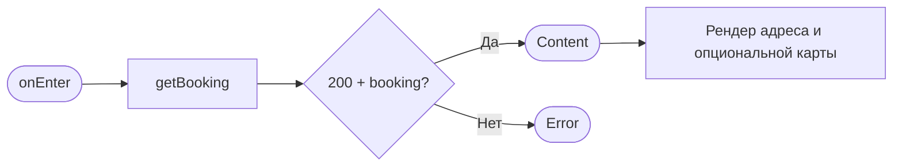

# Детали брони + отмена

**ID:** SCR-006  
**Тип:** Экран  
**Домен:** 03. Бронирования  
**Приоритет:** Critical  
**Статус:** Черновик  
**Функциональные блоки:** FB-006-001 (Просмотр брони), FB-006-002 (Отмена брони)  
**Зона авторизации:** АЗ  
**Дизайн-макет:** На основе `3-design-brief/SCR-006-booking-details.md`

---

## Содержание

- [История изменений](#история-изменений)
- [Обзор](#обзор)
- [Навигация](#навигация)
- [Входные данные](#входные-данные)
- [Применяемые логики](#применяемые-логики)
- [Инициализация](#инициализация)
- [Используемые запросы](#используемые-запросы)
- [Макет экрана](#макет-экрана)
- [Элементы экрана](#элементы-экрана)
- [Состояния экрана](#состояния-экрана)
- [Действия пользователя](#действия-пользователя)
- [Связанные требования](#связанные-требования)
- [Критерии приёмки](#критерии-приёмки)

---

## История изменений

| Релиз | ТЗ | Описание изменений |
|-------|-----|-------------------|
| 0.1.0 | SCR-006 «Детали брони + отмена» | Первичная версия ТЗ на основе дизайн-брифа SCR-006 |

---

## Обзор

Вложенный экран авторизованной зоны приложения «Шеф-стол». Показывает **полную информацию об одной брони** клиента на кулинарный класс и служит **единственной точкой запуска её отмены**. Открывается из списка «Мои записи» (SCR-005).

Две основные задачи экрана:
1. **Просмотр.** Собрать в одном месте все параметры брони и её текущий статус: дата и время, программа (меню) с описанием, шеф, количество мест и выбранный инвентарь, указанные пищевые ограничения, итоговая стоимость и способ оплаты, адрес студии.
2. **Отмена.** Предоставить кнопку «Отменить» для активных броней. Подтверждение и разъяснение правила 2 часов выполняется в шторке BS-003; экран лишь запускает её и после возврата отображает обновлённый статус.

Таб-бар скрыт (вложенный экран). Все данные относятся исключительно к текущему клиенту (NFR-12).

### User Story

> Как клиент, я хочу видеть все детали своей записи на класс и иметь возможность отменить её до начала, чтобы освободить место, если мои планы изменились, и понимать последствия отмены. (US-10)

### Бизнес-ценность

- **Полная прозрачность:** клиент видит не только дату и цену, но и программу, шефа, свой выбор инвентаря и пищевые ограничения.
- **Самостоятельное управление:** отмена записи без обращения в студию экономит время и снижает нагрузку на персонал.
- **Справедливые правила:** чёткое правило 2 часов с отсутствием штрафов формирует доверие и лояльность.

---

## Навигация

### Входящая (откуда открывается)

| Источник | Триггер | Условие | Передаваемые параметры |
|----------|---------|---------|------------------------|
| SCR-005 Мои бронирования | Тап по карточке брони | Всегда | `bookingId` |

### Исходящая (куда ведёт)

| Назначение | Триггер | Передаваемые параметры |
|------------|---------|------------------------|
| BS-003 Подтверждение отмены | Тап по активной кнопке «Отменить» | `bookingId` |
| BS-004 Адрес студии | Тап по адресу / кнопке «Открыть карту» | `slotId` (из брони) |
| SCR-005 Мои бронирования | Кнопка «Назад» / системный жест | — |

> **Важно:** Снеки итога отмены (успех/поздняя отмена) показывает **SCR-006** как экран-родитель после закрытия BS-003. Снеки ошибок, при которых шторка BS-003 остаётся открытой, показывает сама шторка.

---

## Входные данные

| Название | Тип | Возможные значения | Описание |
|----------|-----|-------------------|----------|
| `bookingId` | Параметр навигации | UUID | Идентификатор брони. Обязателен; при отсутствии — невалидный переход (Error). |

---

## Применяемые логики

| Логика | Элемент/Триггер | Описание |
|--------|-----------------|----------|
| LOGIC-003 Расчёт цены брони | Блок «Стоимость» | Итог — серверное поле `Booking.price_total` (R-005). Клиент не пересчитывает. |
| LOGIC-004 Отмена: правило 2 часов | Кнопка «Отменить», подсказка дедлайна | Граница ранней/поздней отмены, момент отсечки `start_at − 2 ч`, доступность CTA. |
| LOGIC-006 Адрес студии | Блок «Адрес студии» | Текстовый адрес + опциональная карта с fallback; переход в BS-004. |
| LOGIC-008 Паттерн состояний экрана | Экран целиком | Loading / Content / Error, обработка снеков. |

---

## Инициализация

При открытии отправляется запрос `getBooking`. Адрес студии отображается на основе данных из ответа (без дополнительного API-запроса).



### Запросы при открытии

| № | Запрос | Критичный | Зависит от | Условие |
|---|--------|-----------|------------|---------|
| 1 | [getBooking](#getbooking) | Да | — | Всегда |

---

## Используемые запросы

### getBooking

**Тип:** REST  
**Метод:** GET  
**Спецификация:** `../api/bookings/api.yaml` → `getBooking` (`GET /bookings/{bookingId}`)

**Триггер:** Инициализация экрана; возврат из BS-003 после отмены; тап «Обновить» в Error.

**Параметры:**

| Параметр | Тип | Обязательность | Источник | Описание |
|----------|-----|----------------|----------|----------|
| `bookingId` | string (uuid) | Да | Параметр навигации | Идентификатор брони. |

**Ответ:** Модель `Booking` с вложенным `Slot` (содержит `Program`, `Chef`).

**Обработка ответа:**

| Результат | Условие | UI-реакция |
|-----------|---------|------------|
| Загрузка | — | Скелетон в форме блоков деталей |
| Успех 200 | `booking` получен | Content: отрисовка всех блоков |
| HTTP 401 | Токен невалиден | Сценарий повторной авторизации |
| HTTP 403 | Бронь принадлежит другому клиенту | Error state с кнопкой «Обновить» |
| HTTP 404 | Бронь не найдена | Error state с кнопкой «Обновить» |
| HTTP 5xx | — | Error state с кнопкой «Обновить» |
| Сеть | Нет соединения | Error state с кнопкой «Обновить» |

---

## Макет экрана

### Структура

```
┌───────────────────────────────┐
│ ←  Детали брони               │  ← хедер
├───────────────────────────────┤
│  [● Активна]                  │  ← бейдж статуса
│                               │
│  📅 12 июля, 09:00            │  ← дата/время (крупно)
│                               │
│  🍝 Итальянская паста         │  ← программа
│     Новичковая · ~180 мин     │
│     Шеф: Анна                 │
│                               │
│  📍 Адрес студии              │
│     Лофт на ул. Заводской, 15 │
│     [ Открыть карту › ]       │
│                               │
│  👥 2 места                   │  ← состав
│     1 прокатный набор         │
│     1 свой инвентарь          │
│                               │
│  🥜 Пищевые ограничения       │
│     Без орехов, без лактозы   │
│                               │
│  💰 Стоимость                 │
│     Места: 1 200 ₽ × 2 = 2 400 ₽
│     Прокат: 500 ₽ × 1 = 500 ₽
│     Итого: 2 900 ₽            │
│     Оплата на месте           │
│                               │
│  Записано: 1 июля, 18:20      │
│  (Отменено: 5 июля, 10:00)    │
├───────────────────────────────┤
│  Бесплатная отмена до 07:00   │  ← дедлайн (если активна)
│ [        Отменить         ]   │  ← фикс. CTA
└───────────────────────────────┘
```

### Компоненты

| Компонент | Описание | Обязательность |
|-----------|----------|----------------|
| Хедер | Кнопка «Назад» + «Детали брони» | Да |
| Бейдж статуса | Текст + иконка статуса | Да |
| Блок «О классе» | Дата/время, программа, тип, длительность, шеф | Да |
| Блок «Адрес студии» | Текстовый адрес + опциональная карта | Да |
| Блок «Состав» | Количество мест, разбивка инвентаря | Да |
| Блок «Пищевые ограничения» | Текст или «Не указаны» | Да |
| Блок «Стоимость» | Итог с разбивкой, офлайн-оплата | Да |
| Служебные метки | Дата создания; отмены (если есть) | Опционально |
| Подсказка дедлайна | Момент `start_at − 2 ч` | Только для активных |
| CTA «Отменить» | Фикс. кнопка | Да |

---

## Элементы экрана

### 1. Бейдж статуса

| Элемент | Описание | Источник данных |
|---------|----------|-----------------|
| Статус | `active` + будущее → «Активна»; `active` + прошлое → «Прошедшая»; `cancelled` → «Отменена»; `late_cancel` → «Поздняя отмена»; `studio_cancelled` → «Отменена студией» | `status` + `slot.start_at` |

**Логика:** Смысл дублируется иконкой/текстом, не только цветом. Для `studio_cancelled` дополнительно выводится причина `cancellation_reason`.

### 2. Блок «О классе»

| Элемент | Описание | Источник данных |
|---------|----------|-----------------|
| Дата и время | `slot.start_at` | `getBooking` |
| Программа | `slot.program.name` | `getBooking` |
| Тип и длительность | «Новичковая · ~180 мин» | `program.type`, `program.duration_min` |
| Шеф | `slot.chef.name` | `getBooking` |

### 3. Блок «Адрес студии»

| Элемент | Описание | Действие |
|---------|----------|----------|
| Адрес (текст) | `slot.studio_address` | Тап → BS-004 |
| Карта (опционально) | Превью при наличии координат | Тап → BS-004 |

**Логика (LOGIC-006):** При ошибке карты — только текст и ссылка «Открыть в картах».

### 4. Блок «Состав»

| Элемент | Описание | Источник данных |
|---------|----------|-----------------|
| Всего мест | `seats_count` | `getBooking` |
| Прокатные наборы | `rental_count` | `getBooking` |
| Свой инвентарь | `seats_count − rental_count` | Вычисляется |

### 5. Блок «Пищевые ограничения»

| Элемент | Описание | Источник данных |
|---------|----------|-----------------|
| Текст | `dietary_restrictions` | `getBooking` |

Если поле пустое — показывается «Не указаны» нейтральным тоном.

### 6. Блок «Стоимость»

| Элемент | Описание | Источник данных |
|---------|----------|-----------------|
| Разбивка | Места: `slot.price × seats_count`; Прокат: `slot.rental_price × rental_count` | `getBooking` |
| Итого | **Серверный `price_total`** | `getBooking` |
| Оплата | «Оплата на месте: наличные или перевод» | `00-foundations` |

### 7. CTA «Отменить» + дедлайн

| Элемент | Описание | Условия |
|---------|----------|---------|
| Дедлайн | «Бесплатная отмена до `<start_at − 2 ч>`» | Только для активных |
| Кнопка «Отменить» | Открывает BS-003 | `status = active` И `start_at` в будущем |

**Логика (LOGIC-004):**
- **Активна:** если бронь активна и класс не начался.
- **Неактивна:** с пояснением «Класс уже начался» или «Запись уже отменена».

**Возврат из BS-003:**

| Исход в BS-003 | Реакция SCR-006 | Снек (показывает SCR-006) |
|----------------|-----------------|---------------------------|
| 200 `cancelled` | Бейдж «Отменена», `cancelled_at`, CTA disabled | «Бронь отменена» |
| 200 `late_cancel` | Бейдж «Поздняя отмена», `cancelled_at`, CTA disabled | «Поздняя отмена: место не освобождено (правило 2 часов). Штраф не взимается.» |
| 422 `slot_started` | `getBooking`, CTA disabled «Класс уже начался» | «Класс уже начался — отмена недоступна.» |
| 409 `already_cancelled` | `getBooking`, актуальный статус, CTA disabled | «Запись уже отменена.» |

---

## Состояния экрана

| Состояние | Условие | Отображение |
|-----------|---------|-------------|
| Loading | Ожидание `getBooking` | Скелетон |
| Content (Активна) | `active` + будущее | Все блоки, активная CTA |
| Content (Прошедшая) | `active` + прошлое | Бейдж «Прошедшая», CTA disabled |
| Content (Отменена/Поздняя/Студией) | `cancelled`/`late_cancel`/`studio_cancelled` | Бейдж, `cancelled_at`, CTA disabled |
| Error | Ошибка загрузки | Заглушка + «Обновить» |

---

## Действия пользователя

| Действие | Элемент | Результат |
|----------|---------|-----------|
| Отменить | Кнопка «Отменить» (активна) | BS-003 |
| Открыть адрес | Адрес / «Открыть карту» | BS-004 |
| Назад | Кнопка «Назад» | SCR-005 |
| Повторить | «Обновить» (Error) | Повтор `getBooking` |

---

## Связанные требования

- FR-16 (отмена до старта)
- FR-17 (ранняя отмена возвращает места/прокат)
- FR-18 (поздняя отмена без штрафов)
- FR-46 (отмена студией с причиной)
- FR-50 (пищевые ограничения)
- US-10 (клиент отменяет запись)
- UC-2 (сценарий отмены)

---

## Критерии приёмки

### Позитивные

| ID | Критерий | P |
|----|----------|----|
| AC-001 | **Дано** активная бронь, **Когда** экран открыт, **Тогда** показаны все детали: программа, шеф, места, инвентарь, цена, адрес, пищевые ограничения; кнопка «Отменить» активна, дедлайн отображается. | P0 |
| AC-002 | **Дано** бронь с `dietary_restrictions`, **Когда** экран открыт, **Тогда** текст отображается полностью. | P1 |
| AC-003 | **Дано** успешная ранняя отмена в BS-003, **Когда** возврат на SCR-006, **Тогда** снек «Бронь отменена», статус «Отменена». | P1 |
| AC-004 | **Дано** успешная поздняя отмена в BS-003, **Когда** возврат, **Тогда** снек о поздней отмене без штрафа, статус «Поздняя отмена». | P1 |

### Негативные

| ID | Критерий | P |
|----|----------|----|
| AC-N01 | **Дано** класс уже начался, **Когда** экран открыт, **Тогда** CTA disabled «Класс уже начался — отменить нельзя». | P0 |
| AC-N02 | **Дано** бронь отменена, **Когда** экран открыт, **Тогда** CTA disabled «Запись уже отменена». | P0 |
| AC-N03 | **Дано** статус `studio_cancelled`, **Когда** экран открыт, **Тогда** показана причина отмены. | P1 |

### Граничные

| ID | Критерий | P |
|----|----------|----|
| AC-E01 | **Дано** до начала ровно 2 часа, **Когда** отмена, **Тогда** трактуется как ранняя. | P1 |
| AC-E02 | **Дано** ошибка загрузки карты, **Когда** экран открыт, **Тогда** адрес показан текстом, остальное работает. | P1 |

---