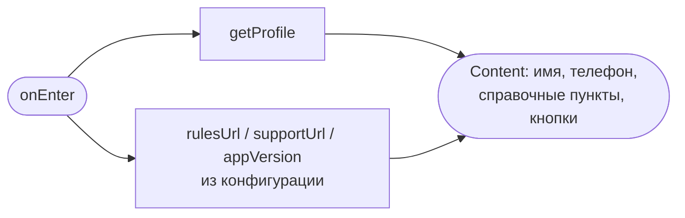
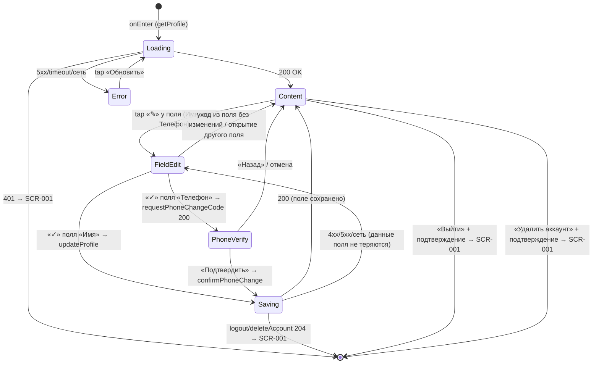

# Профиль клиента

**ID:** SCR-007  
**Тип:** Экран  
**Домен:** 01. Авторизация и профиль  
**Приоритет:** Medium  
**Статус:** Черновик  
**Функциональные блоки:** FB-AUTH-002 (Сессия и выход), FB-PROFILE-001 (Контактные данные), FB-PROFILE-002 (Удаление аккаунта)  
**Зона авторизации:** АЗ  
**Дизайн-макет:** На основе `3-design-brief/SCR-007-profile.md`

> **Редактирование — инлайн по полям.** У полей «Имя» и «Телефон» — отдельные иконки-карандаши; правка идёт инлайн по одному полю, без общего режима «Редактировать» в хедере и без общей кнопки «Сохранить»/«Отмена». Смена телефона по-прежнему подтверждается кодом из SMS (как на SCR-001).
>
> **Удаление аккаунта остаётся в MVP.** Кнопка «Удалить аккаунт» размещается ниже «Выйти», деструктивная, менее акцентная.

---

## Содержание

- [История изменений](#история-изменений)
- [Обзор](#обзор)
- [Навигация](#навигация)
- [Входные данные](#входные-данные)
- [Применяемые логики](#применяемые-логики)
- [Инициализация](#инициализация)
- [Используемые запросы](#используемые-запросы)
- [Макет экрана](#макет-экрана)
- [Элементы экрана](#элементы-экрана)
- [Состояния экрана](#состояния-экрана)
- [Действия пользователя](#действия-пользователя)
- [Связанные требования](#связанные-требования)
- [Критерии приёмки](#критерии-приёмки)

---

## История изменений

| Релиз | ТЗ | Описание изменений |
|-------|-----|-------------------|
| 0.1.0 | SCR-007 «Профиль клиента» | Первичная версия ТЗ: просмотр/редактирование имени и телефона (смена телефона по коду из SMS), выход и удаление аккаунта с подтверждением, справочные пункты. |

---

## Обзор

SCR-007 — корневой экран авторизованной зоны приложения «Шеф-стол», доступный по табу **«Профиль»**. Назначение в MVP:

- **Показать собственные контактные данные** клиента — имя и телефон — и дать их быстро отредактировать (FR-1, FR-2, FR-47). Данные читаются запросом `getProfile` (GET `/profile`).
- **Инлайн-редактирование по полям.** У полей «Имя» и «Телефон» — отдельные иконки-карандаши; правка ведётся **по одному полю**, без общего режима «Редактировать» и без общей кнопки «Сохранить». Тап по карандашу делает конкретное поле редактируемым; сохранение — по подтверждению этого поля (иконка «✓»). Смена **имени** → `updateProfile` (PATCH `/profile`) без подтверждения кодом. Смена **телефона** (телефон — логин) подтверждается кодом из SMS: `requestPhoneChangeCode` + `confirmPhoneChange` — как шаг 2 OTP-флоу на SCR-001.
- **Выход из аккаунта** → `logout` (POST `/auth/logout`) с обязательным подтверждением → SCR-001.
- **Удаление аккаунта** (деструктивно, ПДн) → `deleteAccount` (DELETE `/profile`) с обязательным явным подтверждением → SCR-001. **Последствия удаления (FR-48):** активные брони аннулируются и освобождают места и прокатные наборы в своих классах; прошедшие брони анонимизируются (обезличиваются от ПДн), но остаются в данных студии для статистики.
- **Справочные пункты** — «Правила студии», «Поддержка» (URL из конфигурации), «Версия приложения» (текст из сборки).

Экран показывает **только данные текущего клиента** (NFR-11, NFR-12): чужие данные и любые административные функции отсутствуют. Это не «личный кабинет»: ленты записей здесь нет (см. SCR-005), управления уведомлениями нет — запрос push-разрешения на этом экране **не показывается** (он в BS-002, см. foundations §8.1). Таб-бар на экране виден (корневой экран АЗ).

### User Story

> Как клиент кулинарной студии, я хочу видеть и при необходимости менять своё имя и номер телефона, а также безопасно выходить из аккаунта,
> чтобы быть уверенным, что вошёл под своими данными, и чтобы под моим аккаунтом не записались другие на чужом устройстве.

### Бизнес-ценность

- Контроль клиента над своими ПДн: проверка и актуализация имени/телефона (FR-1, FR-2).
- Защита от случайного выхода и необратимого удаления — обязательные подтверждения (P1).
- Прозрачность и доверие: правила студии, контакты поддержки и версия приложения доступны из одного места.

---

## Навигация

### Входящая (откуда открывается)

| Источник | Триггер | Условие | Передаваемые параметры |
|----------|---------|---------|------------------------|
| Таб-бар АЗ (foundations §4.2) | Тап на таб «Профиль» | Пользователь авторизован (есть активная сессия) | — |

> Это единственная точка входа на экран. Экран корневой, поэтому таб-бар на нём виден; активна вкладка «Профиль».

### Исходящая (куда ведёт)

| Назначение | Триггер | Передаваемые параметры |
|------------|---------|------------------------|
| SCR-001 Регистрация / Вход | «Выйти» + подтверждение → `logout` 204 (сессия завершена, оба токена стёрты) | — |
| SCR-001 Регистрация / Вход | «Удалить аккаунт» + подтверждение → `deleteAccount` 204 (аккаунт удалён, сессия завершена) | — |
| SCR-002 Список классов | Тап на таб «Классы» | — |
| SCR-005 Мои записи | Тап на таб «Мои записи» | — |
| Правила студии (внешний ресурс) | Тап на «Правила студии ›» | URL из конфигурации |
| Поддержка (внешний ресурс) | Тап на «Поддержка ›» | URL/контакт из конфигурации |

> После выхода или удаления аккаунта пользователь попадает в неавторизованную зону; вернуться к авторизованным экранам без повторного входа нельзя.

---

## Входные данные

| Название | Тип | Возможные значения | Описание |
|----------|-----|-------------------|----------|
| `tokens.access_token` | Защищённое хранилище (Keychain / Keystore) | JWT-строка | Access-токен активной сессии; передаётся в `Authorization: Bearer <access_token>` для всех запросов экрана. После `logout`/`deleteAccount` стирается вместе с `refresh_token`. |
| `tokens.refresh_token` | Защищённое хранилище (Keychain / Keystore) | строка | Refresh-токен; используется для обновления `access_token` по 401 (POST `/auth/refresh`, ротация). Стирается в паре с `access_token` при `logout`/`deleteAccount` и при неуспешном refresh. |
| `rulesUrl` | Remote Config / конфигурация | URL-строка | Адрес страницы «Правила студии». |
| `supportUrl` | Remote Config / конфигурация | URL-строка / контакт | Адрес/контакт поддержки. |
| `appVersion` | Сборка приложения | строка (пример `1.0.0`) | Версия приложения; нередактируемый текст. |
| `name` | Состояние экрана (из `getProfile`) | строка 1–100 символов / пусто | Имя клиента для отображения и предзаполнения поля при инлайн-правке. |
| `phone` | Состояние экрана (из `getProfile`) | E.164, `^\+[1-9]\d{1,14}$` | Телефон клиента для отображения и предзаполнения поля. |
| `newPhone` | Состояние флоу смены телефона | E.164 | Введённый новый номер; хранится между шагом ввода и шагом подтверждения кодом. |

> Числовые величины OTP не зашиваются в UI: длина кода — из паттерна `^\d{4,6}$`, таймер повтора — из `resend_after_seconds`, срок жизни — из `ttl_seconds` (ответ `requestPhoneChangeCode`). Поле кода — segmented (отдельные ячейки по длине кода из API).

---

## Применяемые логики

| Логика | Элемент/Триггер | Описание |
|--------|-----------------|----------|
| LOGIC-001 OTP-авторизация | Смена телефона: подтверждение инлайн-правки поля «Телефон» → шаг кода | Подтверждение нового номера кодом из SMS (как шаг 2 SCR-001): `requestPhoneChangeCode` → ввод кода (segmented) → `confirmPhoneChange`; таймер повтора, обработка ошибок кода. |
| LOGIC-008 Паттерн состояний экрана | Инициализация / загрузка профиля; действия (сохранение поля / Подтвердить код / Выйти / Удалить аккаунт) | Сквозной паттерн Loading → Content / Error для чтения данных профиля (`getProfile`); состояние Empty неприменимо (у авторизованного клиента телефон есть всегда). Поведение действий — лоадер на элементе подтверждения поля + блокировка повторного тапа и снеки результата. |
| LOGIC-007 Запрос push-разрешения | — | **Не применяется.** Запрос разрешения на push показывается только после первой успешной записи на BS-002; на экране профиля он **не запрашивается** (управления уведомлениями в MVP нет — см. foundations §8.1). |

---

## Инициализация

> При открытии экрана отправляется один критичный запрос `getProfile` для чтения имени и телефона. Справочные значения (`rulesUrl`, `supportUrl`, `appVersion`) — из конфигурации/сборки, сетевых запросов не требуют. Действия (редактирование, смена телефона, выход, удаление) инициируются пользователем, а не открытием экрана.

### Диаграмма загрузки



### Запросы при открытии

| № | Запрос | Критичный | Зависит от | Условие |
|---|--------|-----------|------------|---------|
| 1 | [getProfile](#getprofile) | Да | — | Всегда |

---

## Используемые запросы

> Все API-запросы экрана с полным описанием параметров и обработки ответов. Тип — REST. GraphQL не используется.

### getProfile

**Тип:** REST  
**Метод:** GET  
**Спецификация:** `../api/profile/api.yaml` → `getProfile`

**Триггер:** Инициализация экрана

**Параметры:**

| Параметр | Тип | Обязательность | Источник | Описание |
|----------|-----|----------------|----------|----------|
| `Authorization` | string (header) | Да | `tokens.access_token` из защищённого хранилища | `Bearer <access_token>`; ответ содержит только данные текущего клиента (NFR-12). |

**Обработка ответа:**

| Результат | Условие | UI-реакция |
|-----------|---------|------------|
| Загрузка | — | Скелетон-шиммер блока данных (две строки «лейбл/значение») |
| Успех 200 | `Client` получен | Отобразить `name` и `phone` (Content, режим просмотра) |
| HTTP 401 | Access-токен невалиден/просрочен | Сначала refresh через `refresh_token` (POST `/auth/refresh`, ротация) и повтор `getProfile`; **только если refresh не удался** — стереть оба токена → переход на SCR-001 |
| HTTP 5xx / default | — | Error state с кнопкой «Обновить»; «Выйти» остаётся доступной |
| Сеть | Нет соединения | Error state с кнопкой «Обновить»; «Выйти» остаётся доступной |

### updateProfile

**Тип:** REST  
**Метод:** PATCH  
**Спецификация:** `../api/profile/api.yaml` → `updateProfile`

**Триггер:** Подтверждение инлайн-правки поля «Имя» (тап «✓» после изменения)

**Параметры:**

| Параметр | Тип | Обязательность | Источник | Описание |
|----------|-----|----------------|----------|----------|
| `name` | string | Да | Поле «Имя» → `UpdateProfileRequest.name` | Новое имя, 1–100 символов. |
| `Authorization` | string (header) | Да | `tokens.access_token` | `Bearer <access_token>` сессии. |

**Обработка ответа:**

| Результат | Условие | UI-реакция |
|-----------|---------|------------|
| Загрузка | — | Лоадер у поля «Имя» (на иконке подтверждения), повторные тапы заблокированы |
| Успех 200 | Обновлённый `Client` | Снек успеха «Профиль обновлён» (foundations §6.1); поле «Имя» возвращается в режим просмотра с новым значением |
| HTTP 400 | Недопустимый формат имени | Снек/ошибка поля «Проверьте имя — кажется, тут лишние символы»; поле остаётся в режиме правки, данные не теряются |
| HTTP 401 | Access-токен невалиден | Сначала refresh через `refresh_token` (POST `/auth/refresh`, ротация) и повтор запроса; **только если refresh не удался** — стереть оба токена → SCR-001 |
| HTTP 5xx / default | — | Снек «Что-то пошло не так. Попробуйте позже»; данные в полях сохраняются |
| Сеть | Нет соединения | Снек «Нет соединения. Проверьте подключение»; данные не теряются |

### requestPhoneChangeCode

**Тип:** REST  
**Метод:** POST  
**Спецификация:** `../api/profile/api.yaml` → `requestPhoneChangeCode`

**Триггер:** Подтверждение инлайн-правки поля «Телефон» (тап «✓» после изменения номера) → переход к шагу подтверждения кодом

**Параметры:**

| Параметр | Тип | Обязательность | Источник | Описание |
|----------|-----|----------------|----------|----------|
| `new_phone` | string | Да | Поле «Телефон» → `ChangePhoneRequestCodeRequest.new_phone` | Новый номер в E.164, `^\+[1-9]\d{1,14}$`. |
| `Authorization` | string (header) | Да | `tokens.access_token` | `Bearer <access_token>` сессии. |

**Обработка ответа:**

| Результат | Условие | UI-реакция |
|-----------|---------|------------|
| Загрузка | — | Лоадер у поля «Телефон» (на иконке подтверждения), повторные тапы заблокированы |
| Успех 200 | `RequestCodeResponse` (`ttl_seconds`, `resend_after_seconds`) | Переход к шагу подтверждения «Подтвердите новый номер кодом из SMS.» (segmented-поле кода); запуск таймера повтора |
| HTTP 400 | Неверный формат номера | Снек/ошибка поля «Похоже, номер введён не полностью»; код не отправлен |
| HTTP 401 | Access-токен невалиден | Сначала refresh через `refresh_token` (POST `/auth/refresh`, ротация) и повтор запроса; **только если refresh не удался** — стереть оба токена → SCR-001 |
| HTTP 409 | Номер уже занят другим клиентом | Снек «Этот номер уже используется. Укажите другой» |
| HTTP 429 | Слишком частые запросы | Снек «Слишком много попыток. Подождите немного»; кнопка повтора по таймеру `resend_after_seconds` |
| HTTP 5xx / default | — | Снек «Что-то пошло не так. Попробуйте позже» |
| Сеть | Нет соединения | Снек «Нет соединения. Проверьте подключение» |

### confirmPhoneChange

**Тип:** REST  
**Метод:** POST  
**Спецификация:** `../api/profile/api.yaml` → `confirmPhoneChange`

**Триггер:** Тап «Подтвердить» на шаге ввода кода смены телефона

**Параметры:**

| Параметр | Тип | Обязательность | Источник | Описание |
|----------|-----|----------------|----------|----------|
| `new_phone` | string | Да | `newPhone` (состояние) → `ChangePhoneConfirmRequest.new_phone` | Подтверждаемый новый номер, E.164. |
| `code` | string | Да | Поле «Код из SMS» → `ChangePhoneConfirmRequest.code` | OTP-код, `^\d{4,6}$`. |
| `Authorization` | string (header) | Да | `tokens.access_token` | `Bearer <access_token>` сессии. |

**Обработка ответа:**

| Результат | Условие | UI-реакция |
|-----------|---------|------------|
| Загрузка | — | Лоадер на кнопке «Подтвердить», повторные тапы заблокированы |
| Успех 200 | Обновлённый `Client` | Снек успеха «Изменения сохранены» (foundations §6.1); возврат в просмотр с новым телефоном |
| HTTP 400 | Неверный/просроченный код | Ошибка поля «Неверный код. Проверьте и введите ещё раз» |
| HTTP 401 | Access-токен невалиден | Сначала refresh через `refresh_token` (POST `/auth/refresh`, ротация) и повтор запроса; **только если refresh не удался** — стереть оба токена → SCR-001 |
| HTTP 409 | Номер занят к моменту подтверждения | Снек «Этот номер уже используется. Укажите другой» |
| HTTP 5xx / default | — | Снек «Что-то пошло не так. Попробуйте позже» |
| Сеть | Нет соединения | Снек «Нет соединения. Проверьте подключение» |

### logout

**Тип:** REST  
**Метод:** POST  
**Спецификация:** `../api/auth/api.yaml` → `logout`

**Триггер:** Подтверждение «Выйти» в мини-шторке подтверждения выхода

**Параметры:**

| Параметр | Тип | Обязательность | Источник | Описание |
|----------|-----|----------------|----------|----------|
| `Authorization` | string (header) | Да | `tokens.access_token` | `Bearer <access_token>` завершаемой сессии (инвалидируется на бэкенде). |

**Обработка ответа:**

| Результат | Условие | UI-реакция |
|-----------|---------|------------|
| Загрузка | — | Лоадер на кнопке «Выйти», повторные тапы заблокированы |
| Успех 204 | — | Оба токена стёрты; переход на SCR-001. Снек успеха не показывается — обратная связь — сам переход на SCR-001 (foundations §6.1) |
| HTTP 401 | Токен уже невалиден | Сессия завершается без refresh (logout — намеренное завершение); оба токена стёрты → SCR-001 |
| HTTP 5xx / default | — | Снек «Не удалось выйти. Проверьте соединение и попробуйте снова.»; пользователь остаётся в аккаунте |
| Сеть | Нет соединения | Снек «Не удалось выйти. Проверьте соединение и попробуйте снова.»; пользователь остаётся в аккаунте |

### deleteAccount

**Тип:** REST  
**Метод:** DELETE  
**Спецификация:** `../api/profile/api.yaml` → `deleteAccount`

**Триггер:** Подтверждение «Удалить аккаунт» в мини-шторке подтверждения удаления (деструктивное действие)

**Параметры:**

| Параметр | Тип | Обязательность | Источник | Описание |
|----------|-----|----------------|----------|----------|
| `Authorization` | string (header) | Да | `tokens.access_token` | `Bearer <access_token>` сессии текущего клиента; удаляются только его данные (NFR-11/12). |

**Обработка ответа:**

| Результат | Условие | UI-реакция |
|-----------|---------|------------|
| Загрузка | — | Лоадер на кнопке «Удалить аккаунт», повторные тапы заблокированы |
| Успех 204 | — | Аккаунт и ПДн удалены; активные брони аннулированы и освободили места и прокатные наборы в классах, прошедшие — анонимизированы (FR-48); сессия завершена, оба токена стёрты → SCR-001. Снек успеха «Аккаунт удалён» показывается на экране входа (SCR-001) после выхода из сессии (foundations §6.1) |
| HTTP 401 | Access-токен невалиден | Сначала refresh через `refresh_token` (POST `/auth/refresh`, ротация) и повтор запроса; **только если refresh не удался** — стереть оба токена → SCR-001 |
| HTTP 5xx / default | — | Снек «Что-то пошло не так. Попробуйте позже»; аккаунт не удалён, пользователь остаётся в профиле |
| Сеть | Нет соединения | Снек «Нет соединения. Проверьте подключение»; аккаунт не удалён |

---

## Макет экрана

### Структура

```
┌─────────────────────────────────────┐
│ Профиль                              │  ← Header (без кнопки «Редактировать»)
├─────────────────────────────────────┤
│                                     │
│  Блок данных (имя, телефон) с ✎      │  ← Scrollable content; карандаш у поля
│  Справочные пункты                  │
│  [ Выйти ] · Удалить аккаунт        │
│                                     │
├─────────────────────────────────────┤
│ Классы · Мои записи · ●Профиль       │  ← Tab-bar (foundations §4.2)
└─────────────────────────────────────┘
```

### Просмотр + инлайн-карандаши

```
┌─────────────────────────────┐
│  Профиль                     │  ← хедер: только заголовок, без «Редактировать»
├─────────────────────────────┤
│  Имя                         │
│  Анна Петрова            ✎   │  ← значение + иконка-карандаш (правка этого поля)
│  Телефон                     │
│  +7 999 123-45-67        ✎   │  ← значение + карандаш (смена → код из SMS)
│  · · · · · · · · · · · · ·   │
│  Правила студии           ›  │  ← справочные пункты
│  Поддержка                ›  │
│  Версия приложения   1.0.0   │
│                              │
│        [   Выйти   ]         │  ← безопасная зона
│      Удалить аккаунт         │  ← деструктивное, с подтверждением
├─────────────────────────────┤
│ Классы · Мои записи · Профиль│  ← таб-бар (foundations §4.2)
└─────────────────────────────┘
```

### Инлайн-правка одного поля

```
┌─────────────────────────────┐
│  Профиль                     │  ← хедер без изменений (нет режима «Редактирование»)
├─────────────────────────────┤
│  Имя                         │
│  [ Анна Петрова          ] ✓ │  ← поле редактируемо + подтверждение «✓»
│  Телефон                     │
│  +7 999 123-45-67        ✎   │  ← остальные поля остаются в просмотре
│  ...                         │
└─────────────────────────────┘
```

> Тап по карандашу делает **только это** поле редактируемым; остальные остаются в просмотре. Подтверждение поля — иконкой «✓» рядом с полем (или Enter / уход из поля). Общего «Сохранить» и «Отмена» нет. Тап по другому карандашу / уход без изменений возвращает поле в просмотр.

### Шаг подтверждения смены телефона

```
┌─────────────────────────────┐
│  ‹ Назад    Подтверждение     │
├─────────────────────────────┤
│  Подтвердите новый номер     │
│  кодом из SMS.               │
│  Код из SMS                  │
│  [ _ ][ _ ][ _ ][ _ ]        │  ← OTP segmented: ячейки по длине кода API
│  Отправить код повторно 00:30│  ← таймер resend_after_seconds
├─────────────────────────────┤
│  [       Подтвердить      ]  │
└─────────────────────────────┘
```

> Поле кода — segmented из отдельных ячеек; число ячеек = длине кода из ответа API (на макете 4 ячейки), таймер — из `resend_after_seconds`. Длину и таймер не хардкодить.

### Компоненты

| Компонент | Описание | Обязательность |
|-----------|----------|----------------|
| Хедер | Заголовок «Профиль» (без кнопок «Редактировать»/«Отмена» — правка инлайн по полям) | Да |
| Блок данных | Пары «лейбл → значение» (имя, телефон); значение крупнее лейбла; у каждого значения — иконка-карандаш | Да |
| Иконка-карандаш у поля | Кнопка «✎» рядом со значением; переводит конкретное поле в режим правки | Да (у «Имя» и «Телефон») |
| Поле «Имя» (инлайн) | Однострочное текстовое поле на месте значения, предзаполнено `name`; рядом — «✓» подтверждения | Да (при правке «Имя») |
| Поле «Телефон» (инлайн) | Поле с маской нац. формата на месте значения, предзаполнено `phone`; числовая клавиатура; рядом — «✓» | Да (при правке «Телефон») |
| Поле «Код из SMS» | OTP segmented (ячейки по длине кода из API), числовая клавиатура | Да (шаг смены телефона) |
| Справочные пункты | «Правила студии ›», «Поддержка ›» (переходы), «Версия приложения» (текст) | Да |
| Кнопка «Выйти» | Тач-зона ≥ 44–48 pt, в безопасной зоне, отделена отступом | Да |
| Кнопка «Удалить аккаунт» | Деструктивная, ниже «Выйти», менее акцентна | Да |
| Таб-бар | Постоянный, активна вкладка «Профиль» | Да |

---

## Элементы экрана

### 1. Хедер

| Элемент | Описание | Источник данных | Валидация | Действие |
|---------|----------|-----------------|-----------|----------|
| Заголовок «Профиль» | Статичный заголовок (не меняется при инлайн-правке полей) | — | — | — |

> Кнопок «Редактировать» / «Отмена» в хедере нет: вход в правку — через карандаш у конкретного поля, выход — подтверждением «✓» или уходом из поля.

### 2. Блок данных (просмотр + карандаши)

| Элемент | Описание | Источник данных | Валидация | Действие |
|---------|----------|-----------------|-----------|----------|
| «Имя» → значение | Имя клиента, крупно и контрастно | `name` из [getProfile](#getprofile) | — | — |
| Карандаш «✎» у поля «Имя» | Иконка-кнопка рядом со значением | — | — | Перевести поле «Имя» в режим инлайн-правки |
| «Телефон» → значение | Телефон, группировка цифр для читаемости | `phone` из [getProfile](#getprofile) | — | — |
| Карандаш «✎» у поля «Телефон» | Иконка-кнопка рядом со значением | — | — | Перевести поле «Телефон» в режим инлайн-правки |

**Условия доступности:**
- Карандаши «✎» активны только в состоянии Content (после успешного `getProfile`); в Loading/Error скрыты/неактивны.

### 3. Инлайн-правка поля (по одному за раз)

| Элемент | Описание | Источник данных | Валидация | Действие |
|---------|----------|-----------------|-----------|----------|
| Поле «Имя*» (инлайн) | Однострочное на месте значения, предзаполнено текущим именем | `name` → `updateProfile.name` / предзаполнение | 1–100 символов; пусто → «Укажите, как к вам обращаться». Недопустимый формат (ответ 400) → «Проверьте имя — кажется, тут лишние символы». | Подтверждение «✓» → [updateProfile](#updateprofile) |
| Поле «Телефон*» (инлайн) | С маской нац. формата, числовая клавиатура, предзаполнено | `phone` → `requestPhoneChangeCode.new_phone` / предзаполнение | Формат E.164. Пусто → «Введите номер телефона». Неполный/неверный → «Похоже, номер введён не полностью». | Подтверждение «✓» → шаг кода из SMS |
| Иконка «✓» подтверждения поля | Рядом с редактируемым полем; на время запроса — лоадер | — | — | Сохранить значение этого поля |

**Момент валидации:** имя/телефон — сообщение под полем, при потере фокуса и при тапе «✓».

**Логика:**
- Каждое поле правится и сохраняется независимо:
  - **Имя:** при тапе «✓» валидация → [updateProfile](#updateprofile) → снек «Профиль обновлён» → поле возвращается в просмотр;
  - **Телефон:** при тапе «✓» валидация → LOGIC-001 OTP-авторизация: [requestPhoneChangeCode](#requestphonechangecode) → шаг кода (segmented) → [confirmPhoneChange](#confirmphonechange).
- Одновременно в правке — одно поле: открытие правки другого поля закрывает предыдущее без изменений.

**Условия доступности:**
- «✓» поля disabled, пока значение поля невалидно или не изменилось; во время запроса — лоадер на «✓», повторные тапы заблокированы.

### 4. Шаг подтверждения смены телефона

| Элемент | Описание | Источник данных | Валидация | Действие |
|---------|----------|-----------------|-----------|----------|
| Кнопка «Назад» (хедер) | Отмена шага подтверждения, возврат к просмотру | — | — | Откат без смены телефона; поле «Телефон» возвращается в просмотр (`newPhone` сбрасывается) |
| Поле «Код из SMS*» | OTP segmented (ячейки по длине кода из API), числовая клавиатура, автофокус | Поле кода → `confirmPhoneChange.code` | Формат `^\d{4,6}$`. Неверный код (ответ 400) → «Неверный код. Проверьте и введите ещё раз» | — |
| Кнопка «Отправить код повторно» | С таймером обратного отсчёта | `resend_after_seconds` | — | Повторно [requestPhoneChangeCode](#requestphonechangecode) |
| Кнопка «Подтвердить» | CTA шага; на время запроса — лоадер, повторные тапы заблокированы | — | — | [confirmPhoneChange](#confirmphonechange) |

**Момент валидации:** формат кода — при тапе «Подтвердить»; валидность кода проверяет бэкенд.

**Логика:**
- Кнопка «Подтвердить»: LOGIC-001 OTP-авторизация — отправка `confirmPhoneChange`; при 200 телефон обновлён, возврат в просмотр.

**Условия доступности:**
- «Отправить код повторно» активна только по истечении таймера `resend_after_seconds`.

### 5. Справочные пункты

| Элемент | Описание | Источник данных | Валидация | Действие |
|---------|----------|-----------------|-----------|----------|
| «Правила студии ›» | Строка-переход | `rulesUrl` из конфигурации | — | Открыть внешний ресурс по `rulesUrl` |
| «Поддержка ›» | Строка-переход | `supportUrl` из конфигурации | — | Открыть внешний ресурс/контакт по `supportUrl` |
| «Версия приложения» | Нередактируемый текст | `appVersion` из сборки | — | — |

### 6. Действия с аккаунтом

| Элемент | Описание | Источник данных | Валидация | Действие |
|---------|----------|-----------------|-----------|----------|
| Кнопка «Выйти» | В безопасной зоне, отделена отступом | — | — | Открыть мини-шторку подтверждения выхода |
| Кнопка «Удалить аккаунт» | Деструктивная, ниже «Выйти», менее акцентна | — | — | Открыть мини-шторку подтверждения удаления |

**Логика — мини-шторка подтверждения выхода** (см. foundations §4.3, §6.2):
- Заголовок «Выйти из аккаунта?»; пояснение «Чтобы снова записаться на класс, нужно будет войти по номеру телефона.»
- Два действия: «Выйти» → [logout](#logout); «Отмена» → закрыть шторку, остаться в профиле. Закрытие шторки = отмена.
- При сбое `logout` — снек «Не удалось выйти. Проверьте соединение и попробуйте снова.», пользователь остаётся в аккаунте.

**Логика — мини-шторка подтверждения удаления** (деструктивно, foundations §4.3, §6.3):
- Заголовок «Удалить аккаунт?»; пояснение «Ваши данные и записи будут удалены безвозвратно. Активные брони отменятся и освободят места и прокатные наборы, прошедшие — обезличатся. Это действие нельзя отменить.» (последствия по FR-48).
- Деструктивная «Удалить аккаунт» (менее акцентна) → [deleteAccount](#deleteaccount); акцентная «Отмена» → закрыть, ничего не удалять. Закрытие = отмена.

**Условия доступности:**
- «Выйти» доступна в любом состоянии экрана, включая Error загрузки профиля (выход не зависит от `getProfile`).

---

## Состояния экрана

### Таблица состояний

| Состояние | Условие | Отображение |
|-----------|---------|-------------|
| Loading | Ожидание `getProfile` | Скелетон-шиммер блока данных (две строки «лейбл/значение»); «Выйти» видна, но неактивна до загрузки |
| Content (просмотр) | `getProfile` 200 | Имя, телефон с карандашами «✎», справочные пункты, кнопки «Выйти», «Удалить аккаунт» |
| FieldEdit (инлайн-правка поля) | Тап по карандашу «✎» у поля | Это поле редактируемо (поле ввода + «✓»); остальные поля и кнопки остаются в просмотре |
| PhoneVerify | Подтверждение «✓» при изменённом телефоне → `requestPhoneChangeCode` 200 | Шаг ввода кода из SMS (segmented) + «Подтвердить» |
| Saving | Идёт `updateProfile` / `confirmPhoneChange` / `logout` / `deleteAccount` | Индикация процесса (лоадер на «✓» поля / кнопке), повторные тапы заблокированы |
| Error | `getProfile` 4xx (кроме 401)/5xx/timeout | Заглушка ошибки + кнопка «Обновить»; «Выйти» остаётся доступной |
| Empty | **Неприменимо** | У авторизованного клиента имя/телефон есть всегда — пустого состояния профиля не бывает |

### Диаграмма переходов



---

## Действия пользователя

| Действие | Элемент | Триггер | Результат |
|----------|---------|---------|-----------|
| Открыть профиль | Таб «Профиль» | Tap | Загрузка `getProfile`, отображение данных |
| Начать правку имени | Карандаш «✎» у поля «Имя» | Tap | Поле «Имя» становится редактируемым (инлайн) |
| Начать правку телефона | Карандаш «✎» у поля «Телефон» | Tap | Поле «Телефон» становится редактируемым (инлайн) |
| Отменить правку поля | Уход из поля без изменений / открытие другого поля | Tap | Поле возвращается в просмотр без изменений |
| Сохранить имя | «✓» у поля «Имя» | Tap | `updateProfile` → снек «Профиль обновлён» → поле в просмотр |
| Сменить телефон | «✓» у поля «Телефон» (номер изменён) | Tap | `requestPhoneChangeCode` → шаг кода (segmented) → `confirmPhoneChange` |
| Подтвердить новый телефон | «Подтвердить» | Tap | `confirmPhoneChange` → обновлённый телефон в просмотре |
| Выйти | «Выйти» → шторка → «Выйти» | Tap | `logout` → SCR-001 |
| Отменить выход | Шторка выхода → «Отмена» / закрытие | Tap / Swipe | Остаётся в профиле |
| Удалить аккаунт | «Удалить аккаунт» → шторка → «Удалить аккаунт» | Tap | `deleteAccount` → SCR-001 |
| Отменить удаление | Шторка удаления → «Отмена» / закрытие | Tap / Swipe | Аккаунт не удалён, остаётся в профиле |
| Открыть правила студии | «Правила студии ›» | Tap | Внешний ресурс по `rulesUrl` |
| Открыть поддержку | «Поддержка ›» | Tap | Внешний ресурс/контакт по `supportUrl` |
| Перейти к классам | Таб «Классы» | Tap | SCR-002 |
| Перейти к записям | Таб «Мои записи» | Tap | SCR-005 |

---

## Связанные требования

### Функциональные (FR-*)

| ID | Название | Приоритет |
|----|----------|-----------|
| FR-1 | Лёгкая регистрация по имени и телефону без пароля (данные профиля) | Must |
| FR-2 | Авторизация клиента по номеру телефона (выход и возврат к входу; телефон — логин) | Must |
| FR-47 | Просмотр и редактирование имени и телефона | Must |
| FR-48 | Удаление аккаунта с аннулированием активных броней и анонимизацией прошедших | Must |
| FR-49 | Выход из аккаунта (logout) | Must |

### Нефункциональные (NFR-*)

| ID | Название | Приоритет |
|----|----------|-----------|
| NFR-11 | Безопасность/Приватность: ПДн (имя, телефон) защищены, передаются по Bearer-токену | Высокий |
| NFR-12 | Разграничение доступа: клиент видит и управляет только своими данными; чужих/административных сведений в UI нет | Высокий |

### UI/UX

| ID | Название |
|----|----------|
| US-1 | Быстрый вход без барьеров (профиль как точка управления сессией) |

---

## Критерии приёмки

### Позитивные сценарии

| ID | Критерий | Приоритет |
|----|----------|-----------|
| AC-001 | **Дано** клиент авторизован, **Когда** он открывает таб «Профиль», **Тогда** `getProfile` возвращает его данные и отображаются его имя и телефон. | P0 |
| AC-002 | **Дано** клиент тапнул карандаш «✎» у поля «Имя» и изменил имя, **Когда** он подтверждает поле «✓», **Тогда** отправляется `updateProfile`, показывается снек «Профиль обновлён», профиль показывает новое имя — без подтверждения кодом и без общего «Сохранить». | P0 |
| AC-003 | **Дано** клиент тапнул карандаш «✎» у поля «Телефон» и изменил номер, **Когда** он подтверждает поле «✓», **Тогда** отправляется `requestPhoneChangeCode` и показывается шаг ввода кода из SMS (segmented, число ячеек по длине кода из API); **И** после верного кода `confirmPhoneChange` обновляет телефон. | P0 |
| AC-004 | **Дано** клиент на экране «Профиль», **Когда** он нажимает «Выйти» и подтверждает в шторке, **Тогда** отправляется `logout`, сессия завершается и он попадает на SCR-001. | P0 |
| AC-005 | **Дано** открыта шторка подтверждения выхода, **Когда** клиент выбирает «Отмена» или закрывает шторку, **Тогда** `logout` не отправляется и он остаётся в профиле. | P0 |
| AC-006 | **Дано** клиент на экране «Профиль», **Когда** он нажимает «Удалить аккаунт» и подтверждает деструктивное действие, **Тогда** отправляется `deleteAccount`, аккаунт и ПДн удаляются, активные брони аннулируются и освобождают места/прокатные наборы, прошедшие анонимизируются (FR-48), сессия завершается и он попадает на SCR-001. | P0 |
| AC-007 | **Дано** открыта шторка подтверждения удаления, **Когда** клиент выбирает «Отмена» или закрывает шторку, **Тогда** `deleteAccount` не отправляется и аккаунт не удаляется. | P0 |
| AC-008 | **Дано** клиент авторизован, **Когда** он находится на экране «Профиль», **Тогда** отображаются только его собственные данные — чужие данные и любые административные функции отсутствуют (NFR-11, NFR-12). | P0 |
| AC-009 | **Дано** клиент тапает «Правила студии» или «Поддержка», **Когда** ссылка задана в конфигурации, **Тогда** открывается соответствующий внешний ресурс; версия приложения отображается как нередактируемый текст. | P1 |
| AC-010 | **Дано** клиент на экране «Профиль», **Когда** он смотрит на хедер, **Тогда** кнопки «Редактировать» нет — правка доступна только через карандаши «✎» у полей; каждое поле сохраняется независимо. | P1 |

### Негативные сценарии

| ID | Критерий | Приоритет |
|----|----------|-----------|
| AC-N01 | **Дано** загрузка профиля завершилась ошибкой 5xx/сети, **Когда** открыт экран, **Тогда** показывается заглушка ошибки с кнопкой «Обновить», **И** кнопка «Выйти» остаётся доступной. | P0 |
| AC-N02 | **Дано** клиент ввёл имя в недопустимом формате при инлайн-правке поля, **Когда** он подтверждает поле «✓», **Тогда** показывается ошибка «Проверьте имя — кажется, тут лишние символы», значение поля не теряется. | P1 |
| AC-N03 | **Дано** при смене телефона введён неверный код, **Когда** клиент нажимает «Подтвердить» и приходит 400, **Тогда** показывается «Неверный код. Проверьте и введите ещё раз», телефон не меняется. | P1 |
| AC-N04 | **Дано** новый номер уже используется другим клиентом, **Когда** отправляется `requestPhoneChangeCode`/`confirmPhoneChange` и приходит 409, **Тогда** показывается «Этот номер уже используется. Укажите другой». | P1 |
| AC-N05 | **Дано** сбой запроса `logout` (5xx/сеть), **Когда** клиент подтвердил выход, **Тогда** показывается «Не удалось выйти. Проверьте соединение и попробуйте снова.» и он остаётся в аккаунте. | P1 |

### Граничные условия (Edge Cases)

| ID | Критерий | Приоритет |
|----|----------|-----------|
| AC-E01 | **Дано** клиент открыл инлайн-правку поля, но не изменил его значение, **Когда** он смотрит на подтверждение поля, **Тогда** иконка «✓» disabled (нечего сохранять); уход из поля возвращает его в просмотр. | P1 |
| AC-E02 | **Дано** запрошен код смены телефона, **Когда** таймер `resend_after_seconds` не истёк, **Тогда** «Отправить код повторно» неактивна; по истечении таймера — активна. | P2 |
| AC-E03 | **Дано** ответ 401 на `getProfile` (access-токен просрочен), **Когда** открыт экран, **Тогда** сначала выполняется попытка refresh через `refresh_token` (POST `/auth/refresh`) с повтором; **и только если** refresh не удался — стираются оба токена и происходит переход на SCR-001. | P1 |
| AC-E04 | **Дано** потеря сети во время `updateProfile`/`confirmPhoneChange`, **Когда** соединение восстановлено, **Тогда** введённое значение поля сохранено и доступен повторный тап «✓»/«Подтвердить». | P2 |

---
