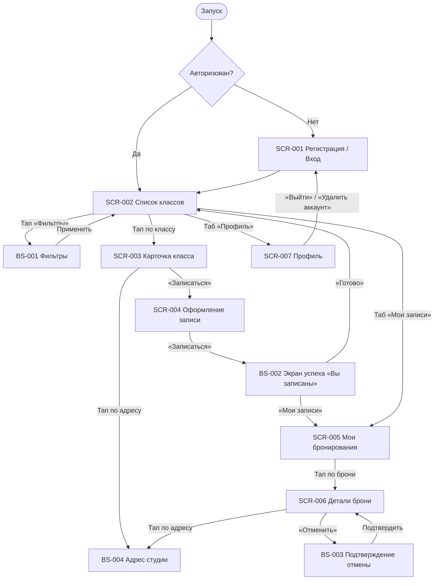

# Фича-лист мобильного приложения «Шеф-стол»

Перечень экранов клиентского приложения и доступных на них функций.
Связующий артефакт между [требованиями](../2-requirements/) и детальным ТЗ по экранам
(будущее заполнение [`_SCREEN_TEMPLATE.md`](_SCREEN_TEMPLATE.md)).

**Статус:** Черновик · **Версия:** 0.1 · **Дата:** 2026-07-05

---

## 1. Назначение

**«Шеф-стол»** — клиентское мобильное приложение для самостоятельной записи на кулинарные классы студии. Заменяет ручную запись через WhatsApp и Google-таблицу, устраняя двойные брони и путаницу с местами.

**Скоуп приложения — только роль «Клиент».** Шеф-повара и Владелец (Артём) работают через существующую инфраструктуру/админку и в приложение **не входят**. Справочные данные (классы, программы, шефы) приложение получает из API в режиме **read-only**; оплата — **офлайн** (наличные / перевод), приложение лишь показывает цену и фиксирует запись.

**Источники:**
[Бриф](../0-customer-brief/brief-cooking.md) ·
[Бизнес-требования](../2-requirements/business-requirements.md) ·
[Функциональные требования](../2-requirements/functional-requirements.md) ·
[Нефункциональные требования](../2-requirements/non-functional-requirements.md) ·
[Use cases](../2-requirements/use-cases.md) ·
[User stories](../2-requirements/user-stories.md) ·
[Модель данных](../4-design/data-model.md) ·
[API-последовательности](../4-design/api-sequence.md)

---

## 2. Глоссарий и роли

| Термин | Значение |
|--------|----------|
| **Класс / Слот** | Конкретное проведение программы: дата, время начала, программа (меню), шеф, цена, всего/свободно мест. |
| **Программа (меню)** | Тема класса (например, «Итальянская паста»). Определяет уровень сложности (новичковая / опытная) и потолок вместимости (до 12 или до 8 мест). |
| **Шеф** | Повар, ведущий класс. |
| **Рабочее место (стол)** | Одно место за столом на одного человека. Лимит слота определяется числом свободных столов и потолком программы. |
| **Прокатный набор** | Комплект студии «фартук + ножи»; фонд 15 наборов, учитывается отдельно от мест. |
| **Своё оборудование** | Клиент использует свои фартук и ножи; прокатный фонд не расходуется. |
| **Запись (бронь)** | Бронь одного или нескольких мест (до 3) на класс: выбор инвентаря для каждого места, пищевые ограничения, итоговая цена, статус. |
| **Пищевые ограничения** | Необязательное текстовое поле при бронировании (аллергии, диеты, пожелания). |
| **Ранняя отмена** | Отмена не позднее чем за 2 часа до начала → места и прокатные наборы возвращаются в слот. |
| **Поздняя отмена** | Отмена менее чем за 2 часа до начала → запись фиксируется, место и прокат **не** освобождаются, штрафов нет. |

**Роль приложения:** **Клиент** — просматривает и фильтрует классы, записывается (себя и гостей), выбирает прокат или своё оборудование, указывает пищевые ограничения, отменяет записи, получает напоминания.

> **Принцип абстракции.** В фича-листе **не привязываемся к конкретным числам** (размер прокатного фонда, потолки программ, длительность). Все лимиты — параметры, приходящие из данных/конфигурации класса и программы.
>
> **Раздельная модель доступности (места ≠ прокатный фонд).** Места и прокатный фонд считаются **независимо**:
> - **Лимит мест группы:** `max_seats = min(free_seats, program.capacity_cap, 3)` — все значения из данных класса/программы (групповой лимит `3` — «себя + до 2 гостей», FR-12).
> - **Лимит прокатного фонда:** `rental_count ≤ free_rental_kits`.
>
> «Своё оборудование» занимает место в группе, но **не** уменьшает прокатный фонд; «Прокатный набор» — занимает место **и** уменьшает прокатный фонд. То есть доступность мест **не** считается «через прокатные наборы» — это два разных лимита.

---

## 3. Карта навигации

---

## 4. Инвентарь экранов

| ID | Экран | Тип | Назначение | Зона | Приоритет | Требования |
|----|-------|-----|------------|------|-----------|------------|
| **SCR-001** | Регистрация / Вход | Экран | Лёгкий вход по имени и телефону без пароля | НЗ | Critical | FR-1, FR-2, FR-43 / US-1 |
| **SCR-002** | Список классов | Экран | Каталог кулинарных классов со свободными местами + фильтры | АЗ | Critical | FR-9, FR-38 / UC-3, US-2, US-3 |
| **BS-001** | Фильтры | Bottom Sheet | Фильтрация списка классов | АЗ | High | FR-38 / US-3 |
| **SCR-003** | Карточка класса | Экран | Полные параметры класса перед записью | АЗ | Critical | FR-9a / US-4 |
| **SCR-004** | Оформление записи | Экран | Выбор числа мест, вариантов инвентаря, пищевых ограничений, цена, запись | АЗ | Critical | FR-10–15, FR-45, FR-50 / UC-1, US-5–8, US-11, US-16 |
| **BS-002** | Подтверждение записи («Вы записаны») | Экран | Полноэкранное подтверждение успешной брони со сводкой и двумя кнопками | АЗ | High | FR-30 / US-5 |
| **SCR-005** | Мои бронирования | Экран | Список предстоящих и прошедших записей | АЗ | Critical | FR-35a / US-9 |
| **SCR-006** | Детали брони + отмена | Экран | Детали записи, пищевых ограничений и запуск отмены | АЗ | Critical | FR-16–18, FR-46 / UC-2, US-10 |
| **BS-003** | Подтверждение отмены | Bottom Sheet | Показ правила 2 часов и подтверждение отмены | АЗ | High | FR-17, FR-18 / US-10 |
| **BS-004** | Адрес студии | Bottom Sheet | Текстовый адрес студии + опциональная карта | АЗ | Medium | FR-9a, NFR-26 / US-4 |
| **SCR-007** | Профиль клиента | Экран | Просмотр/редактирование имени и телефона, выход, удаление аккаунта | АЗ | Medium | FR-47–49 / NFR-12 |

> **Зоны:** НЗ — неавторизованная зона, АЗ — авторизованная зона.

---

## 5. Детализация по экранам

### SCR-001 · Регистрация / Вход

- **Назначение:** минимальный порог входа — регистрация и повторный вход по телефону.
- **Зона:** НЗ.
- **Доступные функции:**
  - Ввод номера телефона.
  - Подтверждение кодом из SMS (OTP).
  - Ввод имени (только для нового пользователя).
  - Повторный вход по номеру телефона (известный номер пропускает шаг «Имя»).
- **Ключевые элементы:** поле «Телефон», поле «Код из SMS», поле «Имя», кнопки «Получить код», «Подтвердить», «Продолжить».
- **Бизнес-правила/валидации:** валидация формата телефона и имени; отсутствие сложного пароля (NFR-3); ≤ минимально необходимых полей (NFR-2). Таймер повторной отправки кода.
- **Требования:** FR-1, FR-2, FR-43 / US-1 / NFR-3.

### SCR-002 · Список классов

- **Назначение:** главный экран — список доступных кулинарных классов; точка входа в запись.
- **Зона:** АЗ.
- **Доступные функции:**
  - Просмотр списка классов (по умолчанию — **ближайшие 7 дней**, `only_available=false`; больший период — фильтром дат).
  - Открыть шторку фильтров [BS-001](#bs-001--фильтры).
  - Переход в карточку класса [SCR-003](#scr-003--карточка-класса).
  - Pull-to-refresh для обновления доступности.
  - Переходы в «Мои записи» и «Профиль».
- **Ключевые элементы:** карточка класса (дата/время начала, программа и тип, шеф, цена, всего/свободно мест); индикатор активных фильтров.
- **Бизнес-правила/валидации:** список показывает классы на **ближайшие 7 дней** (дефолт API; больший период — фильтром дат); заполненные (свободных мест нет) и отменённые студией классы **не скрываются**, а помечаются «Мест нет» с **неактивной CTA «Записаться»**; счётчик свободных мест отражает актуальные данные класса. По умолчанию `only_available=false`; скрыть заполненные можно фильтром «только со свободными местами» (BS-001).
- **Требования:** FR-9, FR-38 / UC-3, US-2, US-3 / NFR-6.

### BS-001 · Фильтры

- **Назначение:** уточнить список классов под запрос клиента.
- **Зона:** АЗ.
- **Доступные функции:**
  - Фильтр по дате / периоду начала.
  - Фильтр по типу программы (новичковая / опытная).
  - Фильтр «только со свободными местами».
  - Фильтр по шефу.
  - Применить / Сбросить фильтры.
- **Бизнес-правила/валидации:** фильтры комбинируются по «И»; при пустом результате — empty state с подсказкой изменить/сбросить фильтры (UC-3 A1, E1). Внутри групп (тип, шеф) — множественный выбор по «ИЛИ».
- **Требования:** FR-38 / US-3.

### SCR-003 · Карточка класса

- **Назначение:** показать все параметры класса, чтобы клиент решил записаться.
- **Зона:** АЗ.
- **Доступные функции:**
  - Просмотр полных параметров класса.
  - Переход к оформлению записи [SCR-004](#scr-004--оформление-записи).
- **Ключевые элементы:** дата/время, программа (меню) и тип, описание (опционально), длительность (опционально), шеф, адрес студии (текст + опциональная карта), цена, всего/свободно мест, доступность прокатных наборов; кнопка «Записаться».
- **Бизнес-правила/валидации:** кнопка «Записаться» неактивна, если свободных мест нет; адрес студии — обязательный элемент; тап по адресу открывает шторку BS-004.
- **Требования:** FR-9a / US-4.

### SCR-004 · Оформление записи

- **Назначение:** собрать параметры брони и зафиксировать запись.
- **Зона:** АЗ.
- **Доступные функции:**
  - Выбор числа мест: себя + до 2 гостей (итого 1–3).
  - Выбор варианта инвентаря (свой / прокатный) для каждого места.
  - Ввод пищевых ограничений (необязательно).
  - Просмотр итоговой цены.
  - Подтверждение записи → [BS-002](#bs-002--подтверждение-записи-вы-записаны).
- **Ключевые элементы:** степпер мест, переключатели «Свой фартук и ножи» / «Прокатный набор» по местам, текстовое поле «Пищевые ограничения», блок цены, кнопка «Записаться».
- **Бизнес-правила/валидации:**
  - Места и прокатный фонд — **два независимых лимита**: `max_seats = min(free_seats, program.capacity_cap, 3)` для мест и `rental_count ≤ free_rental_kits` для проката — значения из данных класса/программы, не хардкодим.
  - Запись «своё оборудование» занимает место в группе, но **не** уменьшает прокатный фонд; «прокатный набор» — занимает место **и** уменьшает прокатный фонд (FR-14).
  - Запрет записи сверх лимита мест или свободных прокатных наборов (FR-13, FR-15).
  - Защита от двойной брони и овербукинга при параллельных записях (NFR-8).
  - Итоговая цена `price_total` рассчитывается сервером и не пересчитывается клиентом (FR-45).
  - Обработка ошибок: нехватка мест (E1), нехватка прокатных наборов с предложением уменьшить число прокатных / выбрать «своё» (E2), гонка запросов (E3), сетевой сбой без частичного повтора (E4) — см. [UC-1](../2-requirements/use-cases.md).
- **Требования:** FR-10–15, FR-45, FR-50 / UC-1, US-5, US-6, US-7, US-8, US-11, US-16 / NFR-2, NFR-8.

### BS-002 · Подтверждение записи («Вы записаны»)

- **Назначение:** подтвердить успешную бронь и показать дальнейшие шаги.
- **Тип:** **Экран** (полноэкранный успех). ID сохранён.
- **Зона:** АЗ.
- **Доступные функции:**
  - Просмотр сводки записи (класс, дата, число мест, инвентарь, пищевые ограничения (если указаны), цена).
  - Напоминание об офлайн-оплате (наличные / перевод).
  - Переход в «Мои бронирования» [SCR-005](#scr-005--мои-бронирования) (primary).
  - «Готово» — возврат к списку «Классы» [SCR-002](#scr-002--список-классов) (secondary).
  - Запрос разрешения на push-уведомления (после первой успешной записи).
- **Бизнес-правила/валидации:** запись появляется в «Моих бронированиях»; свободные места класса уменьшены. Уход только по двум кнопкам.
- **Требования:** FR-30 / US-5.

### SCR-005 · Мои бронирования

- **Назначение:** контроль предстоящих и прошедших классов клиента.
- **Зона:** АЗ.
- **Доступные функции:**
  - Просмотр списка своих записей (предстоящие / история).
  - Переход к деталям брони [SCR-006](#scr-006--детали-брони--отмена).
- **Ключевые элементы:** карточка записи (статус, дата, программа, шеф, число мест, инвентарь).
- **Бизнес-правила/валидации:** клиент видит только свои записи (NFR-12); отменённые записи (включая с будущим началом) попадают в «Историю»; empty state, если записей нет.
- **Требования:** FR-35a / US-9 / NFR-12.

### SCR-006 · Детали брони + отмена

- **Назначение:** показать полную информацию о брони и дать отменить её.
- **Зона:** АЗ.
- **Доступные функции:**
  - Просмотр деталей записи, пищевых ограничений и статуса.
  - Запуск отмены → [BS-003](#bs-003--подтверждение-отмены).
- **Ключевые элементы:** статус, дата/время, программа и тип, адрес студии, шеф, число мест, вариант инвентаря (с разбивкой по местам, если доступно), пищевые ограничения, цена; кнопка «Отменить».
- **Бизнес-правила/валидации:**
  - Кнопка «Отменить» доступна только для активных броней до начала класса (E1).
  - Повторная отмена уже отменённой записи не выполняется (E2).
  - Для статуса «Отменён студией» отображается причина отмены.
- **Требования:** FR-16, FR-17, FR-18, FR-46 / UC-2, US-10.

### BS-003 · Подтверждение отмены

- **Назначение:** объяснить последствия отмены и подтвердить действие.
- **Зона:** АЗ.
- **Доступные функции:**
  - Просмотр правила 2 часов и текущего статуса (ранняя / поздняя отмена).
  - Подтверждение / отказ от отмены.
- **Бизнес-правила/валидации:**
  - **Ранняя отмена** (≥ 2 ч до начала): места и прокатные наборы возвращаются в слот (FR-17).
  - **Поздняя отмена** (< 2 ч до начала): запись помечается «поздняя отмена», место и прокат **не** освобождаются, штрафов нет (FR-18).
  - Время отсечки вычисляется от времени начала класса.
- **Требования:** FR-17, FR-18 / US-10.

### BS-004 · Адрес студии

- **Назначение:** показать адрес студии и, при наличии координат, интерактивную карту.
- **Зона:** АЗ.
- **Доступные функции:**
  - Просмотр текстового адреса студии.
  - Просмотр карты с пином студии (если API предоставляет координаты).
  - Переход во внешнее картографическое приложение для построения маршрута.
- **Ключевые элементы:** текстовый блок с адресом, карта (опционально), кнопки «Проложить маршрут» и «Открыть в картах».
- **Бизнес-правила/валидации:** при отсутствии координат карта скрывается; при ошибке загрузки карты — fallback на текстовый адрес и кнопки.
- **Требования:** FR-9a, NFR-26 / US-4.

### SCR-007 · Профиль клиента

- **Назначение:** контактные данные, выход и удаление аккаунта.
- **Зона:** АЗ.
- **Доступные функции:**
  - Просмотр и редактирование имени и телефона (смена телефона — с подтверждением кодом из SMS).
  - Выход из аккаунта.
  - Удаление аккаунта (с обязательным подтверждением).
- **Бизнес-правила/валидации:** доступ только к собственным данным (NFR-11, NFR-12); при удалении аккаунта активные брони аннулируются и освобождают места, прошедшие — анонимизируются.
- **Требования:** FR-47–49 / NFR-11, NFR-12.

---

## 6. Сквозные функции (не отдельные экраны)

- **Напоминания / уведомления** (FR-33, NFR-13): заблаговременное напоминание о предстоящем классе (push за 24 ч и 2 ч); уведомление об отмене класса студией. Канал в MVP — **системный push** (APNs/FCM). SMS / email / inbox — Phase 2. Запрос разрешения на push — после первой успешной записи в BS-002.
- **Состояния экранов**: единый паттерн Loading (скелетон/шиммер) → Content → Empty (заглушка с подсказкой) → Error (с кнопкой «Обновить»). Применяется ко всем экранам с запросами.
- **NFR, влияющие на UI**: mobile-first для использования на кухне/в студии — крупные элементы, высокий контраст (NFR-1); запись ≤ 3 экранов до подтверждения (NFR-2); отклик списка и подтверждения < 2–3 с (NFR-6). Приложение — нативное/гибридное, распространяется через App Store / Google Play.

---

## 7. Не входит в MVP (Phase 2+)

| Функция | Причина / источник |
|---------|--------------------|
| **Оценки шефов** (1–5 звёзд + отзыв после класса) | **Решение зафиксировано: Phase 2** (осознанное сужение скоупа MVP, перенос согласован с заказчиком). В MVP не входит. |
| **Поделиться классом (share)** | На карточке класса [SCR-003](#scr-003--карточка-класса) иконка «Поделиться» в MVP неактивна/декоративна; функция перенесена в Phase 2. |
| Онлайн-оплата | На старте оплата офлайн (BR-8, FR-30); онлайн — за рамками скоупа. |
| Программа лояльности | Скидки, приоритетная запись, бейджи — не в MVP (NFR-16). |
| Публичные отзывы / рейтинги для клиентов | Агрегаты видит только админ; публичный показ — позже. |
| Мобильные интерфейсы шефа и владельца | Эти роли работают через существующую инфраструктуру/админку. |

---

## 8. Трассировка требований → экраны

| Требование | Покрывающий экран/функция |
|------------|----------------------------|
| FR-1, FR-2, FR-43 (авторизация/OTP) | SCR-001, SCR-007 |
| FR-9 (список классов) | SCR-002 |
| FR-9a (карточка класса) | SCR-003 |
| FR-38 (фильтрация) | SCR-002 + BS-001 |
| FR-10–15, FR-45, FR-50 (запись, инвентарь, лимиты, цена, аллергии) | SCR-004 |
| FR-30 (цена, офлайн-оплата) | SCR-003, SCR-004, BS-002 |
| FR-35a (список своих броней) | SCR-005 |
| FR-16–18, FR-46 (отмена, правило 2 ч, отмена студией) | SCR-006 + BS-003 |
| FR-33 (напоминания) | Сквозная функция (§6) |
| FR-47–49 (профиль, выход, удаление) | SCR-007 |
| UC-1 (запись) | SCR-002 → SCR-003 → SCR-004 → BS-002 |
| UC-2 (отмена) | SCR-005 → SCR-006 → BS-003 |
| UC-3 (фильтрация) | SCR-002 + BS-001 |

---

## 9. Замечания по данным

- **Оценки шефов** — решение зафиксировано: **Phase 2** (осознанное сужение скоупа MVP). В MVP функция не входит; расхождение источников снято — единое решение действует для всех артефактов этапа.
- **API описан** в спецификациях [`../api/`](../api/). Домены: **auth** (OTP, logout), **profile** (профиль, смена телефона, удаление), **slots** (список/фильтрация и карточка, read-only), **bookings** (создание, список, отмена), **chefs** (справочник, read-only). Контракты соответствуют модели данных и API-последовательностям.